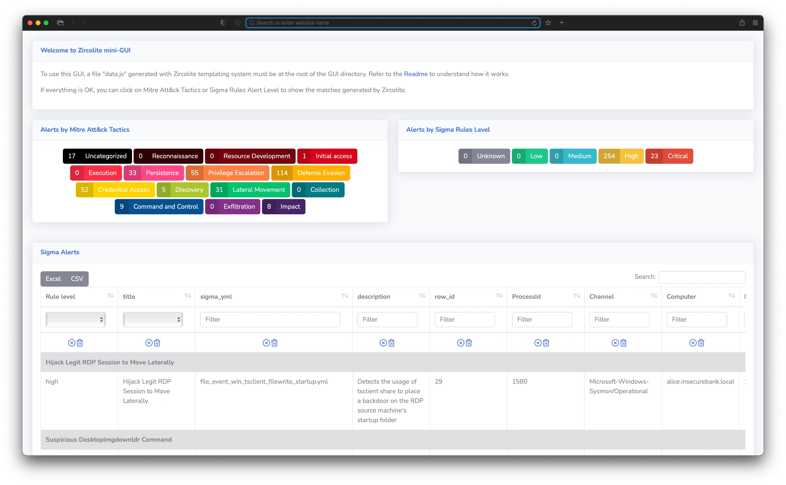
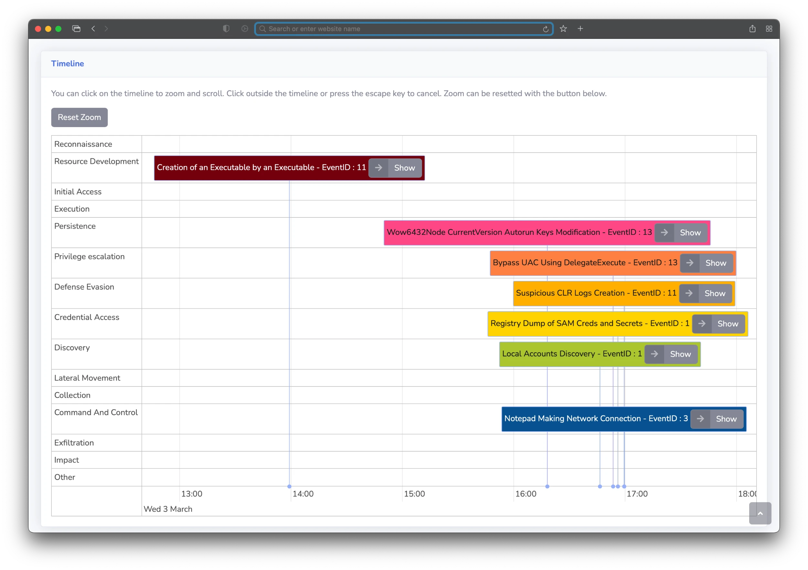
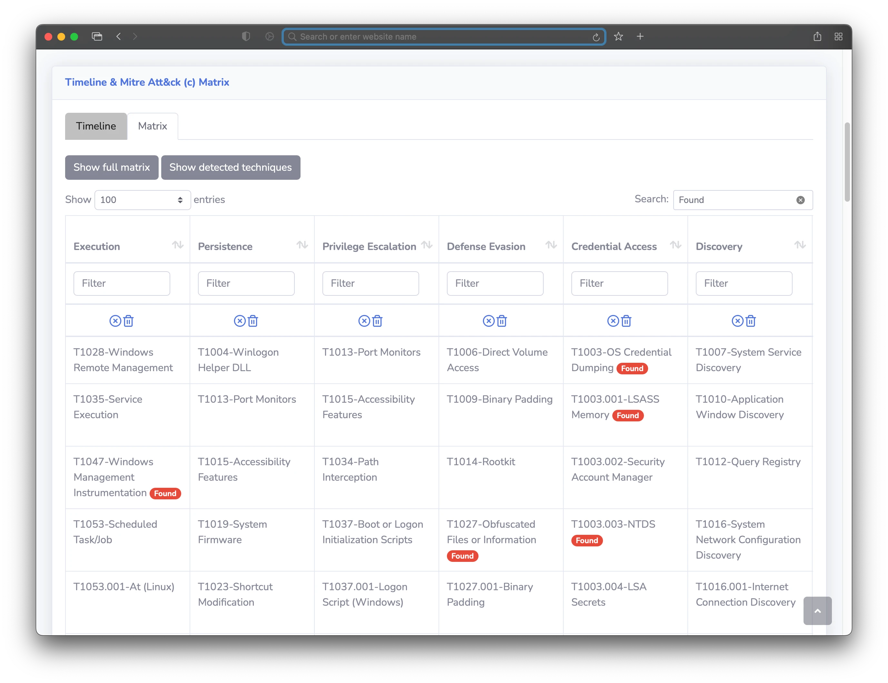

# <p align="center"></p>

## Standalone SIGMA-based detection tool for EVTX, Auditd, Sysmon for linux, XML or JSONL/NDJSON Logs 


[](https://www.python.org/)


**Zircolite** is a standalone tool written in Python 3 that allows you to use SIGMA rules on:

- MS Windows EVTX (EVTX, XML, and JSONL formats)
- Auditd logs
- Sysmon for Linux
- EVTXtract
- CSV and XML logs

### Key Features

- **Fast Processing**: Zircolite is relatively fast and can parse large datasets in just seconds.
- **SIGMA Backend**: It is based on a SIGMA backend (SQLite) and does not use internal SIGMA-to-something conversion.
- **Advanced Log Manipulation**: It can manipulate input logs by splitting fields and applying transformations, allowing for more flexible and powerful log analysis.
- **Flexible Export**: Zircolite can export results to multiple formats using Jinja [templates](templates), including JSON, CSV, JSONL, Splunk, Elastic, Zinc, Timesketch, and more.

**You can use Zircolite directly in Python or use the binaries provided in the [releases](https://github.com/wagga40/Zircolite/releases).** 

**Documentation is available [here](https://wagga40.github.io/Zircolite/) (dedicated site) or [here](docs) (repo directory).**

## Requirements / Installation

The project has only beek tested with Python 3.10. If you only want to use base functionnalities of Zircolite, you can install dependencies with : `pip3 install -r requirements.txt`. But `pip3 install -r requirements.full.txt` is strongly recommended.

The use of [evtx_dump](https://github.com/omerbenamram/evtx) is **optional but required by default (because it is -for now- much faster)**, If you do not want to use it you have to use the `--noexternal` option. The tool is provided if you clone the Zircolite repository (the official repository is [here](https://github.com/omerbenamram/evtx)).

:warning: On some systems (Mac, Arm, ...) the `evtx` library may need Rust and Cargo to be installed.

## Quick start

Check tutorials made by other (EN, SP and FR) [here](#tutorials).

### EVTX files : 

Help is available with:

```shell
python3 zircolite.py -h
```

If your EVTX files have the extension ".evtx" :

```shell
# python3 zircolite.py --evtx <EVTX FOLDER or EVTX FILE> --ruleset <SIGMA RULESET> [--ruleset <OTHER RULESET>]
python3 zircolite.py --evtx sysmon.evtx --ruleset rules/rules_windows_sysmon_pysigma.json
```

- The `--evtx` argument can be a file or a folder. If it is a folder, all EVTX files in the current folder and subfolders will be selected.
- The SYSMON ruleset used is a default one, intended for analyzing logs from endpoints with SYSMON installed.

### Auditd / Sysmon for Linux / JSONL or NDJSON logs : 

```shell
# For Auditd logs
python3 zircolite.py --events auditd.log --ruleset rules/rules_linux.json --auditd
# For Sysmon for Linux logs
python3 zircolite.py --events sysmon.log --ruleset rules/rules_linux.json --sysmon4linux
# For JSONL or NDJSON logs
python3 zircolite.py --events <JSON_FOLDER_OR_FILE> --ruleset rules/rules_windows_sysmon_pysigma.json --jsononly
```

- The `--events` argument can be a file or a folder. If it is a folder, all event files in the current folder and subfolders will be selected.

> [!TIP]
> If you want to try the tool you can test with [EVTX-ATTACK-SAMPLES](https://github.com/sbousseaden/EVTX-ATTACK-SAMPLES) (EVTX Files).

### Running with Docker

```bash
# Pull docker image
docker pull wagga40/zircolite:latest
# If your logs and rules are in a specific directory
docker run --rm --tty \
    -v $PWD:/case/input:ro \
    -v $PWD:/case/output \
    wagga40/zircolite:latest \
    -e /case/input \
    -o /case/output/detected_events.json \
    -r /case/input/a_sigma_rule.yml
```

- Replace `$PWD` with the directory (absolute path only) where your logs and rules/rulesets are stored.

### Updating default rulesets

```shell
python3 zircolite.py -U
```

> [!IMPORTANT]  
> Please note these rulesets are provided to use Zircolite out-of-the-box, but [you should generate your own rulesets](#why-you-should-build-your-own-rulesets) as they can be very noisy or slow. These auto-updated rulesets are available in the dedicated repository: [Zircolite-Rules](https://github.com/wagga40/Zircolite-Rules).

## Docs

Complete documentation is available [here](docs).

## Mini-Gui

The Mini-GUI can be used totally offline. It allows you to display and search results. You can automatically generate a Mini-GUI "package" with the `--package` option. To learn how to use the Mini-GUI, check the docs [here](docs/Advanced.md#mini-gui).

### Detected events by Mitre Att&ck (c) techniques and criticity levels



### Detected events Timeline



### Detected events by Mitre Att&ck (c) techniques displayed on the Matrix 



## Tutorials, references and related projects

### Tutorials

- **English**: [Russ McRee](https://holisticinfosec.io) has published a detailed [tutorial](https://holisticinfosec.io/post/2021-09-28-zircolite/) on SIGMA and Zircolite on his blog.

- **Spanish**: **César Marín** has published a tutorial in Spanish [here](https://derechodelared.com/zircolite-ejecucion-de-reglas-sigma-en-ficheros-evtx/).

- **French**: [IT-connect.fr](https://www.it-connect.fr/) has published [an extensive tutorial](https://www.it-connect.fr/) on Zircolite in French.

- **French**: [IT-connect.fr](https://www.it-connect.fr/) has also published a [Hack the Box challenge Write-Up](https://www.it-connect.fr/hack-the-box-sherlocks-tracer-solution/) using Zircolite.

### References 

- [Florian Roth](https://github.com/Neo23x0/) cited Zircolite in his [**SIGMA Hall of Fame**](https://github.com/Neo23x0/Talks/blob/master/Sigma_Hall_of_Fame_20211022.pdf) during his talk at the October 2021 EU ATT&CK Workshop.
- Zircolite has been cited and presented during [JSAC 2023](https://jsac.jpcert.or.jp/archive/2023/pdf/JSAC2023_workshop_sigma_jp.pdf).
- Zircolite has been cited and used in multiple research papers:
  - **CIDRE Team**:
    - [PWNJUTSU - Website](https://pwnjutsu.irisa.fr)
    - [PWNJUTSU - Academic Paper](https://hal.inria.fr/hal-03694719/document)
    - [CERBERE: Cybersecurity Exercise for Red and Blue Team Entertainment, Reproducibility](https://centralesupelec.hal.science/hal-04285565/file/CERBERE_final.pdf)
  - **Universidad de la República**:
    - [A Process Mining-Based Method for Attacker Profiling Using the MITRE ATT&CK Taxonomy](https://journals-sol.sbc.org.br/index.php/jisa/article/view/3902/2840)

---

## License

- All the **code** of the project is licensed under the [GNU Lesser General Public License](https://www.gnu.org/licenses/lgpl-3.0.en.html).
- `evtx_dump` is under the MIT license.
- The rules are released under the [Detection Rule License (DRL) 1.0](https://github.com/SigmaHQ/Detection-Rule-License/blob/main/LICENSE.Detection.Rules.md).

---
