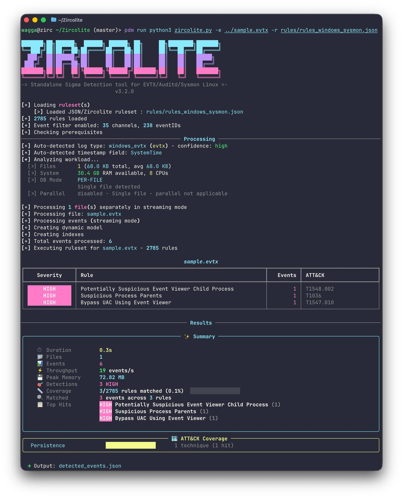
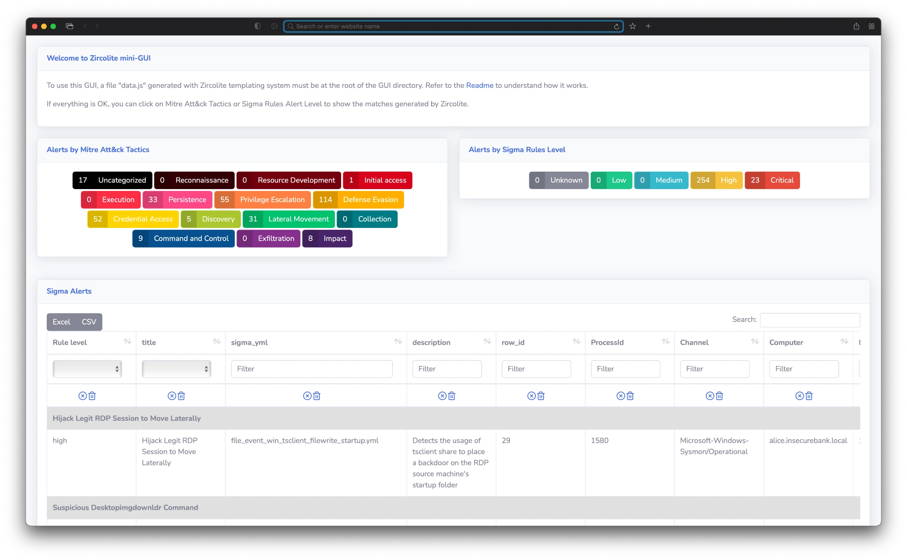
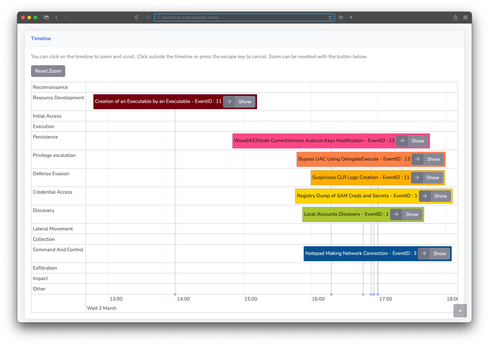
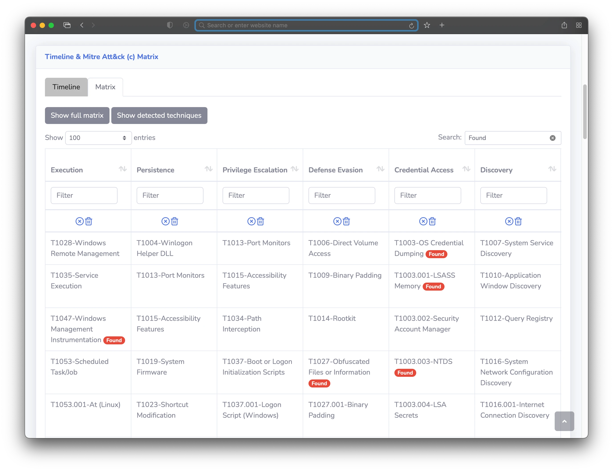

# <p align="center"></p>

## Standalone SIGMA-Based Detection Tool for EVTX, Auditd, Sysmon for Linux, XML, CSV, or JSONL/NDJSON Logs 


[](https://www.python.org/)


**Zircolite** is a standalone tool written in Python 3 that allows you to use SIGMA rules on:

- MS Windows EVTX (EVTX, XML, and JSONL formats)
- Auditd logs
- Sysmon for Linux
- EVTXtract
- CSV and XML logs
- JSON Array logs

### Key Features

- **Fast**: 452,554 events against 4,319 Sigma rules in 11.6 s, and 1.7 million events in 105 s — the fastest of the three on both test corpora, ahead of Hayabusa and Chainsaw, both of them Rust tools. See the [benchmark](#benchmark).
- **Automatic Log Type Detection**: Automatically identifies log formats and timestamp fields using magic bytes, content analysis, and regex-based fallback -- no need to specify format flags in most cases.
- **Multiple Input Formats**: Supports various log formats including EVTX, JSON Lines, JSON Arrays, CSV, XML, and more. Compressed or archived logs (gzip, bzip2, ZIP, 7-Zip) are supported; use `--archive-password` for encrypted ZIP/7z.
- **Native Sigma Support**: Zircolite can directly use native Sigma rules (YAML) by converting them with pySigma.
- **SIGMA Backend**: It is based on a SIGMA backend (SQLite) and does not use internal SIGMA-to-something conversion.
- **Advanced Log Manipulation**: It can manipulate input logs by splitting fields and applying transformations, allowing for more flexible and powerful log analysis.
- **Field Transforms**: Apply custom Python transformations to fields during processing (e.g., Base64 decoding, hex-to-ASCII conversion).
- **Flexible Export**: Zircolite can export results to multiple formats using Jinja [templates](templates), including JSON, CSV, JSONL, Splunk, Elastic, OpenSearch, Timesketch, SARIF, ATT&CK Navigator, and more.
- **Rich Terminal Output**: Detection results displayed in severity-sorted tables with MITRE ATT&CK technique IDs, ATT&CK tactics heatmap, rule coverage metrics, and clickable output file links.

**You can use Zircolite directly with Python, or download a [standalone binary](#standalone-binaries) that needs no Python installation.**

**Documentation is available [here](https://wagga40.github.io/Zircolite/) (dedicated site) or [here](docs) (repository directory).**

## Requirements / Installation

> [!NOTE]
> Everything in this section applies **only when running Zircolite from source**. The
> [standalone binaries](#standalone-binaries) and the [Docker image](#running-with-docker)
> carry their own Python, every dependency and the compiled kernel: they need no Python, no
> package manager and no C compiler.

The project has been tested with Python 3.10 and above. Dependencies are declared in
`pyproject.toml`; install them from the cloned repository with
[PDM](https://pdm-project.org/latest/) (`pdm install`), [uv](https://docs.astral.sh/uv/)
(`uv sync`) or [Poetry](https://python-poetry.org) (`poetry install`).

The examples below run `python3 zircolite.py`: activate the environment the tool created,
or prefix them with `pdm run`, `uv run` or `poetry run`.

### Dependencies

- **Required**: `orjson`, `xxhash`, `rich`, `rich-argparse`, `RestrictedPython`, `requests`, `urllib3`, `pySigma`, `evtx` (pyevtx-rs), `jinja2`, `lxml`, `chardet`, `psutil`, `pyyaml`, `py7zr`, `ijson`, `pyahocorasick`, `pyroaring`
- `py7zr` is imported only when a `.7z` input is opened; ZIP, gzip and bzip2 use the standard library.

### :warning: Install a C compiler first

Installing from source compiles Zircolite's flattening kernel with Cython — but **only if a
C compiler is already there**. Without one the install still succeeds and every run
flattens events in Python instead, which is slower. The binaries and the Docker image are
built with the kernel already compiled, so this does not concern them.

So install the toolchain **before** `pdm install`:

| Platform | Prerequisite |
|----------|--------------|
| Debian, Ubuntu | `apt install build-essential python3-dev` |
| RHEL, Fedora, Rocky | `dnf install gcc python3-devel` |
| Alpine | `apk add build-base python3-dev` |
| macOS | `xcode-select --install` |
| Windows | [Build Tools for Visual Studio](https://visualstudio.microsoft.com/visual-cpp-build-tools/) ("Desktop development with C++") |

Cython itself needs no installing: it is a build-time requirement, fetched into an isolated
build environment and never added to your environment.

### Standalone binaries

Every [release](https://github.com/wagga40/Zircolite/releases) publishes a self-contained
package per platform. Each carries its own Python and every dependency, so nothing has to
be installed first.

| Target | Archive | Runs on |
|--------|---------|---------|
| `linux-x64` | `Zircolite-<version>-linux-x64.zip` | glibc 2.28 or later: RHEL 8, Debian 10, Ubuntu 20.04 and newer |
| `linux-arm64` | `Zircolite-<version>-linux-arm64.zip` | glibc 2.28 or later |
| `macos-arm64` | `Zircolite-<version>-macos-arm64.zip` | macOS 15 or later, Apple silicon |
| `windows-x64` | `Zircolite-<version>-windows-x64.zip` | Windows 10 or later |
| `windows-arm64` | `Zircolite-<version>-windows-arm64.zip` | Windows 10 or later, ARM64 |

Intel Macs and musl-based distributions such as Alpine have no binary; use Python or
Docker there.

```shell
unzip Zircolite-<version>-linux-x64.zip
cd Zircolite-<version>-linux-x64
./Zircolite --events sysmon.evtx --ruleset rules/rules_windows_merged.json
```

In the examples below, replace `python3 zircolite.py` with the path to the executable.

The binaries are not code-signed. macOS quarantines a download made with a browser, the
extracted files inherit the flag, and Gatekeeper then blocks the executable and every
library in `_internal/`. Clear it from the whole directory, recursively, before the first
run:

```shell
xattr -dr com.apple.quarantine Zircolite-<version>-macos-arm64
```

## Quick Start

Check out (old) tutorials made by others (EN, ES, and FR) [here](#tutorials).

### EVTX Files

Help is available with:

```shell
# Don't forget to prefix with "pdm run" or "uv run" or "poetry run" when needed
python3 zircolite.py -h
```

If your EVTX files have the extension ".evtx":

```shell
# python3 zircolite.py --evtx <EVTX FOLDER or EVTX FILE> --ruleset <SIGMA RULESET> [--ruleset <OTHER RULESET>]
python3 zircolite.py --evtx sysmon.evtx --ruleset rules/rules_windows_merged.json
```

`--ruleset` can be left out: Zircolite then uses `rules/rules_windows_merged.json`, which
covers Sysmon and the generic Windows channels.

### Using Native Sigma Rules (YAML)

You can use native Sigma rules (YAML) directly:

```shell
# Single YAML rule
python3 zircolite.py --evtx sample.evtx --ruleset path/to/rule.yml

# Directory of Sigma rules
python3 zircolite.py --evtx sample.evtx --ruleset ./sigma/rules/windows/process_creation

# With pySigma pipelines
python3 zircolite.py --evtx sample.evtx --ruleset rule.yml --pipeline sysmon --pipeline windows-logsources
```

`--pipeline-list` shows the installed pipelines. Naming one that is not installed stops
the run with exit code `2`, before any rule is converted.

### Other Log Formats

Zircolite **auto-detects** the log format in most cases, so explicit format flags are optional:

```shell
# Auto-detection (recommended) - Zircolite identifies the format automatically
python3 zircolite.py --events auditd.log --ruleset rules/rules_linux.json
python3 zircolite.py --events sysmon.log --ruleset rules/rules_linux.json
python3 zircolite.py --events <JSON_FOLDER_OR_FILE> --ruleset rules/rules_windows_merged.json

# Explicit format flags (override auto-detection)
python3 zircolite.py --events auditd.log --ruleset rules/rules_linux.json --auditd
python3 zircolite.py --events sysmon.log --ruleset rules/rules_linux.json --sysmon4linux
python3 zircolite.py --events <JSON_FOLDER_OR_FILE> --ruleset rules/rules_windows_merged.json --jsononly
python3 zircolite.py --events <JSON_FOLDER_OR_FILE> --ruleset rules/rules_windows_merged.json --json-array
python3 zircolite.py --events <CSV_FOLDER_OR_FILE> --ruleset rules/rules_windows_merged.json --csv-input
python3 zircolite.py --events <XML_FOLDER_OR_FILE> --ruleset rules/rules_windows_merged.json --xml-input
```

- The `--events` argument can be a file or a folder. If it is a folder, all log files in the current folder and subfolders will be selected (use `--no-recursion` to disable).
- Use `--file-pattern` to specify a custom glob pattern for file selection.
- Use `--no-auto-detect` to disable automatic format detection.

> [!TIP]
> If you want to try the tool, you can test with [EVTX-ATTACK-SAMPLES](https://github.com/sbousseaden/EVTX-ATTACK-SAMPLES) (EVTX files).

### Running with Docker

```bash
# Pull the Docker image
docker pull wagga40/zircolite:latest
# If your logs and rules are in a specific directory
docker run --rm --tty \
    -v $PWD:/case/input:ro \
    -v $PWD:/case/output \
    wagga40/zircolite:latest \
    -e /case/input \
    -o /case/output/detected_events.json \
    -r /case/input/a_sigma_rule.yml
```

- Replace `$PWD` with the directory (absolute path only) where your logs and rules/rulesets are stored.
- On a Linux host, add `--user "$(id -u):$(id -g)"` and `-l /case/output/zircolite.log`: the image runs as an unprivileged user that cannot write to a directory you own. See [Docker](docs/Usage.md#docker).

### Automatic Processing Optimization

Given several files, Zircolite measures them against available RAM and CPU, picks a database mode (one shared database, or one per file) and decides whether processing them in parallel is worth it — then adapts the worker count to memory pressure as it runs.

```shell
python3 zircolite.py --evtx ./logs/ --ruleset rules/rules_windows_merged.json
```

Override any of it with `--no-auto-mode`, `--unified-db` (one database for all files, which is what cross-file correlation rules need), `--no-parallel` or `--parallel-workers N`. See [Automatic Processing Optimization](docs/Advanced.md#automatic-processing-optimization) for how the choice is made.

### Using YAML Configuration Files

For complex or repeated analysis workflows, use a YAML configuration file:

```shell
# Generate a fully commented configuration file
python3 zircolite.py --generate-config my_config.yaml

# Run with it
python3 zircolite.py --yaml-config my_config.yaml

# CLI arguments override the file
python3 zircolite.py --yaml-config my_config.yaml --evtx ./other_logs/
```

The generated file documents every supported key at its default value;
`config/zircolite_example.yaml` is the same file, kept in the repository. See [YAML configuration](docs/Usage.md#yaml-configuration) for the merge
rules and the options that have no YAML equivalent.

### Updating Default Rulesets

```shell
python3 zircolite.py -U
```

From source this rewrites the repository's `rules/`. A standalone binary writes to the
`rules/` directory beside its executable, and falls back to `./rules` in the working
directory, with a warning, when that one cannot be written to.

Alternatively, if you use [Task](https://taskfile.dev/) (go-task), run `task update-rules` from the project root to update rules from [Zircolite-Rules-v2](https://github.com/wagga40/Zircolite-Rules-v2). See [docs](docs/README.md) for other tasks (Docker build, clean, etc.).

> [!IMPORTANT]  
> Please note that these rulesets are provided to use Zircolite out of the box, but [you should generate your own rulesets](docs/Usage.md#why-you-should-build-your-own-rulesets) as they can be noisy or slow. These auto-updated rulesets are available in the dedicated repository: [Zircolite-Rules-v2](https://github.com/wagga40/Zircolite-Rules-v2).

### Field Splitting and Transforms

Two configuration features shape events as they are ingested, both in `config/config.yaml`:

- **Field splitting** turns a packed key-value field into queryable ones. Sysmon's `Hashes` field (`SHA1=abc123,MD5=def456,SHA256=789xyz`) becomes separate `SHA1`, `MD5` and `SHA256` fields, so rules can match a hash directly.
- **Field transforms** run sandboxed Python over a field's value — decoding base64 command lines, extracting IOCs, flagging LOLBins — and can write the result to a new field rather than replacing the original. Zircolite ships 55 of them across 11 categories, off by default apart from the two auditd ones.

```yaml
split:
  Hashes:
    separator: ","
    equal: "="
```

See [Field Splitting](docs/Usage.md#field-splitting) and [Field Transforms](docs/Advanced.md#field-transforms) for the full configuration, the transforms Zircolite ships, and how to test your own.

## Benchmark

**Zircolite is the fastest of the three on both tested corpora**.

Each tool at its defaults with its own rules, on a 10-core Apple M1 Max. Median of three
runs.

**4 Sysmon EVTX files, one channel (478 MB, 452,554 events):**

| Tool | Rules loaded | Wall time | Throughput | Peak memory |
|------|-------------:|----------:|-----------:|------------:|
| **Zircolite** | 4,319 | **11.6 s** | **39,000 events/s** | 1,207 MiB (4 worker processes) |
| Hayabusa 4.1.0 | 4,658 | 24.7 s | 18,300 events/s | 900 MiB |
| Chainsaw 2.16.0 | 3,524 | 113.5 s | 4,000 events/s | 346 MiB |

**8 EVTX files, 11 channels (13.3 GB, 1,720,377 events):**

| Tool | Rules loaded | Wall time | Throughput | Peak memory |
|------|-------------:|----------:|-----------:|------------:|
| **Zircolite** | 4,319 | **104.8 s** | **16,400 events/s** | 8,103 MiB (5 worker processes) |
| Hayabusa 4.1.0 | 4,658 | 518.8 s | 3,300 events/s | 1,599 MiB |
| Chainsaw 2.16.0 | 3,524 | 206.3 s | 8,300 events/s | 338 MiB |

The channel mix is what moves these numbers: on logs from a single channel both Zircolite
and Hayabusa skip most of their ruleset, and on a mixed corpus they cannot. Zircolite
leads either way, but the two Rust tools swap places between the two.

Zircolite trades memory for that speed: it spreads the files over several worker
processes, and the figures above are their total. `--no-parallel` keeps it to a single
process.

The rule sets differ, so detection counts are not comparable; see [Benchmark](docs/Benchmark.md)
for the setup, the caveats and how to reproduce it with `tools/tool-benchmark.py`.

## Documentation

Complete documentation is available [here](docs).

## Mini-GUI

The Mini-GUI can be used completely offline. It allows you to display and search results. You can automatically generate a Mini-GUI "package" with the `--package` option. Use `--package-dir` to specify the output directory. To learn how to use the Mini-GUI, check the documentation [here](docs/Advanced.md#mini-gui).

### Detected Events by MITRE ATT&CK® Techniques and Criticality Levels



### Detected Events Timeline



### Detected Events by MITRE ATT&CK® Techniques Displayed on the Matrix 



## Tutorials, References, and Related Projects

### Tutorials

- **English**: [Russ McRee](https://holisticinfosec.io) has published a detailed [tutorial](https://holisticinfosec.io/post/2021-09-28-zircolite/) on SIGMA and Zircolite on his blog.

- **Spanish**: **César Marín** has published a tutorial in Spanish [here](https://derechodelared.com/zircolite-ejecucion-de-reglas-sigma-en-ficheros-evtx/).

- **French**: [IT-connect.fr](https://www.it-connect.fr/) has published [an extensive tutorial](https://www.it-connect.fr/zircolite-investigation-numerique-journaux-securite-windows/) on Zircolite in French.

- **French**: [IT-connect.fr](https://www.it-connect.fr/) has also published a [Hack the Box challenge write-up](https://www.it-connect.fr/hack-the-box-sherlocks-tracer-solution/) using Zircolite.

### References 

- [Florian Roth](https://github.com/Neo23x0/) cited Zircolite in his [**SIGMA Hall of Fame**](https://github.com/Neo23x0/Talks/blob/master/Sigma_Hall_of_Fame_20211022.pdf) during his talk at the October 2021 EU ATT&CK Workshop.
- Zircolite has been cited and presented during [JSAC 2023](https://jsac.jpcert.or.jp/archive/2023/pdf/JSAC2023_workshop_sigma_jp.pdf).
- Zircolite has been cited and used in multiple research papers:
  - **CIDRE Team**:
    - [PWNJUTSU - Website](https://pwnjutsu.irisa.fr)
    - [PWNJUTSU - Academic Paper](https://hal.inria.fr/hal-03694719/document)
    - [CERBERE: Cybersecurity Exercise for Red and Blue Team Entertainment, Reproducibility](https://centralesupelec.hal.science/hal-04285565/file/CERBERE_final.pdf)
  - **Universidad de la República**:
    - [A Process Mining-Based Method for Attacker Profiling Using the MITRE ATT&CK Taxonomy](https://journals-sol.sbc.org.br/index.php/jisa/article/view/3902/2840)

---

## License

- All the **code** of the project is licensed under the [GNU Lesser General Public License](https://www.gnu.org/licenses/lgpl-3.0.en.html).
- EVTX parsing uses [`evtx`](https://github.com/omerbenamram/pyevtx-rs) (pyevtx-rs), under the MIT or Apache-2.0 license. Release packages list every bundled library and its license in `THIRD_PARTY_LICENSES`.
- The rules are released under the [Detection Rule License (DRL) 1.1](https://github.com/SigmaHQ/Detection-Rule-License/blob/main/LICENSE.Detection.Rules.md).

---
