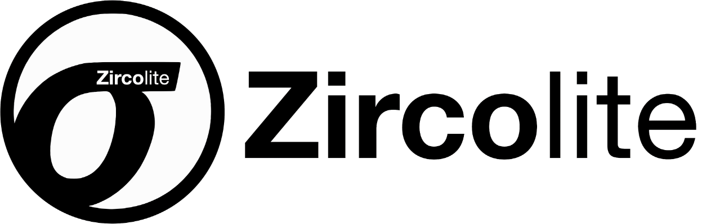
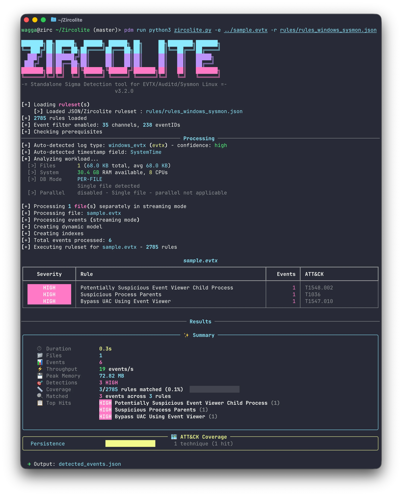

# <p align="center"></p>

## Standalone SIGMA-Based Detection Tool for EVTX, Auditd, Sysmon for Linux, XML, CSV, or JSONL/NDJSON Logs 


[](https://www.python.org/)


**Zircolite** applies Sigma detection rules to:

- MS Windows EVTX (EVTX, XML, and JSONL formats)
- Auditd logs
- Sysmon for Linux
- EVTXtract
- CSV and XML logs
- JSON Array logs

### Key Features

- **Format detection**: Identifies log formats and timestamp fields automatically. Reads gzip, bzip2, ZIP and 7-Zip inputs; encrypted ZIP/7z inputs take their password from `--ask-archive-password` or the `ZIRCOLITE_ARCHIVE_PASSWORD` environment variable.
- **Sigma rules**: Converts native YAML rules with pySigma's SQLite backend or loads preconverted JSON rulesets.
- **Correlations**: Counts, statistics, temporal sequences, absence conditions and chained rules, with supporting events in each alert. Unified mode supports cross-file correlations.
- **Field processing**: Splits key-value fields and applies Python transforms, including Base64 and hex decoding.
- **Export**: JSON, CSV and Jinja [templates](templates) for JSONL, Splunk, Elastic, OpenSearch, Timesketch, SARIF and ATT&CK Navigator.
- **Terminal output**: Severity-sorted detections, MITRE ATT&CK techniques and tactics, rule coverage and output links.

**You can use Zircolite directly with Python, or download a [standalone binary](#standalone-binaries) that needs no Python installation.**

Read the [documentation site](https://wagga40.github.io/Zircolite/) or the [repository docs](docs).

## Requirements / Installation

> [!NOTE]
> Source installs need Python and a package manager. The
> [standalone binaries](#standalone-binaries) and the [Docker image](#running-with-docker)
> include Python, dependencies and the compiled kernel.

The project has been tested with Python 3.10 and above. Dependencies are declared in
`pyproject.toml`; install them from the cloned repository with
[PDM](https://pdm-project.org/latest/) (`pdm install`), [uv](https://docs.astral.sh/uv/)
(`uv sync`) or [Poetry](https://python-poetry.org) (`poetry install`).

The examples below run `python3 zircolite.py`: activate the environment the tool created,
or prefix them with `pdm run`, `uv run` or `poetry run`.

### Dependencies

Dependencies are declared in [`pyproject.toml`](pyproject.toml). See
[Dependencies](docs/Usage.md#dependencies) for their roles.

### :warning: Install a C compiler first

Source installs use a C compiler to build the Cython flattening kernel. If compilation
fails, the build backend warns and installation continues with the slower Python kernel.
Set `ZIRCOLITE_REQUIRE_NATIVE=1` to require a successful native build.

For native acceleration, install the toolchain **before** `pdm install`:

| Platform | Prerequisite |
|----------|--------------|
| Debian, Ubuntu | `apt install build-essential python3-dev` |
| RHEL, Fedora, Rocky | `dnf install gcc python3-devel` |
| Alpine | `apk add build-base python3-dev` |
| macOS | `xcode-select --install` |
| Windows | [Build Tools for Visual Studio](https://visualstudio.microsoft.com/visual-cpp-build-tools/) ("Desktop development with C++") |

Cython is installed automatically as a build dependency.

### Standalone binaries

Every [release](https://github.com/wagga40/Zircolite/releases) publishes a self-contained
package per platform. Each carries its own Python and every dependency, so nothing has to
be installed first.

| Target | Archive | Runs on |
|--------|---------|---------|
| `linux-x64` | `Zircolite-<version>-linux-x64.zip` | glibc 2.28 or later: RHEL 8, Debian 10, Ubuntu 20.04 and newer |
| `linux-arm64` | `Zircolite-<version>-linux-arm64.zip` | glibc 2.28 or later |
| `macos-arm64` | `Zircolite-<version>-macos-arm64.zip` | macOS 15 or later, Apple silicon |
| `windows-x64` | `Zircolite-<version>-windows-x64.zip` | Windows 10 or later |
| `windows-arm64` | `Zircolite-<version>-windows-arm64.zip` | Windows 10 or later, ARM64 |

Intel Macs and musl-based distributions such as Alpine have no binary; use Python or
Docker there.

```shell
unzip Zircolite-<version>-linux-x64.zip
cd Zircolite-<version>-linux-x64
./Zircolite --events sysmon.evtx --ruleset rules/rules_windows_merged.json
```

In the examples below, replace `python3 zircolite.py` with the path to the executable.

The binaries are not code-signed. macOS quarantines a download made with a browser, the
extracted files inherit the flag, and Gatekeeper then blocks the executable and every
library in `_internal/`. Clear it from the whole directory, recursively, before the first
run:

```shell
xattr -dr com.apple.quarantine Zircolite-<version>-macos-arm64
```

## Quick Start

The [tutorials](#tutorials) cover earlier versions in English, Spanish and French.

### EVTX Files

Help is available with:

```shell
# Prefix with pdm run, uv run or poetry run if the environment is not active
python3 zircolite.py -h
```

If your EVTX files have the extension ".evtx":

```shell
# python3 zircolite.py --evtx <EVTX FOLDER or EVTX FILE> --ruleset <SIGMA RULESET> [--ruleset <OTHER RULESET>]
python3 zircolite.py --evtx sysmon.evtx --ruleset rules/rules_windows_merged.json
```

`--ruleset` can be left out: Zircolite then uses `rules/rules_windows_merged.json`, which
covers Sysmon and the generic Windows channels.

### Using Native Sigma Rules (YAML)

You can use native Sigma rules (YAML) directly:

```shell
# Single YAML rule
python3 zircolite.py --evtx sample.evtx --ruleset path/to/rule.yml

# Directory of Sigma rules
python3 zircolite.py --evtx sample.evtx --ruleset ./sigma/rules/windows/process_creation

# With pySigma pipelines
python3 zircolite.py --evtx sample.evtx --ruleset rule.yml --pipeline sysmon --pipeline windows-logsources
```

`--pipeline-list` shows the installed pipelines. Naming one that is not installed stops
the run with exit code `2`, before any rule is converted.

### Other Log Formats

Zircolite **auto-detects** the log format in most cases, so explicit format flags are optional:

```shell
# Auto-detection (recommended) - Zircolite identifies the format automatically
python3 zircolite.py --events auditd.log --ruleset rules/rules_linux.json
python3 zircolite.py --events sysmon.log --ruleset rules/rules_linux.json
python3 zircolite.py --events <JSON_FOLDER_OR_FILE> --ruleset rules/rules_windows_merged.json

# Explicit format flags (override auto-detection)
python3 zircolite.py --events auditd.log --ruleset rules/rules_linux.json --auditd
python3 zircolite.py --events sysmon.log --ruleset rules/rules_linux.json --sysmon4linux
python3 zircolite.py --events <JSON_FOLDER_OR_FILE> --ruleset rules/rules_windows_merged.json --jsononly
python3 zircolite.py --events <JSON_FOLDER_OR_FILE> --ruleset rules/rules_windows_merged.json --json-array
python3 zircolite.py --events <CSV_FOLDER_OR_FILE> --ruleset rules/rules_windows_merged.json --csv-input
python3 zircolite.py --events <XML_FOLDER_OR_FILE> --ruleset rules/rules_windows_merged.json --xml-input
```

- The `--events` argument can be a file or a folder. If it is a folder, all log files in the current folder and subfolders will be selected (use `--no-recursion` to disable).
- Use `--file-pattern` to specify a custom glob pattern for file selection.
- Pass a format flag (`--json-input`, `--xml-input`, ...) to skip automatic format detection.

> [!TIP]
> If you want to try the tool, you can test with [EVTX-ATTACK-SAMPLES](https://github.com/sbousseaden/EVTX-ATTACK-SAMPLES) (EVTX files).

### Running with Docker

```bash
# Pull the Docker image
docker pull wagga40/zircolite:latest
# If your logs and rules are in a specific directory
docker run --rm --tty \
    -v $PWD:/case/input:ro \
    -v $PWD:/case/output \
    wagga40/zircolite:latest \
    -e /case/input \
    -o /case/output/detected_events.json \
    -r /case/input/a_sigma_rule.yml
```

- Replace `$PWD` with the directory (absolute path only) where your logs and rules/rulesets are stored.
- On a Linux host, add `--user "$(id -u):$(id -g)"` and `-l /case/output/zircolite.log`: the image runs as an unprivileged user that cannot write to a directory you own. See [Docker](docs/Usage.md#docker).

### Automatic Processing Optimization

For multiple files, Zircolite selects a database layout and worker count using file sizes,
available RAM and CPU count. It throttles new work under memory pressure.

```shell
python3 zircolite.py --evtx ./logs/ --ruleset rules/rules_windows_merged.json
```

Override any of it with `--no-auto-mode`, `--unified-db` (one database for all files, which auto mode also picks whenever correlation rules are loaded), `--no-parallel` or `--parallel-workers N`. See [Automatic Processing Optimization](docs/Advanced.md#automatic-processing-optimization) for how the choice is made.

### Using YAML Configuration Files

Save reusable run options in a YAML configuration file:

```shell
# Generate a fully commented configuration file
python3 zircolite.py --generate-config my_config.yaml

# Run with it
python3 zircolite.py --yaml-config my_config.yaml

# CLI arguments override the file
python3 zircolite.py --yaml-config my_config.yaml --evtx ./other_logs/
```

The generated file documents every supported key at its default value;
`config/zircolite_example.yaml` is the same file, kept in the repository. See [YAML configuration](docs/Usage.md#yaml-configuration) for the merge
rules and the options that have no YAML equivalent.

### Updating Default Rulesets

```shell
python3 zircolite.py -U
```

`-U` installs the SigmaHQ rulesets, the community rulesets published beside them (each
under its own licence, whose text goes to `rules/licenses/`) and the experimental
correlation rulesets in `rules/experimental/`, after checking every file against the rules
repository's release manifest. From source it writes to the repository's `rules/`. A
standalone binary writes to the `rules/` directory beside its executable, and falls back
to `./rules` in the working directory, with a warning, when that one cannot be written to.
See [Rulesets](docs/Usage.md#rulesets--rules).

Alternatively, if you use [Task](https://taskfile.dev/) (go-task), run `task update-rules` from the project root to update the rulesets from [Zircolite-Rules-v2](https://github.com/wagga40/Zircolite-Rules-v2), as `-U` does. See [docs](docs/README.md) for other tasks (Docker build, clean, etc.).

> [!IMPORTANT]  
> Default rulesets can contain noisy or slow rules. [Select rules for your environment](docs/Usage.md#why-you-should-build-your-own-rulesets).

### Field Splitting and Transforms

Two configuration features shape events as they are ingested, both in `config/config.yaml`:

- **Field splitting** turns a packed key-value field into queryable ones. Sysmon's `Hashes` field (`SHA1=abc123,MD5=def456,SHA256=789xyz`) becomes separate `SHA1`, `MD5` and `SHA256` fields, so rules can match a hash directly.
- **Field transforms** run sandboxed Python over a field's value — decoding base64 command lines, extracting IOCs, flagging LOLBins — and can write the result to a new field rather than replacing the original. Zircolite ships 55 of them across 11 categories, off by default apart from the two auditd ones.

```yaml
split:
  Hashes:
    separator: ","
    equal: "="
```

See [Field Splitting](docs/Usage.md#field-splitting) and [Field Transforms](docs/Advanced.md#field-transforms) for the full configuration, the transforms Zircolite ships, and how to test your own.

## Benchmark

Recorded results on a 10-core Apple M1 Max, with each tool at its defaults and using its
own rules. Times are medians of three runs; see [Benchmark](docs/Benchmark.md) for the
setup and rule revisions.

**4 Sysmon EVTX files, one channel (478 MB, 452,554 events):**

| Tool | Rules loaded | Wall time | Throughput | Peak memory |
|------|-------------:|----------:|-----------:|------------:|
| **Zircolite** | 4,319 | **11.6 s** | **39,000 events/s** | 1,207 MiB (4 worker processes) |
| Hayabusa 4.1.0 | 4,658 | 24.7 s | 18,300 events/s | 900 MiB |
| Chainsaw 2.16.0 | 3,524 | 113.5 s | 4,000 events/s | 346 MiB |

**8 EVTX files, 11 channels (13.3 GB, 1,720,377 events after Zircolite's event filter):**

| Tool | Rules loaded | Wall time | Throughput | Peak memory |
|------|-------------:|----------:|-----------:|------------:|
| **Zircolite** | 4,319 | **104.8 s** | **16,400 events/s** | 8,103 MiB (5 worker processes) |
| Hayabusa 4.1.0 | 4,658 | 518.8 s | 3,300 events/s | 1,599 MiB |
| Chainsaw 2.16.0 | 3,524 | 206.3 s | 8,300 events/s | 338 MiB |

Channel mix affects rule pruning and runtime. Memory figures cover the whole process
tree; Zircolite used multiple worker processes. `--no-parallel` disables those workers.

The rule sets differ, so detection counts are not comparable; see [Benchmark](docs/Benchmark.md)
for the setup, the caveats and how to reproduce it with `tools/tool-benchmark.py`.

## Documentation

See the [documentation index](docs/README.md) for usage, configuration and internals.

## Zircolite Viewer

`--package` writes one zip holding every event of the run, not only the matches, with the
detections and correlation alerts linked to them. Extract it and open `index.html`: the
Zircolite Viewer runs offline in a browser, with nothing to install and no network, and
offers an overview, the detections, a searchable event table, a timeline, the ATT&CK matrix,
entities, process trees and an SQL console for one SELECT at a time over the package's
tables. Share a package as you would the logs it came from; see
[Zircolite Viewer](docs/Advanced.md#zircolite-viewer).


## Tutorials, References, and Related Projects

### Tutorials

- **English**: [Sigma and Zircolite](https://holisticinfosec.io/post/2021-09-28-zircolite/), Russ McRee.

- **Spanish**: [Running Sigma rules on EVTX files](https://derechodelared.com/zircolite-ejecucion-de-reglas-sigma-en-ficheros-evtx/), César Marín.

- **French**: [Windows log investigation](https://www.it-connect.fr/zircolite-investigation-numerique-journaux-securite-windows/), IT-Connect.

- **French**: [Hack the Box challenge write-up](https://www.it-connect.fr/hack-the-box-sherlocks-tracer-solution/), IT-Connect.

### References 

- [Florian Roth](https://github.com/Neo23x0/) cited Zircolite in his [**SIGMA Hall of Fame**](https://github.com/Neo23x0/Talks/blob/master/Sigma_Hall_of_Fame_20211022.pdf) during his talk at the October 2021 EU ATT&CK Workshop.
- Zircolite has been cited and presented during [JSAC 2023](https://jsac.jpcert.or.jp/archive/2023/pdf/JSAC2023_workshop_sigma_jp.pdf).
- Zircolite has been cited and used in multiple research papers:
  - **CIDRE Team**:
    - [PWNJUTSU - Website](https://pwnjutsu.irisa.fr)
    - [PWNJUTSU - Academic Paper](https://hal.inria.fr/hal-03694719/document)
    - [CERBERE: Cybersecurity Exercise for Red and Blue Team Entertainment, Reproducibility](https://centralesupelec.hal.science/hal-04285565/file/CERBERE_final.pdf)
  - **Universidad de la República**:
    - [A Process Mining-Based Method for Attacker Profiling Using the MITRE ATT&CK Taxonomy](https://journals-sol.sbc.org.br/index.php/jisa/article/view/3902/2840)

---

## License

- All the **code** of the project is licensed under the [GNU Lesser General Public License](https://www.gnu.org/licenses/lgpl-3.0.en.html).
- EVTX parsing uses [`evtx`](https://github.com/omerbenamram/pyevtx-rs) (pyevtx-rs), under the MIT or Apache-2.0 license. Release packages list every bundled library and its license in `THIRD_PARTY_LICENSES`.
- The rules keep the licence of their source, whose text is in [`rules/licenses/`](rules/licenses/): the SigmaHQ and Hayabusa rules are under the [Detection Rule License (DRL) 1.1](https://github.com/SigmaHQ/Detection-Rule-License/blob/main/LICENSE.Detection.Rules.md), the Joe Security, Micah Babinski and tsale rules under the GPL 3.0, and the mdecrevoisier rules under CC0 1.0. `rules_windows_all.json` combines them, each rule keeping its own. Release packages credit every ruleset in `THIRD_PARTY_LICENSES`.

---
