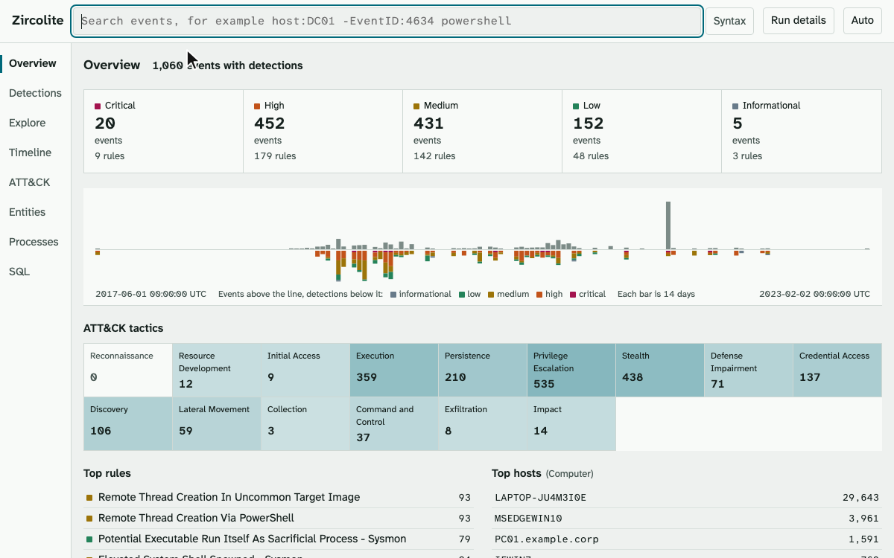

# <p align="center"></p>

## Standalone Sigma-based detection for EVTX, Auditd, Sysmon for Linux, XML, CSV and JSON logs

[](https://www.python.org/)


**Zircolite** runs [Sigma](https://github.com/SigmaHQ/sigma) rules over your logs. It
flattens events into SQLite, turns each rule into an SQL query and reports what matches,
offline, in one command.


- **Many log formats**, detected automatically: Windows EVTX (binary, XML, JSON), Auditd,
  Sysmon for Linux, EVTXtract, CSV, XML and JSON, plain or in gzip, bzip2, ZIP and 7-Zip
  archives.
- **Sigma rules as they are**: native YAML converted with pySigma, or the ready-made
  rulesets in `rules/`. Correlation rules included.
- **Fast**: a compiled flattening kernel, parallel workers and rule prefiltering; see the
  [benchmark](#benchmark).
- **Field processing**: split packed fields and run sandboxed Python transforms (Base64
  decoding, IOC extraction, LOLBin detection, …).
- **Exports**: JSON, CSV, and templates for Splunk, Elastic, OpenSearch, Timesketch, SARIF
  and ATT&CK Navigator.
- **Zircolite Viewer**: every event and detection in one zip that opens offline in a browser.

📖 Read the **[documentation](https://wagga40.github.io/Zircolite/)**, also in [`docs/`](docs).

## Install

| Route | How |
|-------|-----|
| **Standalone binary**, nothing to install | Download the zip for your platform from the [releases](https://github.com/wagga40/Zircolite/releases): Linux x64 and ARM64, macOS Apple silicon, Windows x64 and ARM64 |
| **Docker** | `docker pull wagga40/zircolite:latest` |
| **From source**, Python 3.10+ | `git clone https://github.com/wagga40/Zircolite.git && cd Zircolite && pdm install` (or `uv sync`, `poetry install`) |

Source installs compile a native flattening kernel and need a C compiler for it; without
one they fall back to a slower Python kernel. See
[Installation](docs/Usage.md#requirements-and-installation) for compiler packages, binary
details (macOS quarantine, checksums) and Docker permissions.

## Quick start

```shell
# Windows logs, with the default ruleset (rules/rules_windows_merged.json)
python3 zircolite.py --events sysmon.evtx

# Linux logs: the format is detected
python3 zircolite.py --events auditd.log --ruleset rules/rules_linux.json

# Native Sigma rules, through pySigma pipelines
python3 zircolite.py --events logs/ --ruleset ./sigma/rules/windows/process_creation \
    --pipeline sysmon --pipeline windows-logsources

# Every event and detection, for the Zircolite Viewer
python3 zircolite.py --events logs/ --package
```

With a binary, run `./Zircolite` instead of `python3 zircolite.py`. From source, prefix the
command with `pdm run` (or `uv run`, `poetry run`) unless the environment is active. With
Docker, mount the logs and give absolute paths:

```shell
docker run --rm --tty -v $PWD:/case/input:ro -v $PWD:/case/output \
    wagga40/zircolite:latest --events /case/input -o /case/output/detected_events.json
```

On a Linux host, add `--user "$(id -u):$(id -g)"` and `-l /case/output/zircolite.log`: the
image runs as an unprivileged user that cannot write to a directory you own.

Detections go to `detected_events.json`. For logs to try it on, see
[EVTX-ATTACK-SAMPLES](https://github.com/sbousseaden/EVTX-ATTACK-SAMPLES).

> [!IMPORTANT]
> The default rulesets can contain noisy or slow rules.
> [Select rules for your environment](docs/Usage.md#why-you-should-build-your-own-rulesets),
> and update them with `python3 zircolite.py -U`.

## How it works

Zircolite flattens each event into a row of an SQLite table, converts every Sigma rule into
an SQL query over that table, and reports the rows that match.



## Zircolite Viewer

`--package` writes one zip holding every event of the run, with the detections and
correlation alerts linked to them. Extract it and open `index.html`: the viewer runs offline
and offers an overview, the detections, a searchable event table, a timeline, the ATT&CK
matrix, entities, process trees and an SQL console. Share a package as you would the logs it
came from. See [Zircolite Viewer](docs/Viewer.md).



## Benchmark

Median wall time on a 10-core Apple M1 Max, each tool at its defaults with its own rules:

| Tool | 4 Sysmon EVTX, 478 MB | 8 EVTX over 11 channels, 13.3 GB |
|------|----------------------:|---------------------------------:|
| **Zircolite** | **11.6 s** | **104.8 s** |
| Hayabusa 4.1.0 | 24.7 s | 518.8 s |
| Chainsaw 2.16.0 | 113.5 s | 206.3 s |

Zircolite uses more memory than the others, through its parallel workers (`--no-parallel`
turns them off), and the rule sets differ, so detection counts do not compare. See
[Benchmark](docs/Benchmark.md) for memory, setup and how to reproduce it.

## Tutorials, references and related projects

Tutorials, written for earlier versions:

- **English**: [Sigma and Zircolite](https://holisticinfosec.io/post/2021-09-28-zircolite/), Russ McRee.
- **Spanish**: [Running Sigma rules on EVTX files](https://derechodelared.com/zircolite-ejecucion-de-reglas-sigma-en-ficheros-evtx/), César Marín.
- **French**: [Windows log investigation](https://www.it-connect.fr/zircolite-investigation-numerique-journaux-securite-windows/) and [Hack the Box challenge write-up](https://www.it-connect.fr/hack-the-box-sherlocks-tracer-solution/), IT-Connect.

References:

- [Florian Roth](https://github.com/Neo23x0/) cited Zircolite in his [**SIGMA Hall of Fame**](https://github.com/Neo23x0/Talks/blob/master/Sigma_Hall_of_Fame_20211022.pdf) at the October 2021 EU ATT&CK Workshop.
- Zircolite was cited and presented at [JSAC 2023](https://jsac.jpcert.or.jp/archive/2023/pdf/JSAC2023_workshop_sigma_jp.pdf).
- Research papers citing or using it:
  - **CIDRE Team**: [PWNJUTSU website](https://pwnjutsu.irisa.fr), [PWNJUTSU paper](https://hal.inria.fr/hal-03694719/document), [CERBERE: Cybersecurity Exercise for Red and Blue Team Entertainment, Reproducibility](https://centralesupelec.hal.science/hal-04285565/file/CERBERE_final.pdf)
  - **Universidad de la República**: [A Process Mining-Based Method for Attacker Profiling Using the MITRE ATT&CK Taxonomy](https://journals-sol.sbc.org.br/index.php/jisa/article/view/3902/2840)

Zircolite also runs inside [KAPE](https://github.com/EricZimmerman/KapeFiles/tree/master/Modules/Apps/GitHub)
and [Velociraptor](https://docs.velociraptor.app/exchange/artifacts/pages/windows.eventlogs.zircolite/).

## License

- The **code** is under the [GNU Lesser General Public License](https://www.gnu.org/licenses/lgpl-3.0.en.html).
- EVTX parsing uses [`evtx`](https://github.com/omerbenamram/pyevtx-rs) (pyevtx-rs), under the MIT or Apache-2.0 licence. Release packages list every bundled library and its licence in `THIRD_PARTY_LICENSES`.
- The **rules** keep the licence of their source, with the texts in [`rules/licenses/`](rules/licenses/): the SigmaHQ and Hayabusa rules are under the [Detection Rule License (DRL) 1.1](https://github.com/SigmaHQ/Detection-Rule-License/blob/main/LICENSE.Detection.Rules.md), the Joe Security, Micah Babinski and tsale rules under the GPL 3.0, and the mdecrevoisier rules under CC0 1.0. `rules_windows_all.json` combines them, each rule keeping its own. Release packages credit every ruleset in `THIRD_PARTY_LICENSES`.
