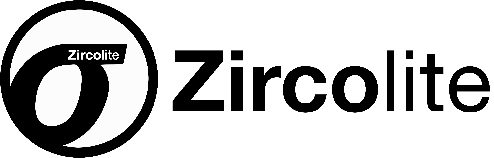

# <p align="center"></p>

## Battle-tested, standalone and fast SIGMA-based detection tool for EVTX or JSON

[](https://www.python.org/)


**Zircolite is a standalone tool written in Python 3 allowing to use SIGMA rules on Windows event logs (in EVTX and JSON format) :**

- Zircolite can be used directly on an endpoint (pseudo live-forensics) or in your forensic/detection workstation
- Zircolite was designed to be light (about 500 lines of code), simple and portable
- Zircolite is more a workflow than a real detection engine ([check here](#architecture))
- Zircolite can handle EVTX files and JSON files as long as they are in JSONL/NDJSON format (one JSON event per line). It has been successfully tested with MORDOR Datasets and NXlog files.

If you use `zircolite.py` with evtx files as input **you can only execute it on a 64 bits OS** (`evtx_dump` is 64 bits only).
Zircolite can be used directly in Python or you can use the binaries provided in release (Microsoft Windows only).

:information_source: If you want to try the tool you can test with these samples : 

- [EVTX-ATTACK-SAMPLES](https://github.com/sbousseaden/EVTX-ATTACK-SAMPLES) (EVTX Files)
- [MORDOR Datasets - APT29 Day 1](https://github.com/OTRF/mordor/blob/master/datasets/large/apt29/day1/apt29_evals_day1_manual.zip) (JSONL Files)
- [MORDOR Datasets - APT29 Day 2](https://github.com/OTRF/mordor/blob/master/datasets/large/apt29/day2/apt29_evals_day2_manual.zip) (JSONL Files)
- [MORDOR Datasets - APT3 Scenario 1](https://github.com/OTRF/mordor/blob/master/datasets/large/windows/apt3/caldera_attack_evals_round1_day1_2019-10-20201108.tar.gz) (JSONL Files)
- [MORDOR Datasets - APT3 Scenario 2](https://github.com/OTRF/mordor/blob/master/datasets/large/windows/apt3/empire_apt3.tar.gz) (JSONL Files)

## Requirements

### Mandatory

* [Evtx_dump](https://github.com/omerbenamram/evtx) : The tool is provided if you clone the repo. You can download also the tool directly on the official repository : [here](https://github.com/omerbenamram/evtx). In order to use it with Zircolite you must put it in the [bin](bin/) directory and name it accordingly to the following array :

    | Tool             | Windows             | MacOS          | Linux           |
    |------------------|---------------------|----------------|-----------------|
    | evtx_dump        | evtx\_dump\_win.exe | evtx\_dump\_mac| evtx\_dump\_lin |

### Optional

To enhance Zircolite experience, you can use the following third party Python libraries : **tqdm**, **colorama**, **jinja2**. You can install them with : `pip3 install -r requirements.txt`

## Quick start

Help is available with `zircolite.py -h`. If your evtx files have the extension ".evtx" :

```shell
python3 zircolite.py --evtx <EVTX folder> --ruleset <Converted Sigma rules>
python3 zircolite.py --evtx ../Logs --ruleset rules/rules_windows_sysmon.json
```

## Advanced use

### File filters

Some EVTX files are not used by SIGMA rules but can become quite large (`Microsoft-Windows-SystemDataArchiver%4Diagnostic.evtx` etc.), if you use Zircolite with directory as input argument, all EVTX files will be converted, saved and matched against the SIGMA Rules. 

To speed up the detection process, you may want to use Zircolite on files matching or not matching a specific pattern. For that you can use **filters** provided by the two command line arguments :

- `-s` or `--select` : select files partly matching the provided a string (case insensitive)
- `-a` or `--avoid` : exclude files partly matching the provided a string (case insensitive)

```shell
# Only use EVTX files that contains "sysmon" in their names
python3 zircolite.py --evtx logs/ --ruleset rules/rules_windows_sysmon.json --select sysmon

# Exclude "Microsoft-Windows-SystemDataArchiver%4Diagnostic.evtx" 
python3 zircolite.py --evtx logs/ --ruleset rules/rules_windows_sysmon.json --avoid systemdataarchiver

# Only use EVTX files with "operational" in their names but exclude "defender" related logs
python3 zircolite.py --evtx logs/ --ruleset rules/rules_windows_sysmon.json \
--select operational --avoid defender

```

For example, the **Sysmon** ruleset available in the `rules` directory only use the following channels (names have been shortened) : *Sysmon, Security, System, Powershell, Defender, AppLocker, DriverFrameworks, Application, NTLM, DNS, MSexchange, WMI-activity, TaskScheduler*. So if you use the sysmon ruleset with the following rules, you should speed up `Zircolite`execution : 

```shell
python3 zircolite.py --evtx logs/ --ruleset rules/rules_windows_sysmon.json \
--select sysmon --select security.evtx --select system.evtx \
--select application.evtx --select Windows-NTLM --select DNS \
--select powershell --select defender --select applocker \
--select driverframeworks --select "msexchange management" \
--select TaskScheduler --select WMI-activity
```

:information_source: the "select" argument is always applied first and then the "avoid" argument is applied. So, it is possible to exclude files from included files but not the opposite.

### Date filtering

Sometimes you want to work on a selected time range to speed up analysis. With Zircolite, it is possible to filter on specific time range just by using the `--after` and `--before` and their respective shorter versions `-A` and `-B`. The filter will apply on the `SystemTime` field of each event : 

```shell
python3 zircolite.py --evtx logs/ --ruleset rules/rules_windows_sysmon.json \ 
-A 2021-06-02T22:40:00 -B 2021-06-02T23:00:00
```

The `--after` and `--before` arguments can be used independantly.

### Rule filtering

Some rules can be noisy or slow on specific datasets (check [here](rules/Readme.md)) so it is possible to skip stop by using the `-R` or `--rulefilter` argument. The filter will apply on the rule title. Since there is a CRC32 in the rule title it is easiers to use it : 

```shell
python3 zircolite.py --evtx logs/ --ruleset rules/rules_windows_sysmon.json -R BFFA7F72
``` 

### Templating

Zircolite provides a templating system based on Jinja 2. It allows you to change the output format to suits your needs (Splunk or ELK integration, Grep-able output...). To use the template system, use these arguments :

- `--template <template_filename>`
- `--templateOutput <output_filename>`

```shell
python3 zircolite.py --evtx sample.evtx  --ruleset rules/rules_windows_sysmon.json \
--template templates/exportCSV.tmpl --templateOutput test.csv
```

It is possible to use multiple templates if you provide for each `--template` argument there is a `--templateOutput` argument associated.

### Mini-Gui


The Mini-GUI can be used totaly offline, it allows the user to display and search results. It uses [datatables](https://datatables.net/) and the [SB Admin 2 theme](https://github.com/StartBootstrap/startbootstrap-sb-admin-2). To use it you just need to generate a `data.js` file with the `exportForZircoGui.tmpl` template and move it to the [gui](gui/) directory :

```shell
python3 zircolite.py --evtx sample.evtx 
	--ruleset rules/rules_windows_sysmon.json \ 
	--template templates/exportForZircoGui.tmpl --templateOutput data.js
mv data.js gui/
```

Then you just have to open `index.html` in your favorite browser and click on a Mitre Att&ck category or an alert level.
  
:warning: **The mini-GUI was not built to handle big datasets**.

### Forward SIGMA detected events

#### Forward to a HTTP server

If you have multiple endpoints to scan, it is usefull to send the detected events to a central point. As of v1.2, Zircolite can forward detected events to an HTTP server :

```shell
python3 zircolite.py --evtx sample.evtx  --ruleset rules/rules_windows_sysmon.json \
	--remote http://address:port/uri
```
An **example** server called is available in the [tools](tools/) directory.

#### Forward to a Splunk instance via HEC

As of v1.3.5, Zircolite can forward detections to a Splunk instance with Splunk **HTTP Event Collector**.

1. Configure HEC on you Splunk instance : [check here](https://docs.splunk.com/Documentation/Splunk/8.2.0/Data/UsetheHTTPEventCollector)
2. Get you token and you are ready to go : 

```shell
python3 zircolite.py --evtx /sample.evtx  --ruleset rules/rules_windows_sysmon.json --remote https://x.x.x.x:8088 --token xxxxxxx-xxxx-xxxx-xxxx-xxxxxxxxxxxx
```

### Big EVTX files

Zircolite tries to be as fast as possible so a lot of data is stored in memory. So : 

- As of v1.0, there is no "slower" mode that use less memory. **Zircolite memory use oscillate between 2 or 3 times the size of the logs**
- It is not a good idea to use it on very big EVTX files or a large number of EVTX
- Except when `evtx_dump` is used, Zircolite only use one core. 

If you have a lot of EVTX files and their total size is big, it is recommanded that you use a script to launch multiple Zircolite instances. On Linux or macOS The easiest way is to use GNU Parallel : 

```shell
find ../Samples/EVTX-ATTACK-SAMPLES/  -type f -name "*.evtx" \
| parallel -j -1 --progress python3 zircolite.py --evtx {} \
--ruleset rules/rules_windows_sysmon.json --outfile {/.}.json
```

If you don't have find and/or GNU Parallel, you can use the **very basic** `Zircolite_mp.py` available in the [tools](tools/) directory of this repository.

### Benchmarks (**Updated 22nd May 2021**)

On an Intel Core-i9 8c/16t - 64 GB RAM - with **765 sigma rules** :

|                                                    | Monocore | Multicore  |
|----------------------------------------------------|----------|------------|
| EVTX : 34 GB - 16 files                            | -        | 9 Min      |
| EVTX : 7.8 GB - 4 files                            | -        | 162 sec    |
| EVTX : 1.7 GB - 1 file                             | 99 sec   | -          |
| EVTX : 40 MB  - 263 files                          | 3 sec    | 1 sec      |
| MORDOR Datasets - APT29 Day 1 (196 081 events)     | 62 sec   | -          |
| MORDOR Datasets - APT29 Day 2 (587 286 events)     | 4 min    | -          |
| MORDOR Datasets - APT3 Scenario 1 (101 904 events) | 70 sec   | -          |
| MORDOR Datasets - APT3 Scenario 2 (121 659 events) | 27 sec   | -          |

:information_source: These results can be largely improved with fine-tuned rulesets.

### Rules

The SIGMA rules must be converted into JSON. This can be done with the `genRules.py` script located in the repository `tools` directory. Some rules are already provided in the rules directory.

## Architecture

**Zircolite is more a workflow than a real detection engine**. To put it simply, it leverages the ability of the sigma converter to output rules in SQLite format. Zircolite simply applies SQLite-converted rules to EVTX stored in an in-memory SQLite DB.


### Project structure

```text
├── Makefile                # Only make clean works
├── Readme.md               # The file you are reading
├── bin                     # Directory containing all external binaries used by Zircolite
├── config                  # Directory containing the config files
├── pics                    # Pictures directory - not really relevant
├── rules                   # Sample rules you can use
├── templates               # Jinja2 templates
├── tools                   # Directory containing all external tools
└── zircolite.py            # Zircolite !
```

## Installation

No installation needed, if you want to run the tool on Windows without the Python interpreter check the [releases](https://github.com/wagga40/Zircolite/releases).

If you need/want to package Zircolite for standalone use, you can use [PyInstaller](https://www.pyinstaller.org/) or [Nuitka](https://nuitka.net/). An very short help is provided [here](#package-zircolite-with-pyinstaller).

### Zircolite with Docker

Zircolite is also packaged as a Docker image (cf. `wagga40/zircolite` on Docker Hub), which embeds all dependencies (e.g. `evtx_dump`) and provides a platform-independant way of using the tool.

Using Zircolite with Docker is as simple as:

```sh
docker container run --tty --volume /path/to/evtx:/case docker.io/wagga40/zircolite:1.1.4 \ 
	--ruleset rules/rules_windows_sysmon.json \
	--evtx /case --outfile /case/detected_events.json
```

This will recursively find EVTX files in the `/case` directory of the container (which is bound to the `/path/to/evtx` of the host filesystem) and write the detection events to the `/case/detected_events.json` (which finally corresponds to `/path/to/evtx/detected_events.json`).

Event if Zircolite does not alter the original EVTX files, sometimes you want to make sure that nothing will write to the original files. For these cases, you can use a read-only bind mount with the following command:

```sh
docker run --rm --tty -v /path/to/evtx:/case/input:ro -v /path/to/results:/case/output \
	docker.io/wagga40/zircolite:1.1.4 -r rules/rules_windows_sysmon.json \
	-e /case/input -o /case/output/detected_events.json
```

Since the Docker image mirrors Zircolite's repository, all options are also available in the image.

### Package Zircolite with PyInstaller

* Install Python 3.8 on the same OS as the one you want to use Zircolite on
* After Python 3.8 install, you will need PyInstaller : `pip3 install pyinstaller`
* In the root folder of Zircolite type : `pyinstaller -c --onefile zircolite.py`
* The `dist` folder will contain the packaged app

:warning: When packaging with PyInstaller some AV may not like your package.

## "Battle-tested" ?

Zircolite has been used to perform cold-analysis (in Lab) on EVTX in multiple "real-life" situations. 
However, even if Zircolite has been used many times to perform analysis directly on an Microsoft Windows endpoint, there is not yet a pipeline to thoroughly test every release.

## License

- All the **code** of the project is licensed under the [GNU Lesser General Public License](https://www.gnu.org/licenses/lgpl-3.0.en.html)
- `evtx_dump` is under the MIT license
- The rules are released under the [Detection Rule License (DRL) 1.0](https://github.com/Neo23x0/sigma/blob/master/LICENSE.Detection.Rules.md)
