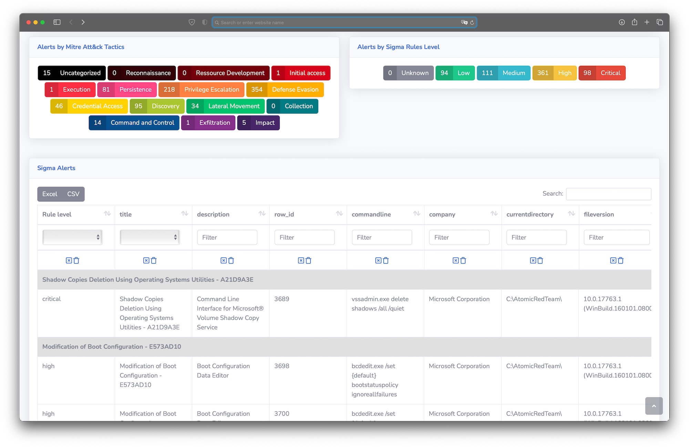
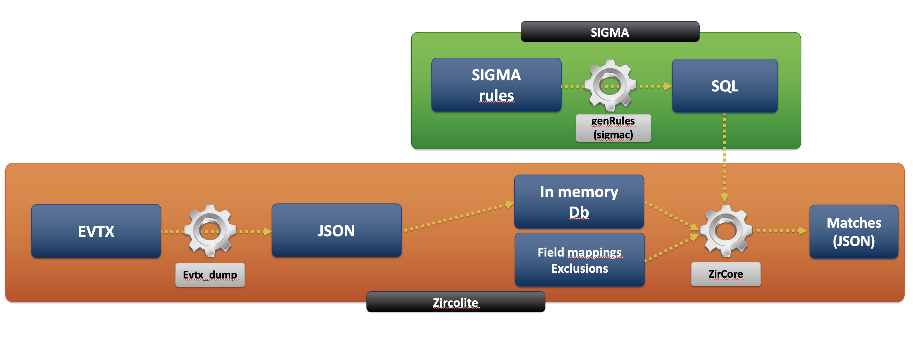

# Zircolite
## Battle-tested, standalone and fast SIGMA-based detection tool for EVTX or JSON

[](https://www.python.org/)


### CLI


**Zircolite is a standalone tool written in Python 3 allowing to use SIGMA rules on Windows EVTX logs. It can be used directly on an endpoint (pseudo live-forensics) or in your forensic/detection workstation.** Zircolite is light (less than 500 lines of code) and simple.

For now, `evtx_dump` is 64 bits only so if you use `zircolite.py` with evtx files as input **you can only execute it on a 64 bits OS.**

Zircolite can be used directly in Python or you can use the binaries provided in released (Microsoft Windows only).

### Mini-GUI



## Requirements 

### Mandatory

* [Evtx_dump](https://github.com/omerbenamram/evtx) : The tool is provided if you clone the repo. If you want to be sure of what you execute, you can download the tool directly on the official repository : [here](https://github.com/omerbenamram/evtx). In order to use it with Zircolite you must put it in the `bin` directory. The file must be named accordingly to the following array : 

	| Tool             | Windows             | MacOS          | Linux           |
	|------------------|---------------------|----------------|-----------------|
	| evtx_dump        | evtx\_dump\_win.exe | evtx\_dump\_mac| evtx\_dump\_lin | 
	
### Optional

To enhance Zircolite experience, you can use the following third party Python libraries : **tqdm**, **colorama**, **jinja2**. You can install them with : `pip3 install -r requirements.txt`  

## Quick start

If your evtx files have the extension ".evtx" : 

```shell
python3 zircolite.py --evtx <EVTX folder> --ruleset <Converted Sigma rules>
python3 zircolite.py --evtx ../Logs --ruleset rules/rules_medium_sysmon.json
```

Other arguments are described when using : `zircolite.py -h`. Relevant **optional** arguments are : 

- `--config [configuration file]` : JSON File containing field mappings and exclusions
- `--fileext` : Allows to customize the evtx file extension (some tools like to change the extension)

:warning: Zircolite puts a lot of data in memory, if you want to use it with a lot of logs please check the "Advanced" section.

## Advanced use

### Templating

Zircolite provides a templating system based on Jinja 2. It allows you to change the output format to suits your needs (Splunk or ELK integration, Grep-able output...).

To use the template system, use these arguments : 

- `--template <template_filename>`
- `--templateOutput <output_filename>`

```shell
python3 zircolite.py --evtx example.evtx  --ruleset rules/rules_windows_sysmon.json \
--template templates/exportCSV.tmpl \
--templateOutput test.csv --template templates/exportForSplunk.tmpl
```

It is possible to use multiple templates if you provide as long as for each `--template` argument there is a `--templateOutput` argument associated.

:warning: Use of templating can slow Zircolite. Templating is not supported with `zircolite_mp.py`.

### Mini-Gui

A mini-GUI screenshot is available at the beggining of this Read Me. The Mini-GUI can be used totaly offline, it allows the user to display results in a visual friendly and searchable. It uses [datatables](https://datatables.net/) and the [SB Admin 2 theme](https://github.com/StartBootstrap/startbootstrap-sb-admin-2).

To use it you just need to generate a `data.js` file with the `exportForZircoGui.tmpl`template and move it to the `gui` directory : 

```shell
python3 zircolite.py \
			--evtx ../EVTX-ATTACK-SAMPLES/ \
			--ruleset rules/rules_medium_sysmon_performance_v3.json \ 
			--template templates/exportForZircoGui.tmpl \ 
			--templateOutput data.js
mv data.js gui/

```

Then you just have to open `index.html` in your favorite browser and click on a Mitre Att&ck category or an alert level.

:warning: The mini-GUI was not build to handle very big datasets.

### Big EVTX files

Even if it is written in Python, Zircolite tries to be as fast as possible so a lot of data is stored in memory. As of v1.0, there is no "slower" mode that use less memory. Zircolite memory use oscillate between 2 or 4 times the size of the logs, so it is not a good idea to use it on very big EVTX files or a large number of EVTX. Moreover, Except when `evtx_dump` is used, Zircolite only use one core. If you have a lot of EVTX files and the total size is big, it is recommanded that you use a script to launch multiple Zircolite instances. By the way, a very basic one is provided in this repository : `Zircolite_mp.py`.

`zircolite_mp.py` is a tool that leverages multiple cores to launch multiple Zircolite instances to speed up the analysis. It is pretty much like `GNU Parallel`. All cores can be used, but it is better to leave one or two cores unused. `zircolite_mp.py` needs data to be organised accordingly to the following directory tree : 

```console
CASE
├── COMPUTER-DC-01
│   ├── *.evtx
├── COMPUTER-DC-02
│   ├── *.evtx
├── WORKSTATION_WIN10_01
│   ├── *.evtx
├── WORKSTATION_WIN10_02
│   ├── *.evtx
├── ...
```
To launch `zircolite_mp.py` :

```
# 1 core "--monore" or "--core 1"
python3 zircolite.py --evtx ../Logs --ruleset rules/rules_medium_generic.json --monocore
# All cores "--core all" (default)
python3 zircolite.py --evtx ../Logs --ruleset rules/rules_medium_generic.json --core all
# 4 cores
python3 zircolite.py --evtx ../Logs --ruleset rules/rules_medium_generic.json --core 4

```
:warning: For now, `evtx_dump` will use all CPU cores, this will be changed in future versions.

### Benchmarks

On an Intel Core-i9 8c/16t - 64 Go RAM : 

|                            | Monocore | Multicore  |
|----------------------------|----------|------------|
| EVTX : 34 Go - 16 folders  | -        | 12 Min     |
| EVTX : 3,4 Go - 9 folders  | -        | 3 Min      |
| EVTX : 1,2 Go - 6 folders  | 11 Min   | 1 Min 30 s |
| EVTX : 40 Mo  - 2 folders  | 3 s      | 1 s        |

### Rules

The SIGMA rules must be converted into JSON. This can be done with the `genRules.py` script located in the repository `tools` directory (check the Read Me in the directory). Some rules are already provided.

## Architecture

**Zircolite is more a workflow than a real detection engine**. To put it simply, it leverages the ability of the sigma converter to output rules in SQLite format. Zircolite simply applies SQLite-converted rules to EVTX stored in an in-memory SQLite DB.



### Project structure

```text
├── Makefile                # Only make clean works
├── Readme.md               # The file you are reading  
├── bin                     # Directory containing all external binaries used in Zircolite
├── config                  # Directory containing the config files
│   └── fieldMappings.json  # File containing the field mappings and exclusions
├── pics                    # Pictures directory - not really relevant
├── rules                   # Sample rules you can use
├── templates               # Jinja2 templates
├── tools                   # Directory containing all external tools
│   ├── config              # Sysmon config file for Sigmac
│   └── genRules.py         # genRules allows to generate rules in JSON for Zircolite
└── zircolite.py            # Zircolite !
```

## Installation

No installation needed. If you need to package it for standalone use on a computer use [PyInstaller](https://www.pyinstaller.org/) or [Nuitka](https://nuitka.net/).

### How to package Zircolite

#### PyInstaller

* Install Python 3.8 on the same OS as the one you want to use Zircolite on
* After Python 3.8 install, you will need PyInstaller : `pip3 install pyinstaller`
* In the root folder of Zircolite type : `pyinstaller -c --onefile zircolite.py`
* The `dist` folder will contain the packaged app 

:warning: When packaging with PyInstaller some AV may not like your package... Check [here](https://twitter.com/cyb3rops/status/1366011127801516035).

#### Nuitka

* Even if I'm am not using it for now, it is possible and pretty straightforward to package Zircolite with Nuitka. Refer to Nuitka docs to know how to proceed.

## "Battle-tested" ?

Zircolite has been used to perform cold-analysis on EVTX in multiple "real-life" situations. It also has been used directly on endpoints to perform live forensics but these were not real-life scenarios.

## License

- All the code of the project 
- `evtx_dump` is under the MIT license
- The rules are released under the [Detection Rule License (DRL) 1.0](https://github.com/Neo23x0/sigma/blob/master/LICENSE.Detection.Rules.md)
