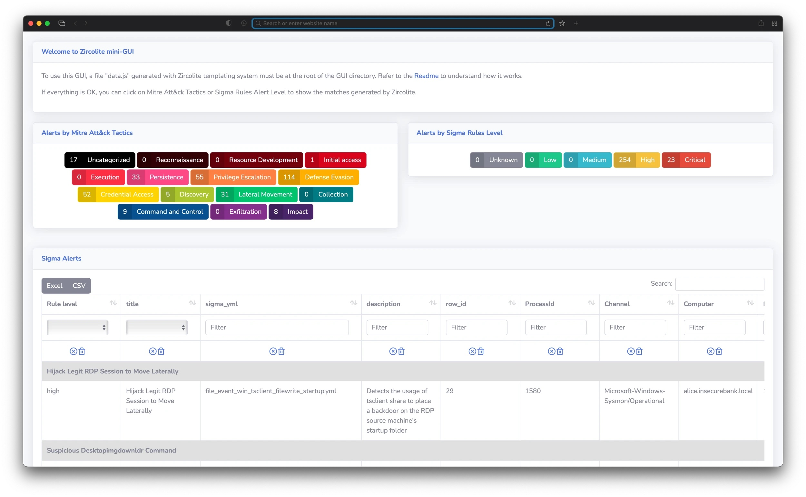

# Advanced use

## Working with large datasets

Zircolite tries to be as fast as possible so a lot of data is stored in memory. So : 

- **Zircolite memory use oscillate between 2 or 3 times the size of the logs**
- It is not a good idea to use it on very big EVTX files or a large number of EVTX **as is**

There are a lot of ways to speed up Zircolite :

- Using as much CPU core as possible : see below "[Using GNU Parallel](using-gnu-parallel)"
- Using [Filtering](#filtering)

> [!NOTE]  
> There is an option to heavily limit the memory usage of Zircolite by using the `--ondiskdb <DB_NAME>` argument. This is only usefull to avoid errors when dealing with very large datasets and if you have have a lot of time... **This should be used with caution and the below alternatives are far better choices**.

### Using GNU Parallel 

Except when `evtx_dump` is used, Zircolite only use one core. So if you have a lot of EVTX files and their total size is big, it is recommended that you use a script to launch multiple Zircolite instances. On Linux or MacOS The easiest way is to use **GNU Parallel**. 

> [!NOTE]  
> On MacOS, please use GNU find (`brew install find` will install `gfind`)

- **"DFIR Case mode" : One directory per computer/endpoint**

	This mode is very useful when you have a case where all your evidences is stored per computer (one directory per computer containing all EVTX for this computer). It will create one result file per computer in the current directory.

	```shell
	find <CASE_DIRECTORY> -maxdepth 1 -mindepth 1 -type d | \
		parallel --bar python3 zircolite.py -e {} \
		-r rules/rules_windows_sysmon_pysigma.json --outfile {/.}.json
	```
	
	One downside of this mode is that if you have less computer evidences than CPU Cores, they all will not be used.

- **"WEF/WEC mode" : One zircolite instance per EVTX**

	You can use this mode when you have a lot of aggregated EVTX coming from multiple computers. It is generally the case when you use WEF/WEC and you recover the EVTX files from the collector. This mode will create one result file per EVTX.

	```shell
	find <CASE_DIRECTORY> -type f -name "*.evtx" \
		parallel -j -1 --progress python3 zircolite.py -e {} \
		-r rules/rules_windows_sysmon_pysigma.json --outfile {/.}.json
	```
	
	In this example the `-j -1` is for using all cores but one. You can adjust the number of used cores with this arguments.

## Keep data used by Zircolite

**Zircolite** has a lot of arguments that can be used to keep data used to perform Sigma detections : 

- `--dbfile <FILE>` allows you to export all the logs in a SQLite 3 database file. You can query the logs with SQL statements to find more things than what the Sigma rules could have found
- `--keeptmp` allows you to keep the source logs (EVTX/Auditd/Evtxtract/XML...) converted in JSON format
- `--keepflat` allow you to keep the source logs (EVTX/Auditd/Evtxtract/XML...) converted in a flattened JSON format

## Filtering

Zircolite has a lot of filtering options to speed up the detection process. Don't overlook these options because they can save you a lot of time.

### File filters

Some EVTX files are not used by SIGMA rules but can become quite large (a good example is `Microsoft-Windows-SystemDataArchiver%4Diagnostic.evtx`), if you use Zircolite with a directory as input argument, all EVTX files will be converted, saved and matched against the SIGMA Rules. 

To speed up the detection process, you may want to use Zircolite on files matching or not matching a specific pattern. For that you can use **filters** provided by the two command line arguments :

- `-s` or `--select` : select files partly matching the provided a string (case insensitive)
- `-a` or `--avoid` : exclude files partly matching the provided a string (case insensitive)

> [!NOTE]  
> When using the two arguments, the "select" argument is always applied first and then the "avoid" argument is applied. So, it is possible to exclude files from included files but not the opposite.

- Only use EVTX files that contains "sysmon" in their names

	```shell
	python3 zircolite.py --evtx logs/ --ruleset rules/rules_windows_sysmon_pysigma.json \
		--select sysmon
	```
- Exclude "Microsoft-Windows-SystemDataArchiver%4Diagnostic.evtx" 

	```shell
	python3 zircolite.py --evtx logs/ --ruleset rules/rules_windows_sysmon_pysigma.json \
		--avoid systemdataarchiver
	```

- Only use EVTX files with "operational" in their names but exclude "defender" related logs
	
	```shell
	python3 zircolite.py --evtx logs/ --ruleset rules/rules_windows_sysmon_pysigma.json \
	--select operational --avoid defender
	```

For example, the **Sysmon** ruleset available in the `rules` directory only use the following channels (names have been shortened) : *Sysmon, Security, System, Powershell, Defender, AppLocker, DriverFrameworks, Application, NTLM, DNS, MSexchange, WMI-activity, TaskScheduler*. 

So if you use the sysmon ruleset with the following rules, it should speed up `Zircolite`execution : 

```shell
python3 zircolite.py --evtx logs/ --ruleset rules/rules_windows_sysmon_pysigma.json \
	--select sysmon --select security.evtx --select system.evtx \
	--select application.evtx --select Windows-NTLM --select DNS \
	--select powershell --select defender --select applocker \
	--select driverframeworks --select "msexchange management" \
	--select TaskScheduler --select WMI-activity
```

### Time filters

Sometimes you only want to work on a specific timerange to speed up analysis. With Zircolite, it is possible to filter on a specific timerange just by using the `--after` and `--before` and their respective shorter versions `-A` and `-B`. Please note that : 

-  The filter will apply on the `SystemTime` field of each event
-  The `--after` and `--before` arguments can be used independently
-  The timestamps provided must have the following format : YYYY-MM-DD**T**HH:MM:SS (hours are in 24h format)

Examples : 

- Select all events between the 2021-06-02 22:40:00 and 2021-06-02 23:00:00 : 

	```shell
	python3 zircolite.py --evtx logs/ --ruleset rules/rules_windows_sysmon_pysigma.json \
		-A 2021-06-02T22:40:00 -B 2021-06-02T23:00:00
	```

- Select all events after the 2021-06-01 12:00:00 : 

	```shell
	python3 zircolite.py --evtx logs/ --ruleset rules/rules_windows_sysmon_pysigma.json \
		-A 2021-06-01T12:00:00
	```

### Rule filters

Some rules can be noisy or slow on specific datasets (check [here](https://github.com/wagga40/Zircolite/tree/master/rules/README.md)) so it is possible to skip them by using the `-R` or `--rulefilter` argument. This argument can be used multiple times.

The filter will apply on the rule title. To avoid unexpected side-effect **comparison is case-sensitive**. For example, if you do not want to use all MSHTA related rules : 

```shell
python3 zircolite.py --evtx logs/ \
	--ruleset rules/rules_windows_sysmon_pysigma.json \
	-R MSHTA
```

### Limit the number of detected events

Sometimes, SIGMA rules can be very noisy (and generate a lot of false positives) but you still want to keep them in your rulesets. It is possible to filter rules that returns too mich detected events with the option `--limit <MAX_NUMBER>`. **Please note that when using this option, the rules are not skipped the results are just ignored** but this is useful when forwarding events to Splunk.

## Forwarding detected events 

> [!WARNING]  
> Forwarding is DEPRECATED and will likely be disabled in a future release

Zircolite provide multiple ways to forward events to a collector : 

- the HTTP forwarder : this is a very simple forwarder and pretty much a **"toy"** example and should be used when you have nothing else. An **example** server called is available in the [tools](../tools/zircolite_server/) directory
- the Splunk HEC Forwarder : it allows to forward all detected events to a Splunk instance using **HTTP Event Collector**
- the ELK ES client : it allows to forward all detected events to an ELK instance

There are two modes to forward the events : 

- By default all events are forwarded after the detection process
- The argument `--stream` allow to forward events during the detection process

If you forward your events to a central collector you can disable local logging with the Zircolite `--nolog` argument.

### Forward events to a HTTP server

If you have multiple endpoints to scan, it is useful to send the detected events to a central collector. As of v1.2, Zircolite can forward detected events to an HTTP server :

```shell
python3 zircolite.py --evtx sample.evtx  --ruleset rules/rules_windows_sysmon_pysigma.json \
	--remote "http://address:port/uri"
```
An **example** server called is available in the [tools](https://github.com/wagga40/Zircolite/tree/master/tools/zircolite_server/) directory.

### Forward events to a Splunk instance via HEC

As of v1.3.5, Zircolite can forward detections to a Splunk instance with Splunk **HTTP Event Collector**.

1. Configure HEC on you Splunk instance : [check here](https://docs.splunk.com/Documentation/Splunk/8.2.0/Data/UsetheHTTPEventCollector)
2. Get your token and you are ready to go : 

```shell
python3 zircolite.py --evtx /sample.evtx  --ruleset rules/rules_windows_sysmon_pysigma.json \
	--remote "https://x.x.x.x:8088" --token "xxxxxxx-xxxx-xxxx-xxxx-xxxxxxxxxxxx" \
	[--index myindex]
```

Since Splunk HEC default to the first associated index, `--index` is optional but can be used to specify the choosen index among the available ones.

> [!WARNING]  
> On Windows do not forget to put quotes

### Forward to ELK

As of version 2.8.0, Zircolite can forward events to an ELK stack using the ES client.

```shell
python3 zircolite.py --evtx /sample.evtx  --ruleset rules/rules_windows_sysmon_pysigma.json \
	--remote "https://x.x.x.x:8088" --index "zircolite-whatever" \
	--eslogin "yourlogin" --espass "yourpass"
```

> [!NOTE]  
> the `--eslogin` and `--espass` arguments are optional.

> [!WARNING]  
> **Elastic is not handling logs the way Splunk does. Since Zircolite is flattening the field names in the JSON output some fields, especially when working with EVTX files, can have different types between Channels, logsources etc. So when Elastic uses automatic field mapping, mapping errors may prevent events insertion into Elastic.**

#### No local logs

When you forward detected events to an server, sometimes you don't want any log file left on the system you have run Zircolite on. It is possible with the `--nolog` option.

### Forwarding all events 

Zircolite is able to forward all events and not just the detected events to Splunk, ELK or a custom HTTP Server. you just to use the `--forwardall` argument. Please note that this ability forward events as JSON and not specific  `Windows` sourcetype.

> [!WARNING]  
> **Elastic is not handling logs the way Splunk does. Since Zircolite is flattening the field names in the JSON output some fields, especially when working with EVTX files, can have different types between Channels, logsources etc. So when Elastic uses automatic field mapping, mapping errors may prevent events insertion into Elastic.**

## Templating and Formatting

Zircolite provides a templating system based on Jinja 2. It allows you to change the output format to suits your needs (Splunk or ELK integration, Grep-able output...). There are some templates available in the [Templates directory](https://github.com/wagga40/Zircolite/tree/master/templates) of the repository : Splunk, Timesketch, ... To use the template system, use these arguments :

- `--template <template_filename>`
- `--templateOutput <output_filename>`

```shell
python3 zircolite.py --evtx sample.evtx  --ruleset rules/rules_windows_sysmon_pysigma.json \
--template templates/exportForSplunk.tmpl --templateOutput exportForSplunk.json
```

It is possible to use multiple templates if you provide for each `--template` argument there is a `--templateOutput` argument associated.

## Mini-GUI




The Mini-GUI can be used totally offline, it allows the user to display and search results. It uses [datatables](https://datatables.net/) and the [SB Admin 2 theme](https://github.com/StartBootstrap/startbootstrap-sb-admin-2). 

### Automatic generation

As of Zircolite 2.1.0, the easier way to use the Mini-GUI is to generate a package with the `--package` option. A zip file containing all the necessary data will be generated at the root of the repository.  

### Manual generation

You need to generate a `data.js` file with the `exportForZircoGui.tmpl` template, decompress the zircogui.zip file in the [gui](https://github.com/wagga40/Zircolite/tree/master/gui/) directory and replace the `data.js` file in it with yours :

```shell
python3 zircolite.py --evtx sample.evtx 
	--ruleset rules/rules_windows_sysmon_pysigma.json \
	--template templates/exportForZircoGui.tmpl --templateOutput data.js
7z x gui/zircogui.zip
mv data.js zircogui/
```

Then you just have to open `index.html` in your favorite browser and click on a Mitre Att&ck category or an alert level.
  
> [!WARNING]  
> **The mini-GUI was not built to handle big datasets**.

## Packaging Zircolite 

### PyInstaller

* Install Python 3.8 on the same OS as the one you want to use Zircolite on
* Install all dependencies : `pip3 install -r requirements.txt`
* After Python 3.8 install, you will need PyInstaller : `pip3 install pyinstaller`
* In the root folder of Zircolite type : `pyinstaller -c --onefile zircolite.py`
* The `dist` folder will contain the packaged app

### Nuitka

* Install Python 3.8 on the same OS as the one you want to use Zircolite on
* Install all dependencies : `pip3 install -r requirements.txt`
* After Python 3.8 install, you will need Nuitka : `pip3 install nuitka`
* In the root folder of Zircolite type : `python3 -m nuitka --onefile zircolite.py`

> [!WARNING]  
> When packaging with PyInstaller or Nuitka some AV may not like your package.

## Using With DFIR Orc

**DFIR Orc** is a Forensics artefact collection tool for systems running Microsoft Windows (pretty much like [Kape](https://www.kroll.com/en/services/cyber-risk/incident-response-litigation-support/kroll-artifact-parser-extractor-kape) or [artifactcollector](https://forensicanalysis.github.io/documentation/manual/usage/acquisition/)). For more detailed explanation, please check here : [https://dfir-orc.github.io](https://dfir-orc.github.io).

[ZikyHD](https://github.com/ZikyHD) has done a pretty good job at integrating **Zircolite** with **DFIR Orc** in this repository : [https://github.com/Zircocorp/dfir-orc-config](https://github.com/Zircocorp/dfir-orc-config).

Basically, if you want to integrate Zircolite with **DFIR Orc** : 

- Clone the [DFIR Orc Config repository](https://github.com/DFIR-ORC/dfir-orc-config) : `git clone https://github.com/Zircocorp/dfir-orc-config.git`
- Create a `DFIR-ORC_config.xml` (or add to an existing one) in the `config` directory containing : 

```xml
<?xml version="1.0" encoding="utf-8"?>
<wolf childdebug="no" command_timeout="1200">
    <log disposition="truncate">DFIR-ORC_{SystemType}_{FullComputerName}_{TimeStamp}.log</log>
    <outline disposition="truncate">DFIR-ORC_{SystemType}_{FullComputerName}_{TimeStamp}.json
    </outline>
    
    <!-- BEGIN ZIRCOLITE SPECIFIC CONFIGURATION-->
    <!-- This part creates a specific archive for Zircolite -->
    <archive name="DFIR-ORC_{SystemType}_{FullComputerName}_Zircolite.7z" 
             keyword="Zircolite" concurrency="1" 
             repeat="Once" 
             compression="fast" 
             archive_timeout="120" >
        <restrictions ElapsedTimeLimit="480" />
        <command keyword="GetZircoliteSysmon" winver="6.2+">
            <execute name="zircolite_win10_nuitka.exe" 
                     run="7z:#Tools|zircolite_win10_nuitka.exe"/>
            <input  name='rules_windows_generic.json' 
                    source='res:#rules_windows_generic.json' 
                    argument='-r {FileName}' />
            <input  name='fieldMappings.json' 
                    source='res:#fieldMappings.json' 
                    argument='-c {FileName}' />
            <argument> --cores 1 --noexternal -e C:\windows\System32\winevt\Logs</argument>
            <output  name="detected_events.json" source="File" argument="-o {FileName}" />
            <output  name="zircolite.log" source="File" argument="-l {FileName}" />
        </command>
    </archive>
    <!-- /END ZIRCOLITE SPECIFIC CONFIGURATION-->
    
</wolf>
```

> [!NOTE]  
> Please note that if you add this configuration to an existing one, you only need to keep the part between `<!-- BEGIN ... -->` and `<!-- /END ... -->` blocks.

-  Put your custom or default mapping file `zircolite_win10_nuitka.exe ` (the default one is in the Zircolite repository `config` directory)   `rules_windows_generic.json` (the default one is in the Zircolite repository `rules` directory) in the the `config` directory.

- Put **Zircolite** [binary](https://github.com/wagga40/Zircolite/releases) (in this example `zircolite_win10_nuitka.exe`) and **DFIR Orc** [binaries](https://github.com/DFIR-ORC/dfir-orc/releases) (x86 and x64) in the the `tools` directory.

- Create a `DFIR-ORC_Embed.xml` (or add to an existing one) in the `config` directory containing : 

```xml
<?xml version="1.0" encoding="utf-8"?>
<toolembed>
	<input>.\tools\DFIR-Orc_x86.exe</input>
	<output>.\output\%ORC_OUTPUT%</output>

	<run64 args="WolfLauncher" >7z:#Tools|DFIR-Orc_x64.exe</run64>
	<run32 args="WolfLauncher" >self:#</run32>

	<file name="WOLFLAUNCHER_CONFIG" 
	      path=".\%ORC_CONFIG_FOLDER%\DFIR-ORC_config.xml"/>
	
    <!-- BEGIN ZIRCOLITE SPECIFIC CONFIGURATION-->
	<file name="rules_windows_generic.json" 
	      path=".\%ORC_CONFIG_FOLDER%\rules_windows_generic.json" />
	<file name="fieldMappings.json" 
	      path=".\%ORC_CONFIG_FOLDER%\fieldMappings.json" />
	<!-- /END ZIRCOLITE SPECIFIC CONFIGURATION-->

    <archive name="Tools" format="7z" compression="Ultra">
		<file name="DFIR-Orc_x64.exe" 
		      path=".\tools\DFIR-Orc_x64.exe"/>
		
		<!-- BEGIN ZIRCOLITE SPECIFIC CONFIGURATION-->
		<file name="zircolite_win10_nuitka.exe" 
		      path=".\tools\zircolite_win10_nuitka.exe"/>
		<!-- /END ZIRCOLITE SPECIFIC CONFIGURATION-->
		
	</archive>
</toolembed>
```
> [!NOTE]  
> Please note that if you add this configuration to an existing one, you only need to keep the part between `<!-- BEGIN ... -->` and `<!-- /END ... -->` blocks.

- Now you need to generate the **DFIR Orc** binary by executing `.\configure.ps1` at the root of the repository
- The final output will be in the `output` directory

## Other tools 

Some other tools (mostly untested) have included a way to run Zircolite : 

- [Kape](https://www.kroll.com/en/services/cyber-risk/incident-response-litigation-support/kroll-artifact-parser-extractor-kape) has a module for Zircolite : [here](https://github.com/EricZimmerman/KapeFiles/tree/master/Modules/Apps/GitHub)
- [Velociraptor](https://github.com/Velocidex/velociraptor) has an artifact for Zircolite : [here](https://docs.velociraptor.app/exchange/artifacts/pages/windows.eventlogs.zircolite/)
