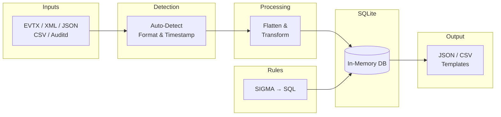
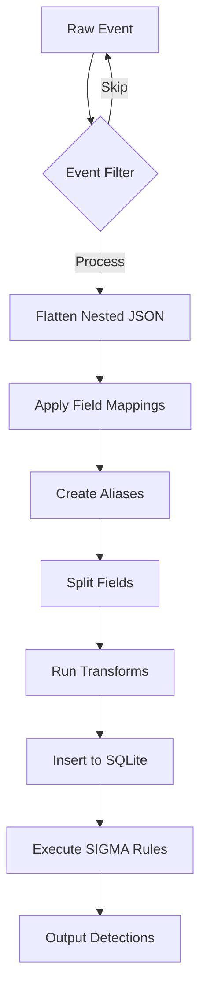
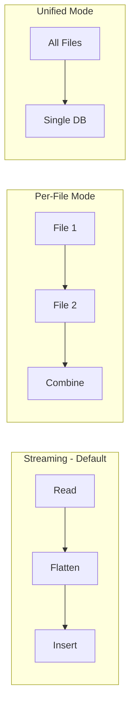
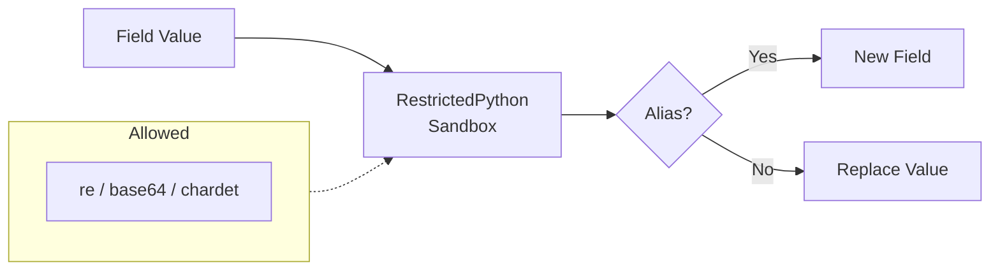
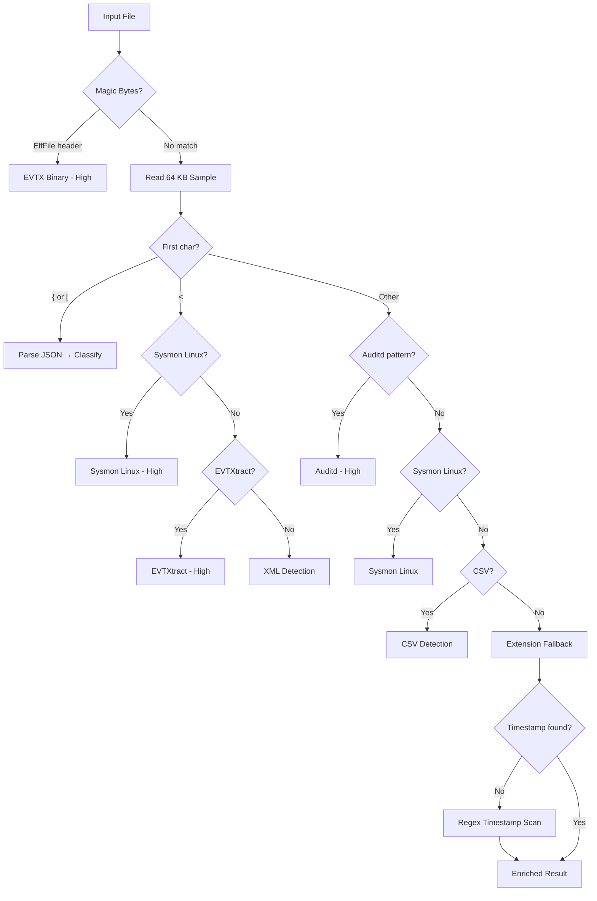

# Internals

## Zircolite Architecture

**Zircolite is more a workflow than a real detection engine.** To put it simply, it leverages the ability of the Sigma converter to output rules in SQLite format. Zircolite simply applies SQLite-converted rules to EVTX logs stored in an in-memory SQLite database.

### High-Level Flow



### Event Processing Pipeline



### Field Processing Details

| Stage | Description | Example |
|-------|-------------|---------|
| **1. Filter** | Skip events not matching any rule | Channel/EventID check |
| **2. Flatten** | Nested → flat structure | `Event.System.Channel` → `Channel` |
| **3. Mappings** | Rename fields | `Event.EventData.CommandLine` → `CommandLine` |
| **4. Aliases** | Duplicate fields with new names | `CommandLine` → `cmdline` |
| **5. Splits** | Parse key=value strings | `"a=1 b=2"` → `{a:1, b:2}` |
| **6. Transforms** | Custom Python code (sandboxed) | Extract filename from path |

### Processing Modes



**Mode Selection:**
- **Streaming** (default): Single-pass, no intermediate files
- **Per-File**: Separate DB per file, enables parallel processing
- **Unified**: All files in one DB, enables cross-file correlation

### Transform System



**Transform capabilities:**
- Regex extraction (`re` module)
- Base64 encoding/decoding
- Character encoding detection
- Custom logic in sandboxed Python

### Log Type Detection

Zircolite includes an automatic log type detection system (`LogTypeDetector` in `detector.py`) that analyzes input files to determine their format, log source, and timestamp field before processing begins.

#### Detection Pipeline



#### JSON Event Classification

When JSON content is detected, the classifier inspects the parsed event structure:

| Check | Log Source | Confidence |
|-------|-----------|------------|
| `Event.System.Channel` in Sysmon channels | `sysmon_windows` | High |
| `Event.System.Channel`/`EventID` present | `windows_evtx_json` | High |
| Top-level `Channel` + `EventID` | `windows_evtx_json` (pre-flattened) | High |
| `@timestamp` or `winlog` structure | `ecs_elastic` | High/Medium |
| `type` field with auditd value | `auditd` | High |
| 3+ Sysmon fields (RuleName, ProcessGuid, etc.) | `sysmon_windows` | Medium |
| Generic with detected timestamp | `generic_json` | Medium |
| Generic without timestamp | `generic_json` | Low |

#### Timestamp Detection Strategy

1. **Known field names** (priority order): `SystemTime`, `UtcTime`, `TimeCreated`, `@timestamp`, `timestamp`, etc.
2. **Heuristic scoring**: All event fields are scored by name relevance and value format.
3. **Regex fallback**: Raw file content is scanned for timestamp patterns (ISO 8601, syslog, epoch, US date-time, Windows FileTime) and matched back to JSON keys when possible.

### Core Components

Zircolite is built around several key classes, organized in the `zircolite/` package:

- **LogTypeDetector** (`detector.py`): Automatic log format and timestamp detection. Analyzes magic bytes, content structure, and file extension to determine the input type and log source.
- **ZircoliteCore** (`core.py`): The main detection engine that manages the SQLite database, loads rulesets, and executes detection rules.
- **ZircoliteConsole** (`console.py`): Rich-based terminal output with styled messages, progress bars, live detection counters, detection results tables, summary panels, MITRE ATT&CK coverage panels, terminal hyperlinks, post-run suggestions, file tree views, and quiet mode support.
- **StreamingEventProcessor** (`streaming.py`): Single-pass processor for efficient event extraction, flattening, and database insertion.
- **JSONFlattener** (`flattener.py`): Processes and flattens JSON log events, applies field mappings, aliases, splits, and transforms.
- **EvtxExtractor** (`extractor.py`): Converts various log formats (EVTX, XML, Auditd, Sysmon for Linux, CSV) to JSON.
- **RulesetHandler** (`rules.py`): Manages ruleset loading and conversion, including native Sigma (YAML) to Zircolite format (JSON) conversion using pySigma.
- **RulesUpdater** (`rules.py`): Downloads and updates rulesets from the Zircolite-Rules-v2 repository.
- **TemplateEngine** (`templates.py`): Generates output using Jinja2 templates.
- **ZircoliteGuiGenerator** (`templates.py`): Creates the Mini-GUI package for result visualization.
- **MemoryTracker** (`utils.py`): Monitors and reports memory usage during execution.
- **MemoryAwareParallelProcessor** (`parallel.py`): Handles parallel file processing with memory awareness and adaptive worker scaling.
- **ConfigLoader** (`config_loader.py`): Loads and validates YAML configuration files, merges with CLI arguments.

### Processing Flow

Zircolite supports multiple processing modes that are automatically selected based on workload analysis:

#### Automatic Mode Selection

When processing multiple files, Zircolite analyzes the workload and automatically:

1. **Analyzes files**: Counts files, measures sizes, checks available RAM and CPU cores.
2. **Selects database mode**: Unified (all files in one DB) vs. per-file (separate DB per file).
3. **Enables parallel processing**: When beneficial, automatically processes files in parallel.

The heuristics consider:
- File count and sizes
- Available system memory
- CPU core count
- Estimated memory per file (dynamic multiplier based on file size)

Use `--no-auto-mode` to disable automatic selection and use per-file mode by default, or `--unified-db` to force unified mode.

#### Streaming Mode (Default)

1. **Single-Pass Processing**: `StreamingEventProcessor` reads events, flattens them, and inserts into the database in one pass.
2. **Dynamic Schema Discovery**: Database columns are added dynamically as new fields are discovered.
3. **Batch Insertion**: Events are inserted in batches for optimal performance.
4. **Rule Execution**: `ZircoliteCore` executes each rule's SQL query against the database. Matching results are displayed in a severity-sorted Rich Table with Rule, Events, and ATT&CK columns. In parallel mode, table display is suppressed per-worker (`show_table=False`) and an aggregated table is shown after all workers complete.
5. **Result Output**: Matches are written to the output file (JSON or CSV) and optionally processed through templates.

Benefits of streaming mode:
- Faster processing
- No intermediate JSON files (eliminates disk I/O)
- Single JSON parse per event
- Lower memory footprint

#### Traditional Mode

1. **Input Processing**: Log files are read and converted to JSON format using `EvtxExtractor`.
2. **Flattening**: JSON events are flattened by `JSONFlattener`, applying field mappings, aliases, splits, and transforms.
3. **Database Insertion**: Flattened events are inserted into an in-memory SQLite database.
4. **Rule Execution**: `ZircoliteCore` executes each rule's SQL query against the database.
5. **Result Output**: Matches are written to the output file (JSON or CSV) and optionally processed through templates.

Use `--no-streaming` to force traditional mode.

### Per-File vs. Unified Processing

Zircolite can process files in two database modes:

#### Per-File Mode (Default)
- Each log file is processed separately in its own in-memory database.
- Database is released after processing each file, reducing peak memory.
- Results from all files are combined into a single output file.
- Parallel processing is available in this mode.

#### Unified Mode
- All files are loaded into a single database.
- Enables cross-file correlation (rules can match events from different files).
- Higher memory usage but faster for many small files.
- Force with `--unified-db`.

### Parallel Processing

The `MemoryAwareParallelProcessor` handles parallel file processing:

- **Adaptive worker count**: Calculates optimal workers based on available memory, CPU cores, and estimated memory per file.
- **Memory monitoring**: Samples memory usage during processing and can throttle if limits are approached.
- **Thread-based**: Uses `ThreadPoolExecutor` for I/O-bound EVTX parsing (process-based parallelism was deprecated).
- **Progress reporting**: Shows spinner with file count, event count, and worker status.

The parallel processor is automatically enabled when:
- Multiple files are being processed
- Sufficient memory is available
- Per-file mode is being used (not compatible with unified mode)

### Field Transforms

Transforms use **RestrictedPython** for safe, sandboxed execution of custom Python code:

- Available modules: `re`, `base64`, `chardet`
- Transform functions are compiled once and cached for reuse
- Transforms can create new fields (aliases) or replace existing values

## Project Structure

```text
├── README.md               # Project documentation
├── Taskfile.yml            # Production tasks (Docker, rules update, clean)
├── bin/                    # Directory containing external binaries (evtx_dump)
├── config/                 # Configuration files
│   ├── fieldMappings.yaml  # Field mappings, aliases, splits, and transforms
│   └── zircolite_example.yaml  # Example YAML configuration file
├── docs/                   # Documentation directory
│   ├── README.md           # Documentation index
│   ├── Usage.md            # Usage guide
│   ├── Advanced.md         # Advanced usage
│   └── Internals.md        # This file
├── gui/                    # Mini-GUI package
│   └── zircogui.zip        # ZircoGui files
├── pics/                   # Images for documentation
├── rules/                  # Default rulesets
│   ├── rules_linux.json
│   ├── rules_windows_*.json
│   └── README.md
├── templates/              # Jinja2 output templates
│   ├── exportForSplunk.tmpl
│   ├── exportForTimesketch.tmpl
│   ├── exportForZircoGui.tmpl
│   └── ...
├── tests/                  # Unit tests
├── requirements.txt        # Dependencies
├── pyproject.toml          # Project metadata
├── zircolite.py            # Main entry point (CLI and argument handling)
└── zircolite/              # Core package (modular implementation)
    ├── __init__.py         # Package exports
    ├── config.py           # Configuration dataclasses
    ├── config_loader.py    # YAML configuration file loader
    ├── console.py          # ZircoliteConsole (Rich-based terminal output)
    ├── core.py             # ZircoliteCore class (database and rule execution)
    ├── detector.py         # LogTypeDetector (automatic log format detection)
    ├── streaming.py        # StreamingEventProcessor (single-pass processing)
    ├── flattener.py        # JSONFlattener (log flattening)
    ├── extractor.py        # EvtxExtractor (log format conversion)
    ├── parallel.py         # MemoryAwareParallelProcessor (parallel processing)
    ├── rules.py            # RulesetHandler, RulesUpdater (rule management)
    ├── templates.py        # TemplateEngine, ZircoliteGuiGenerator (output)
    └── utils.py            # Utility functions, MemoryTracker, heuristics
```

### Package Modules

The `zircolite/` package contains modular implementations of all core components:

- **`config.py`**: Contains dataclasses for configuration (`ProcessingConfig`, `ExtractorConfig`, `RulesetConfig`, etc.).
- **`config_loader.py`**: Contains `ConfigLoader` for loading and validating YAML configuration files.
- **`console.py`**: Contains `ZircoliteConsole` and helper functions for Rich-based terminal output including styled messages, progress bars, live detection counters during rule execution, detection results tables (`build_detection_table`), MITRE ATT&CK coverage panels (`build_attack_summary`), terminal hyperlinks (`make_file_link`), post-run contextual suggestions (`get_suggestions`, `print_suggestions`), summary dashboards, file tree views, severity style constants (`LEVEL_STYLES`), `DetectionStats`, and a global quiet mode (`set_quiet_mode`, `is_quiet`).
- **`core.py`**: Contains `ZircoliteCore`, the main detection engine managing SQLite operations and rule execution. The `execute_ruleset` method accepts a `show_table` parameter to control detection table display (used to suppress per-worker output in parallel mode).
- **`detector.py`**: Contains `LogTypeDetector` and `DetectionResult` for automatic log format, log source, and timestamp detection via magic bytes, content analysis, and regex fallback.
- **`streaming.py`**: Contains `StreamingEventProcessor` for efficient single-pass event processing.
- **`flattener.py`**: Contains `JSONFlattener` for flattening nested JSON log events.
- **`extractor.py`**: Contains `EvtxExtractor` for converting various log formats to JSON.
- **`parallel.py`**: Contains `MemoryAwareParallelProcessor` and `ParallelConfig` for memory-aware parallel file processing.
- **`rules.py`**: Contains `RulesetHandler` and `RulesUpdater` for rule management.
- **`templates.py`**: Contains `TemplateEngine` and `ZircoliteGuiGenerator` for output generation.
- **`utils.py`**: Contains utility functions (`init_logger`, file filters), `MemoryTracker`, and workload analysis heuristics (`analyze_files_and_recommend_mode`).

## SQLite Optimizations

Zircolite uses several SQLite optimizations for better performance:

### In-Memory Database
- `journal_mode = OFF` - No journal needed
- `synchronous = OFF` - No disk sync needed
- `temp_store = MEMORY` - Temp tables in memory
- `cache_size = -128000` - 128MB cache
- `mmap_size = 268435456` - 256MB memory-mapped I/O
- `locking_mode = EXCLUSIVE` - Single-user optimization

### On-Disk Database
- `journal_mode = WAL` - Write-Ahead Logging for better concurrency
- `synchronous = NORMAL` - Balance between safety and speed
- `cache_size = -64000` - 64MB cache
- `wal_autocheckpoint = 10000` - Less frequent checkpoints

## Custom SQLite Functions

Zircolite adds a custom `regexp` function to SQLite for regex matching in rule queries:

```python
def udf_regex(pattern, value):
    if value is None: 
        return 0
    if re.search(pattern, value):
        return 1
    else:
        return 0
```

This allows Sigma rules that use regex matching to work correctly.

## Memory Management

- **MemoryTracker** class samples memory usage at key points during execution
- Uses `psutil` if available, falls back to `resource` module on Unix
- Reports peak and average memory usage at the end of execution
- Per-file processing ensures databases are released after processing

## Dependencies

### Required (requirements.txt)
- `orjson` - Fast JSON parsing/serialization
- `xxhash` - Fast hashing for log line identification
- `rich` - Styled terminal output with colors, progress bars, tables, and formatted text
- `RestrictedPython` - Safe execution of field transforms
- `requests` - For rule updates
- `pySigma` and related packages - For native Sigma rule conversion
- `evtx` (pyevtx-rs) - For EVTX file parsing
- `jinja2` - For templating
- `lxml` - For XML input support
- `psutil` - For memory tracking and parallel processing
- `pyyaml` - For YAML configuration file parsing

All dependencies listed above are required for full functionality. Install them with:

```shell
pip3 install -r requirements.txt
```
