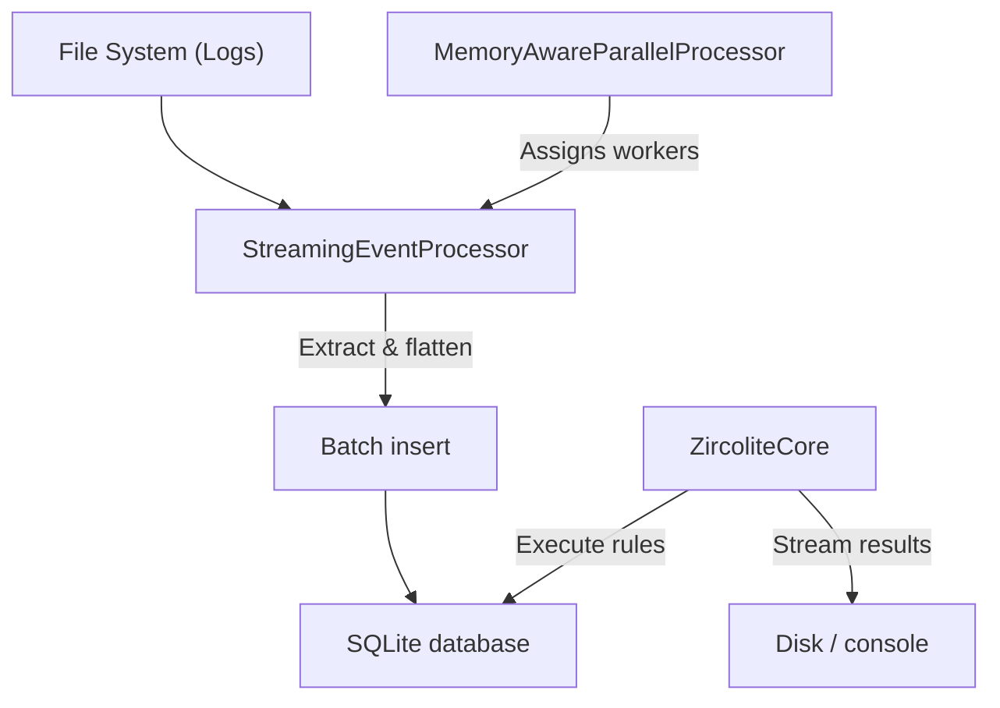
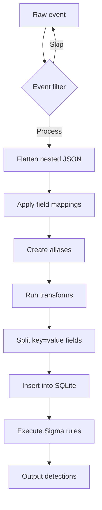
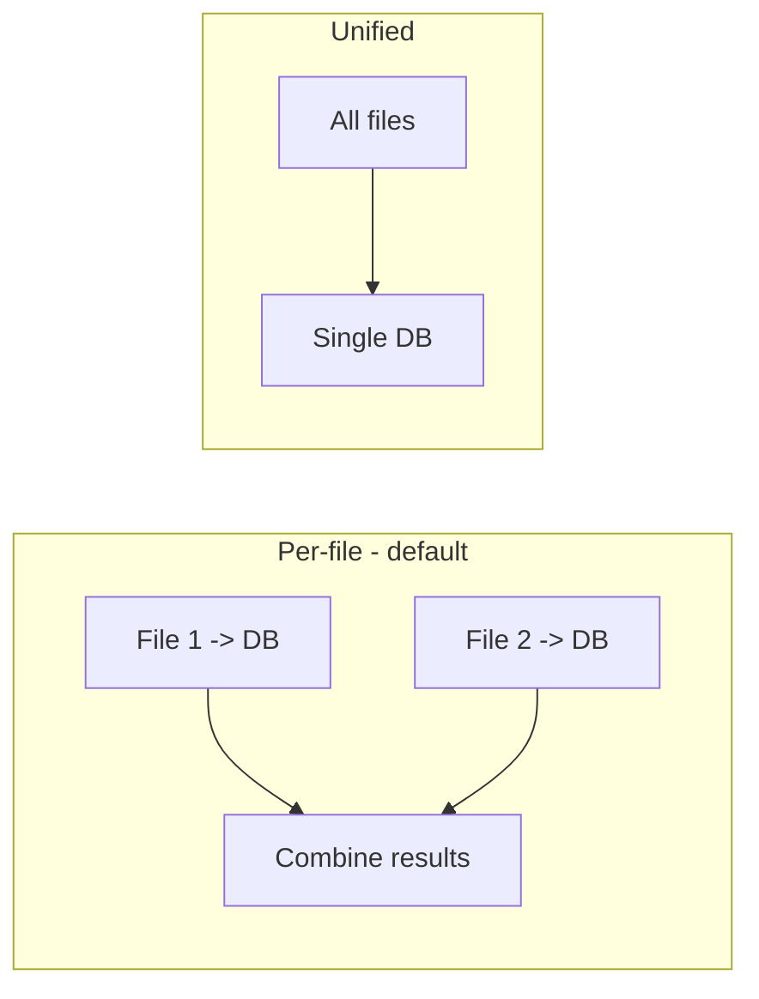

# Internals

Zircolite is more a workflow than a detection engine of its own. It leans on the Sigma
converter's ability to emit rules as SQLite `SELECT` statements: events are flattened
into an SQLite database, and each rule is a query run against it.

This page covers the architecture and the parts of the runtime whose behaviour is not
obvious from the command line. For how to *use* any of it, see
[Usage](Usage.md) and [Advanced](Advanced.md); for the dependency list, see
[Usage → Dependencies](Usage.md#dependencies).

## Architecture


```mermaid
graph TD
    FS["File System (Logs)"] --> SEP["StreamingEventProcessor"]
    SEP -->|"Extract & flatten"| IB["Batch insert"]
    IB --> DB["SQLite database"]

    MAPP["MemoryAwareParallelProcessor"] -->|"Assigns workers"| SEP

    ZC["ZircoliteCore"] -->|"Execute rules"| DB
    ZC -->|"Stream results"| OUT["Disk / console"]
```

Reading, flattening and insertion happen in a single pass. There is no intermediate
file and no alternative pipeline to select — what *is* selectable is how the database
is organised across input files.

## Event processing pipeline


```mermaid
flowchart TB
    A[Raw event] --> B{Event filter}
    B -->|Skip| A
    B -->|Process| C[Flatten nested JSON]
    C --> D[Apply field mappings]
    D --> E[Create aliases]
    E --> F[Run transforms]
    F --> G[Split key=value fields]
    G --> H[Insert into SQLite]
    H --> I[Execute Sigma rules]
    I --> J[Output detections]
```

| Stage | What it does | Example |
|-------|--------------|---------|
| **1. Filter** | Skip events whose Channel, or that channel's EventID bound, is claimed by no rule | Channel/EventID check |
| **2. Flatten** | Nested → flat structure | `Event.System.Channel` → `Channel` |
| **3. Mappings** | Rename fields | `Event.EventData.CommandLine` → `CommandLine` |
| **4. Aliases** | Duplicate a field under a new name | `CommandLine` → `cmdline` |
| **5. Transforms** | Sandboxed Python over the value | Extract the filename from a path |
| **6. Splits** | Parse key=value strings | `"a=1,b=2"` → `{a:1, b:2}` |

Transforms run before splitting, so a transform that *replaces* a value (rather than
writing an alias) changes what the split then parses. Splitting writes its derived fields
directly, so aliases do not apply to them.

Database columns are added as new fields are discovered, and events are inserted in
batches.

JSON arrays are validated incrementally, including delimiters and the closing
bracket. The optional `ijson` backend accelerates parsing; its numeric values are
normalized to Python integers and floats before insertion. ZIP members stream from
the archive, and 7-Zip members spool to automatically removed temporary files.
Compressed file size never selects an unbounded full-load array path.

Only transforms enabled for the selected source and CLI selection are compiled.
Immutable bytecode is cached by source; function namespaces remain local to each
processor. External transform source is cached by path, modification time and size.

CLI output uses a temporary row spool per matching rule, releasing it after the
output and summary callbacks finish. Multi-file CSV runs spool rows until their
complete header is known. Summaries retain counts and metadata, while templates,
packaging and library callers requesting `keep_results` retain complete matches.
`execute_ruleset` additionally accepts `result_sink` and `stream_results`; sinks must
consume the temporary row iterator during the callback. Public `execute_rule` and
`execute_select_query` still return ordinary dictionaries and lists.

## Rule execution

Before the rules run, `execute_ruleset` reads the distinct `(Channel, EventID)` pairs of
the logs table through `idx_channel_eventid`. A rule is skipped when every one of its
statements has `sqlscan` bounds that miss all of those pairs, the same bounds
`EventFilter` uses to drop events before ingestion. Channels are compared case-folded,
text EventIDs as integers, and a missing column as NULL. A statement without bounds, a
correlation rule, or a column holding values SQLite would coerce (numbers in `Channel`,
BLOBs) always runs. The saving is the statement preparation: about 0.3 ms per rule,
paid for every rule on every file in per-file and parallel modes.

Automatic literal filtering requires at least 1,000 rows and 32 distinct eligible
queries. It is built once per `execute_ruleset` call and discarded after its output
callbacks finish. `literal` forces construction; `off` disables it. Aho–Corasick searches necessary literals in each
field; Roaring bitmaps retain row IDs. Unknown predicates have an unbounded
candidate set. AND intersects candidates, OR unions them, and NOT supplies no
bound. Only simple `SELECT * FROM logs WHERE ...` statements qualify, and a pattern
contributes its longest literal run when that run is three characters or more, or holds
a non-ASCII character (emoji and homoglyph lists), which LIKE compares exactly. A rule
too deep to prepare is indexed in the rebalanced form the rule loop retries it with
(see [Automatic SQL repairs](#automatic-sql-repairs)). Unsupported
queries, custom LIKE implementations, uncertain schemas, and negative IDs take
the ordinary query path. A column exceeding an index budget becomes unbounded;
completed indexes for other columns remain usable. NULL values contribute no
positive LIKE candidates. Other non-text values remain candidates in a shared
per-column bitmap so SQLite owns their conversion. REGEXP queries remain on the
normal path as well. Candidate filtering never removes the original WHERE predicate.

The filter limits construction to one million pattern characters and sixteen
retained row IDs per event, at least two million (including shared uncertain IDs),
and bypasses a candidate set holding at least half the rows the rule's Channel/EventID
bounds select (half the table for an unbounded rule). These limits bound indexing work;
they are not a process memory ceiling. Candidates reach SQLite as
`logs.row_id IN (SELECT value FROM json_each('[...]'))` in front of the original
predicate, so the filter creates no tables; an empty candidate set becomes `0 AND (...)`,
which still compiles the rule but scans nothing. JSON1 is required, and the filter stays
off without it. Referenced fields are scanned together in batches of 256 rows. Immutable normalized SQL and
literal plans are cached across files; schema validation and postings stay local
to each database.

## Processing modes

Working storage is independent of database layout and export. With
`--working-db disk`, each core owns a temporary directory and a SQLite file;
closing the core removes the database and its WAL sidecars. The page cache is
configurable, query temporary storage can spill to disk, and mmap is disabled.
Explicit library `db_location` paths remain caller-owned. Database export still
uses SQLite backup, including when working storage is on disk.

Flattening selects the compiled kernel once per processor when it is built from the
current `flatten_kernel.py`, and otherwise runs the same source as Python.

Every mode reads events through the same pipeline. There are two database layouts, and
parallelism is an overlay on one of them rather than a third layout.


```mermaid
flowchart LR
    subgraph PerFile[Per-file - default]
        P1[File 1 -> DB] --> P3[Combine results]
        P2[File 2 -> DB] --> P3
    end

    subgraph Unified[Unified]
        U1[All files] --> U2[Single DB]
    end
```

| Layout | Flag | Database | Enables |
|--------|------|----------|---------|
| Per-file | default | One per file, reused | Parallel processing |
| Unified | `--unified-db` | One for all files | Cross-file correlation rules |

`analyze_files_and_recommend_mode` returns only `per-file` or `unified`. When the answer
is per-file and there is more than one input, the same function separately recommends
running those files across workers — one database per worker, which is why it is
available in per-file mode and not with `--unified-db`. `--no-parallel` declines it;
`--strict` and `--profile-rules` force it off, because a parse error and a per-rule timing
both need one file at a time.

The layout choice is made from file count, file sizes, available RAM and CPU count.
`--no-auto-mode` disables this choice and keeps per-file mode. The heuristics are
documented in [Advanced → Automatic processing optimization](Advanced.md#automatic-processing-optimization).

`--executor auto` is the CLI default. Parallel per-file workloads averaging at least
50 MiB select separate interpreters when CPU and RAM permit at least two process
workers; smaller workloads use threads. Explicit `thread` and `process` settings
remain available. Low-level `ParallelConfig` retains its thread default. Processes return summaries and temporary output paths instead
of pickling large match lists. Workers share a shutdown event, and EVTX parser
threads are divided across the file-worker CPU budget. ZIP/7z expanded sizes and
gzip/bzip2 estimates inform scheduling; estimates are advisory, with runtime memory
throttling still applied. gzip sizes can wrap at 4 GiB, so compressed-size estimates
cannot guarantee a fixed process memory ceiling.

Performance records are owned by each core and returned as plain dictionaries
from workers. Nested stage timers pause their parent, preventing index/output
time from also counting as ingestion/detection. The CLI aggregates worker stage
seconds separately from wall time and samples RSS in a background thread.

## Measured results

Complete CLI runs with `rules/rules_windows_merged.json` (4,319 rules) on a 10-core arm64
Mac, Python 3.14 and SQLite 3.53, compiled flattening built. Every run reported the same
detections as the same workload with `--rule-prefilter off`, compared as per-rule event
multisets.

| Workload | Before (`c972b28`) | After |
|---|---:|---:|
| Test corpus, 4 EVTX / 452,554 events, auto (processes) | 42.0 s | 11.0 s |
| Test corpus, `--unified-db` | — | 22.8 s |
| Test corpus as database input (`-D`) | — | 11.7 s (51.8 s with the prefilter off) |
| EVTX-ATTACK-SAMPLES, 278 files, auto (unified) | 7.0 s | 5.8 s |
| EVTX-ATTACK-SAMPLES, 278 files, per-file | 473 s | 55.7 s |

That corpus holds a single channel, so its gains come from the literal prefilter and process
workers; the 278 small multi-channel files show the per-rule costs of per-file mode that
the census prune and lazy result spools remove. Reproduce comparisons with
`tools/throughput-benchmark.py`, and measure the rule phase alone with `-D` and
`--performance-json`. [Benchmark](Benchmark.md) compares the same run with Hayabusa and
Chainsaw.

## Module map

All the logic lives in the `zircolite/` package. `zircolite.py` is a shim that calls
`zircolite/cli.py`; `python -m zircolite` goes through `__main__.py` and is equivalent.

| Module | Contents |
|--------|----------|
| `cli.py` | The whole command line: `parse_arguments`, `discover_files`, `main` |
| `__main__.py` | Entry point for `python -m zircolite` |
| `assets.py` | Resolution of the shipped `config/`, `rules/`, `templates/` and `gui/` |
| `streaming.py` | `StreamingEventProcessor` — single-pass read, flatten, transform, insert |
| `flatten_kernel.py` | Flattening kernel; the reference Python implementation, also compiled as `_flatten_native` |
| `jsonstream.py` | Validating JSON-array reader with an optional C parser |
| `results.py` | Temporary detection row storage and incremental JSON output |
| `core.py` | `ZircoliteCore` — database management, indexes, rule execution, output |
| `prefilter.py` | Literal prefilter: rows that may satisfy a rule's `LIKE` literals, handed to SQLite, which still runs the full rule |
| `performance.py` | Stage timers, per-file metrics and the `--performance-json` report |
| `detector.py` | `LogTypeDetector` — format, log source and timestamp-field detection |
| `processing.py` | Coordinates per-file, unified and parallel runs; aggregates results |
| `utils.py` | Logging, `MemoryTracker`, compressed-input handling, mode heuristics |
| `rules.py` | `RulesetHandler` (Sigma → Zircolite), `RulesUpdater`, `EventFilter` |
| `console.py` | Rich output: theme, detection tables, ATT&CK panels, hyperlinks, reports |
| `config_loader.py` | Loads and validates YAML run configurations; generates the template |
| `parallel.py` | `MemoryAwareParallelProcessor` — worker scaling and memory throttling |
| `sqlscan.py` | Quote-aware rule-SQL reader, and the OR-chain depth repair |
| `run_config.py` | `SETTINGS` — one row per option: YAML key, default, merge rule |
| `templates.py` | `TemplateEngine` (Jinja2 output), `ZircoliteGuiGenerator` (Mini-GUI) |
| `formats.py` | Input format registry: flag, YAML value, extension, encoding, reader |
| `extractor.py` | `EvtxExtractor` — log line / XML element → event dict |
| `config.py` | Dataclasses passed to the engine (`ProcessingConfig`, `ExtractorConfig`, …) |
| `attack.py` | MITRE ATT&CK technique and tactic IDs from Sigma tags |
| `shutdown.py` | SIGINT handling, so `Ctrl+C` finishes the current batch and writes results |
| `__init__.py` | The package's public re-export surface — and deliberately not `cli`, which would make `from zircolite import console` resolve to the submodule rather than the `Console` object |

`formats.py` is the single source of truth for input formats: the CLI, the YAML loader,
the streaming dispatcher and the extractor factory all resolve through the same table,
so a new format is a new row rather than an edit in each of them.

## Bundled asset resolution

`config/`, `rules/`, `templates/` and `gui/` ship with Zircolite, and the paths pointing
at them are relative, so they have to resolve whatever the working directory is.
`assets.py` does it, and lives outside `cli.py` because `config_loader` needs it too and
cannot import `cli` — `cli` imports it in turn.

For every value a user can override, a file of that name in the working directory wins and
anything else falls through to `bundled_asset`. That covers

- `--config`, for any relative path under `config/`, not only the default
- `--ruleset`, both the default and an explicit `-r rules/…`
- `--template`, and the templates behind `--timesketch` and `--navigator-output`
- the `rules` and `templates` entries of a `-Y` configuration file

`resolve_default_path` tests for a file. `resolve_asset_path` tests for existence instead,
and rulesets go through it because `--ruleset` also accepts a *directory* of native Sigma
YAML, which the file test would reject.

Only a value already rooted at the shipped directory falls back, so
`-r myrules/windows.json` keeps reporting itself missing instead of quietly loading
`rules/windows.json`.

Two paths deliberately do not follow that rule. `--package` reads the ZircoGui template
and `gui/zircogui.zip` from the bundle only: the two have to come from the same build, and
a copy of just one of them in the working directory would pair a new `data.js` with an old
GUI. `-U` writes to the installed `rules/` — the directory a later run will actually read
— and falls back to `./rules` only when that one cannot be written to.

`bundled_asset` returns the first root that holds the file:

| Order | Root | Applies to |
|-------|------|-----------|
| 1 | the directory holding the executable | frozen builds only |
| 2 | `sys._MEIPASS`: the `_internal/` directory beside the executable, where PyInstaller puts `datas` | frozen builds only |
| 3 | two levels up from `assets.py`: the repository root from source, `_internal/` again in a binary | always |

The executable's own directory comes first so that the `config/`, `rules/`, `templates/`
and `gui/` the release package ships beside the binary can be edited: an updated ruleset
dropped there takes effect without a rebuild. The copy under `_internal/` is what lets a
bare build — `dist/Zircolite/` straight out of PyInstaller, holding only the executable
and `_internal/` — run on its own, and it is what the binary tests run against. When no
root holds the file, the first candidate is returned, so the error names a directory you
can actually write to.

`bundled_dir`, which `-U` uses to choose where to write, skips every root inside
`sys._MEIPASS`, comparing resolved paths so that the third root is caught as well.
`_internal/` still holds a readable copy, but it is the part of the package nobody should
edit and the next release replaces it whole; in a onefile build the same root would be a
temporary directory deleted when the process exits. In a binary that leaves the
executable's directory, and `RulesUpdater` falls back to `./rules`, with a warning, when
that cannot be written to.

## Packaging

The standalone binaries are PyInstaller builds in its *onedir* layout, made from
`Zircolite.spec` in the repository root:

```shell
pdm run pyinstaller --noconfirm Zircolite.spec
```

That writes `dist/Zircolite/`: the executable (`Zircolite`, or `Zircolite.exe`) and
`_internal/`, which holds the Python runtime, the extension modules, the bytecode and a
copy of `config/`, `rules/`, `templates/` and `gui/`. `tools/package-release.py` stages the
release from it, adding editable copies of those four directories beside the executable,
`docs/`, `pics/`, `README.md`, `LICENSE` and a generated `THIRD_PARTY_LICENSES`, and
archives the result as `dist/Zircolite-<version>-<target>.zip` for every target. The Linux
and macOS archives record each entry as made on Unix, with its mode and, for the symlinks
a macOS build keeps in `Python.framework`, its link target: `unzip` and Archive Utility
restore both, so the executable comes out executable. Windows cannot extract a symlink
from a zip, and a Windows build with one fails to package.

### Why onedir

A onefile executable unpacks its whole runtime into a temporary directory on every start.
On macOS that cost 2–4 s per run, against about 0.37 s for onedir or a source checkout. It
also fails outright where `/tmp` is mounted `noexec`, and self-extracting executables draw
more antivirus false positives. The release package is a directory anyway — the editable
assets sit beside the executable — so a single file bought nothing.

The spec keeps PyInstaller's default `_internal/` contents directory. Flattening it into
the executable's directory (`contents_directory='.'`) would put the `zircolite/` package
directory next to the `Zircolite` executable, and the two collide on case-insensitive
filesystems, the default on macOS and Windows.

### What the spec has to name

PyInstaller follows the imports it can see in bytecode. Everything below is reached some
other way, and each gap failed silently rather than loudly:

- **pySigma pipelines and backends.** pySigma discovers them by walking the
  `sigma.pipelines` and `sigma.backends` namespace packages at run time, so the spec
  collects those submodules itself, test modules excluded. Without them `--pipeline-list`
  came back empty and `-p sysmon` converted rules without their `EventID=1` condition.
  That silent outcome is also why an unknown `-p` name is an error that exits `2` rather
  than a line in the log.
- **The flattening kernel.** `streaming.py` loads `zircolite._flatten_native` through
  `importlib`. A binary ships no `flatten_kernel.py` either, so the run-time
  `SOURCE_SHA256` staleness check has nothing to compare against; the spec runs that
  check at build time instead and, under `ZIRCOLITE_REQUIRE_NATIVE=1`, refuses to build
  from a missing or stale kernel. It checks the kernel beside the spec, so the project
  must be installed in place (`pdm install`) before building.
- **`evtx` and `ijson`**, collected whole with their data files and binaries.

The spec also names `py7zr`. The scan does find it, because `detector.py` and `utils.py`
import it inside functions, but naming it keeps `.7z` support from depending on that.

UPX compression is off, and the test and build-only packages (`pytest`, `Cython`,
`tkinter`, `IPython`) are excluded, as is `setuptools`: PyInstaller's `backports` alias
follows the `backports.zstd` import that py7zr and urllib3 keep for Pythons older than
3.14 into `setuptools._vendor`, which the binary never runs.

### Why PyInstaller

PyInstaller onedir, Nuitka standalone and PyApp over python-build-standalone (PBS) were
each built and run against a parity harness on macOS arm64 with Python 3.14 (Homebrew).
Timings are medians.

| | PyInstaller onedir | Nuitka 4.2.1 standalone | PyApp + PBS |
|---|---|---|---|
| Parity with source | all pass | all pass, after a loader-race patch (onefile also needs an asset-root patch) | all pass |
| `--version` start-up | 0.375 s, the same as source | **0.27 s** | 0.32 s, after a first run of 2–3 s that extracts ~180 MB into the user's home |
| Run time against source | −4 % to +1 % | 5–18 % slower, +25–35 MiB RSS | 11–29 % faster, from the PBS interpreter rather than the launcher |
| Local build time | 17–30 s | 105–180 s | 81 s, plus a Rust toolchain |
| Problems found | pipelines not bundled (fixed in the spec) | a thread-import race dropped files with exit `0` in 8 of 15 runs; `.py` data files skipped silently; the executable and package names collide; SIGBUS in a cached onefile | a permanent per-user install; Rust on every build leg; Windows `Ctrl+C` untested |

- **Nuitka** starts about 0.1 s sooner but is slower on real workloads. The hot paths —
  the Rust EVTX parser, SQLite, orjson and the Cython kernel — are native already, so
  compiling the remaining Python buys little, and it brought new silent failures and
  builds several times slower.
- **PyApp with PBS** runs fastest but deploys worse: it installs itself permanently into
  the user's home on first run and needs Rust on every build leg. Its speed comes from the
  PBS interpreter, not from PyApp. The Linux legs already build on PBS; whether a
  PyInstaller build on PBS reproduces the gain on macOS and Windows has yet to be
  measured.
- **Not viable:** cx_Freeze uses the same model as PyInstaller onedir, with nothing to
  gain; PyOxidizer is no longer maintained; Briefcase only produces installers; Mojo and
  Codon cannot compile pySigma, lxml or evtx and still need CPython to run them, and Mojo
  has no native Windows support; a whole-application Cython build is effectively what
  Nuitka does, and that measured slower.

### Support floors

| Target | Floor | What sets it |
|--------|-------|--------------|
| `linux-x64`, `linux-arm64` | glibc 2.28: RHEL 8, Debian 10, Ubuntu 20.04 | The build runs inside a `manylinux_2_28` container, on a PBS 3.14 installed by uv. A runner's own Python links against the runner's glibc — 2.39 on Ubuntu 24.04 — and the binary inherits it |
| `macos-arm64` | macOS 15.0 | The `macos-15` runner, with `MACOSX_DEPLOYMENT_TARGET=15.0`. The wheels PDM selects there, orjson's among them, are built for macOS 15, and the older runners are being retired |
| `windows-x64`, `windows-arm64` | Windows 10 | Python 3.14, which the binary carries, supports nothing older |

The binary tests check the first two when `ZIRCOLITE_GLIBC_FLOOR` and
`ZIRCOLITE_MACOS_FLOOR` are set, as CI sets them: the highest `GLIBC_` symbol version
across every ELF file in the build and a non-executable stack for libpython on Linux, the
`minos` of every Mach-O file on macOS.

### Windows ARM64

`pdm.lock` cannot be installed on Windows ARM64 as it stands. `evtx` publishes neither a
`win_arm64` wheel nor an sdist, and `jq`, which pySigma requires, does not build there.
`tools/install-win-arm64.py` assembles the environment instead: it exports the locked
development requirements without those two, installs them into a uv virtual environment
with `--no-deps` so that `jq` is never resolved again, adds an `evtx` wheel the workflow
builds with maturin from pyevtx-rs `0.12.1`, installs Zircolite editable so the kernel is
compiled into the tree where the spec looks for it, and points PDM at that environment so
the shared `pdm run` steps work unchanged. pySigma imports `jq` only inside its jq
transformation, which Zircolite never uses.

### CI gates

`.github/workflows/build_pyinstaller.yml` builds, tests, verifies and releases:

| Trigger | What runs |
|---------|-----------|
| A `v*` tag | All five targets, then the release |
| A push to `master`, or a pull request, touching the spec, `zircolite.py`, the package, `pyproject.toml`, `pdm.lock`, `setup.py`, the shipped assets, the test fixtures and golden files, `tests/conftest.py`, `pytest.ini`, the binary tests, `tools/`, the packaged docs (`docs/`, `pics/`, `README.md`, `LICENSE`) or the workflow | The `linux-x64` leg only, as a canary |
| `workflow_dispatch` (`dry_run`, true by default) and a weekly schedule | All five targets |

**Build.** Each leg installs the project, builds with the spec, then runs

```shell
pdm run python -m pytest tests/test_frozen_binary.py tests/test_e2e_regression.py
```

with `ZIRCOLITE_BINARY` naming the built executable. `test_e2e_regression.py` then runs its
format-parity, mode-equivalence and golden-detection cases through the binary instead of
in process. `test_frozen_binary.py` compares the binary with `python -m zircolite` from the
same environment: version and layout, the pipeline list and the SQL each pipeline
produces, compressed and encrypted archives, both executors, assets and `--package` from a
foreign working directory, transforms, the selected flattening kernel, platform floors and
`Ctrl+C`. The raw `dist/Zircolite/` is tested, without the editable directories the
release adds, so anything missing from `_internal/` fails here. On a tag,
`tools/package-release.py --check-tag` confirms that the tag, `__version__`, the
`pyproject.toml` version and the binary's `--version` all agree. The leg then packages its
single archive and uploads it.

**Verify.** One job per target downloads that archive onto a fresh runner that never sets
up Python, PDM or the project (the image's own `python3` only compares the output with
the golden file on Linux and macOS), extracts it, and from the package directory runs
`--version`, a detection over `tests/fixtures/sample_bitsadmin.evtx` with
`rules/rules_windows_sysmon.json` that must return exactly the golden result, and
`--package`. The Linux targets repeat `--version` and the detection, but not `--package`,
in `rockylinux:8`, `debian:11` and `ubuntu:20.04` containers, which have no Python at
all.

**Release.** Once every verify job passes on a tag, a dispatch or the weekly schedule,
one job collects the archives and writes `SHA256SUMS`. On a tag it then attests the
archives' build provenance and creates a *draft* GitHub release carrying them, or replaces
the assets of the release if it already exists; publishing is done by hand. A dispatch
that is not on a tag, a `dry_run` dispatch and the schedule stop after `SHA256SUMS`; the
pull-request and master-push canaries never reach this job.

**Forgejo pre-flight.** `.forgejo/workflows/build_pyinstaller.yml` mirrors the
`linux-x64` leg for the self-hosted instance: the same container image and commands, then
the verify smoke inside the same job. The distro containers and the release stay on
GitHub, because Forgejo job containers get no Docker socket.

## SQLite behaviour

### Pragmas

Two pragmas apply to every database: `page_size` `4096` and `threads`
`min(8, cpu_count)`. Two follow the working storage chosen with `--working-db`:

| Pragma | `memory` (default) | `disk` |
|--------|--------------------|--------|
| `temp_store` | `MEMORY` | `FILE` |
| `mmap_size` | `268435456` (256 MB) | `0` |

The rest depend on where the database lives:

| Pragma | In-memory | On disk |
|--------|-----------|---------|
| `journal_mode` | `MEMORY` | `WAL` |
| `synchronous` | `OFF` | `NORMAL` |
| `cache_size` | `-128000` (128 MB) | `--sqlite-cache-mib` × `-1024` (default 64 MiB: `-65536`) |
| `locking_mode` | `EXCLUSIVE` | — |
| `wal_autocheckpoint` | — | `10000` |

### The `regexp` function

Sigma rules that match by regex need a `REGEXP` implementation, which SQLite does not
ship. Zircolite registers one that compiles patterns through an LRU cache, since the
same pattern is evaluated against every row.

Two details matter:

- **Patterns are validated before the query runs.** Sigma is written against PCRE, so a
  rule can carry a construct Python's `re` rejects (`\p{L}`, a possessive quantifier).
  Discovering that inside the function would mean discovering it once per row with
  nowhere to report it, and the rule would look like a clean non-match. Instead the
  patterns are compiled up front and a rule that fails is recorded as broken.
- **Values are coerced with `str()`.** A column takes its type from the first value
  observed for that field, so a field whose first event carried a number becomes
  `INTEGER` for the rest of that database. Passing an `int` to `re.search` raises, and
  SQLite reports that as a failure of the whole statement. Coercing to text matches what
  `LIKE` already does with a numeric column.

### Typing and collation

Columns are declared `TEXT` or `INTEGER`, both `COLLATE NOCASE`. `NOCASE` on an integer
column costs nothing — numeric equality and ranges are unaffected — and without it a
numeric first value would leave the column comparing text case-sensitively for the rest
of the run.

How far "the rest of that database" reaches depends on the mode. `--unified-db` really
is one table, so the first value seen anywhere in the corpus types the column. Per-file
and parallel modes rebuild the table between files, so each input is typed by its own
events; otherwise one file's schema would decide what every later file could match.

### Indexes

Which indexes exist, and how to change them, is covered in
[Usage → Database indexes](Usage.md#database-indexes). What matters here is the ordering.

Auto-indexes are applied once the ruleset is loaded, and `ANALYZE logs` runs immediately
after so the new indexes are covered. That analysis is not optional: rule widening (see
below) can more than double the column count, and with no statistics SQLite prices a row
by column count alone and starts abandoning selective indexes.

The built-in pair is `idx_eventid` and the composite `idx_channel_eventid`. A lone
`Channel` index prices a rule's channel test correctly and then leaves SQLite fetching
every row of that channel to re-check the eventID — which on a corpus carrying six
channels measured ~1.6× the rule-phase wall clock against the same detections. The
composite's leading column still serves channel-only rules, so it replaces the single
index rather than joining it. `idx_eventid` stays because a `(Channel, …)` index cannot
serve a rule that names only an eventID, and many do.

Both are created only when the column is actually present. SQLite would otherwise accept
`CREATE INDEX ... ON logs ("eventid")` against a table without that column by reading the
quoted name as a string literal, building an index over a constant: no error raised, and
nothing able to use it.

## Automatic SQL repairs

A rule whose SQL cannot be prepared matches nothing, and looks exactly like a rule that
found nothing. Zircolite therefore attempts two repairs, each at most once, before
giving up and recording the rule as broken in the run summary.

**Missing columns.** SQLite resolves column names when it prepares a statement, so a
rule naming one field the dataset never produced fails as a whole — losing the branches
that reference fields it does have. The absent columns are added as `NULL`, which makes
the rule evaluate exactly as it would against an event that simply lacks them. Rules
whose fields are *all* absent are widened too, so `|exists: false` becomes `IS NULL` and
matches every row.

Column names are read with `sqlscan.py`, not with a regex, for two reasons: the backend
backtick-quotes every field name that is not `^[a-zA-Z0-9_]*$` — which is every ECS and
Winlogbeat name (`event.code`, `@timestamp`, `Data[1]`) — and a name inside a string
literal is not a column, so `CommandLine LIKE '%user=bob%'` must not invent a `user`.
Nor is a name the statement binds with `AS`: a correlation's `HAVING event_count >= 3`
compares its own aggregate, and a NULL `event_count` column in logs would shadow it
through the subquery's `SELECT *`, silently emptying that rule and every later one using
the alias.

### Reading a statement

Four questions are asked of every rule statement: which channels it can match, which
eventIDs, which columns it names, and which patterns it hands to `REGEXP`. All four need
the same quote-aware lexer, and lexing is what reading a ruleset costs — roughly 100 ms
per megabyte of SQL, against merged rulesets carrying several.

So `sqlscan.scan_query` lexes a statement once, answers all four from that single token
list, and memoises the result; `column_refs`, `regex_literals`, `channel_constraints` and
`eventid_constraints` are folds over it. Every one of those answers is a pure function of
the statement text — no schema, no database, no config — so nothing can invalidate an
entry and there is no cache key beyond the SQL itself. Per-file and parallel modes ask the
same questions of the same statements once per input file, and after the first file they
are answered from memory.

The corollary is the rule to keep: anything schema-dependent stays out of `sqlscan.py`.
Deciding which of a statement's columns are *missing* needs the live table, so that stays
in `core.py`; only the list of names it mentions is cached.

**Over-deep expressions.** The SQLite backend emits value lists as a left-deep chain
(`a OR b OR c OR …`), whose parse-tree depth equals the number of terms. SQLite refuses
anything past `SQLITE_MAX_EXPR_DEPTH` (1000 by default), so rules listing a few thousand
hashes or filenames could not be prepared at all. Those chains are re-associated into a
balanced tree, bringing the depth down to O(log n). Chains of fewer than eight terms are
left alone.

Two properties keep the rewrite safe:

- **Only `OR` is re-associated, never `AND`.** The `AND` in `x BETWEEN a AND b` is syntax
  rather than a boolean operator; re-associating it compiles cleanly and silently returns
  the wrong rows. `OR` has the lowest precedence in SQL, so splitting on it and
  re-associating the operands always preserves meaning.
- **Anything unmodelled bails out**, returning the statement untouched: comments,
  unterminated quotes or `CASE`, unbalanced parentheses, an empty `OR` operand, a
  statement with no top-level `WHERE`, `UNION`/`INTERSECT`/`EXCEPT`, and any
  parenthesised group holding a `SELECT`. That last one matters because a
  subquery is not a boolean expression — re-associating the `OR`s inside
  `x IN (SELECT … OR …)` turns it into a truth value, which still compiles and quietly
  matches the wrong rows. Reporting a rule as broken is far better than emitting subtly
  wrong SQL.

Both repairs run only when SQLite itself raises the error, so a statement that already
compiles is never rewritten. The depth repair is memoised like the statement scan above,
because per-file and parallel modes run the same ruleset once per input file; widening
cannot be, since it alters the live table. They also chain: an over-deep statement is
rejected while parsing, before SQLite ever resolves column names, so widening only becomes
reachable once the expression has been rebalanced.

What this means for output is covered in
[Usage → Rules with very large value lists](Usage.md#rules-with-very-large-value-lists).
One further consequence: a repaired or re-planned query can return the same events in a
different order, because a query driven by one index visits rows in a different order than
one driven by another. Rules, counts and matched events are identical.

### Negated conditions on absent fields

Sigma reads a condition on a field the event does not carry as false, so
`selection and not filter` still matches when the filter names such a field. SQLite
evaluates that comparison to `NULL`, and `NOT NULL` is `NULL`, so the row is dropped.
Sysmon network events have no `CommandLine`, and a network rule whose filters mention one
matched nothing at all: *Rundll32 Internet Connection* found none of the 75,793 events on
the test corpus that Sigma's semantics select.

Unlike the two repairs, this rewrite applies to every statement before it runs.
`sqlscan.normalize_rule_sql` wraps the operand of each prefix `NOT` in
`COALESCE((…), 0)`, turning that `NULL` back into the false Sigma means. The operand runs
to the next `AND`/`OR` or closing parenthesis at its own depth, since `NOT` binds tighter
than those and looser than every comparison. Nested negations are rewritten too, so what
reaches a `COALESCE` is only `AND`/`OR` over comparisons, and reading its `NULL` as false
is exactly Sigma's answer. `NOT LIKE`, `NOT IN` and `IS NOT NULL` compare rather than
negate, and are left as written; so is a `NOT` whose operand holds a `BETWEEN` or `CASE`,
whose own `AND` would end the operand too early. The same pass quotes identifiers, so a
ruleset is still lexed once.

The literal prefilter plans the rewritten form (a negation never narrows its candidates),
and the Channel/EventID bounds read from it are unchanged.
