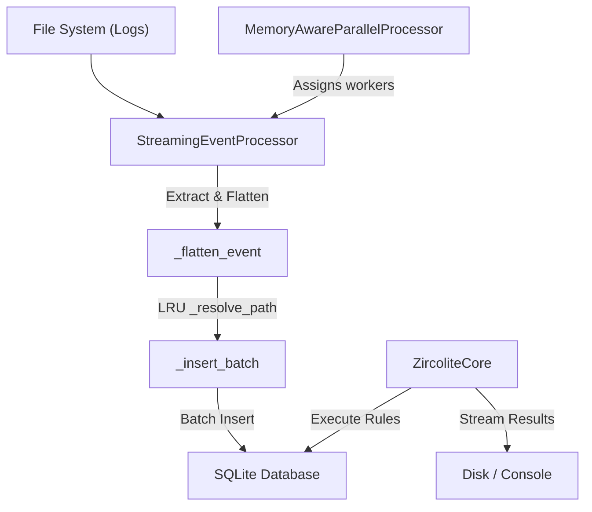
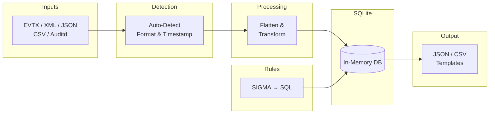
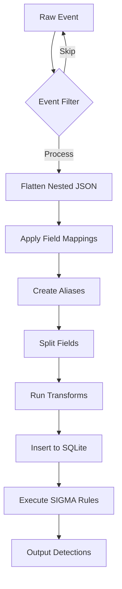
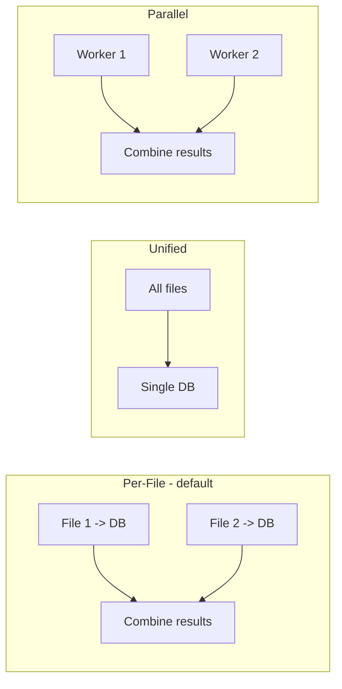
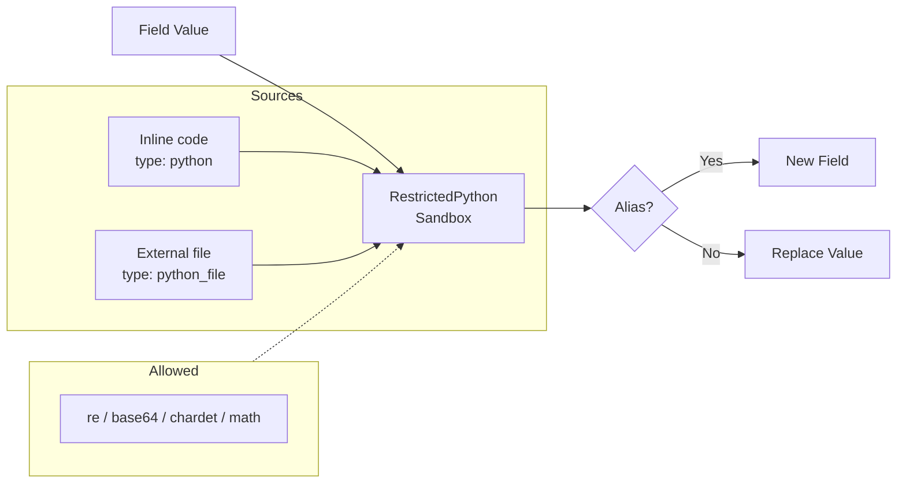
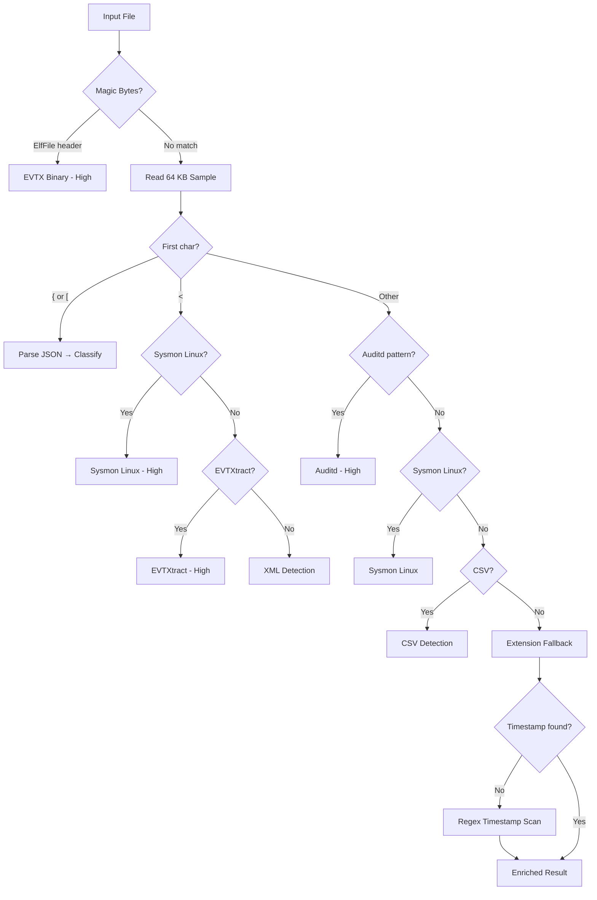

# Internals

## Zircolite Architecture

**Zircolite is more a workflow than a real detection engine.** To put it simply, it leverages the ability of the Sigma converter to output rules in SQLite format. Zircolite simply applies SQLite-converted rules to EVTX logs stored in an in-memory SQLite database.

### Architecture Overview


```mermaid
graph TD
    FS["File System (Logs)"] --> SEP["StreamingEventProcessor"]
    SEP -->|"Extract & Flatten"| FE["_flatten_event"]
    FE -->|"LRU _resolve_path"| IB["_insert_batch"]
    IB -->|"Batch Insert"| DB["SQLite Database"]
    
    MAPP["MemoryAwareParallelProcessor"] -->|"Assigns workers"| SEP
    
    ZC["ZircoliteCore"] -->|"Execute Rules"| DB
    ZC -->|"Stream Results"| OUT["Disk / Console"]
```

### High-Level Flow


```mermaid
flowchart LR
    subgraph IN[Inputs]
        I[EVTX / XML / JSON<br/>CSV / Auditd]
    end
    
    subgraph DETECT[Detection]
        D[Auto-Detect<br/>Format & Timestamp]
    end
    
    subgraph PROC[Processing]
        F[Flatten &<br/>Transform]
    end
    
    subgraph DB[SQLite]
        S[(In-Memory DB)]
    end
    
    subgraph RULES[Rules]
        R[SIGMA → SQL]
    end
    
    subgraph OUT[Output]
        O[JSON / CSV<br/>Templates]
    end
    
    I --> D --> F --> S
    R --> S
    S --> O
```

### Event Processing Pipeline


```mermaid
flowchart TB
    A[Raw Event] --> B{Event Filter}
    B -->|Skip| A
    B -->|Process| C[Flatten Nested JSON]
    C --> D[Apply Field Mappings]
    D --> E[Create Aliases]
    E --> F[Split Fields]
    F --> G[Run Transforms]
    G --> H[Insert to SQLite]
    H --> I[Execute SIGMA Rules]
    I --> J[Output Detections]
```

### Field Processing Details

| Stage | Description | Example |
|-------|-------------|---------|
| **1. Filter** | Skip events whose Channel, or that channel's EventID bound, is claimed by no rule | Channel/EventID check |
| **2. Flatten** | Nested → flat structure | `Event.System.Channel` → `Channel` |
| **3. Mappings** | Rename fields | `Event.EventData.CommandLine` → `CommandLine` |
| **4. Aliases** | Duplicate fields with new names | `CommandLine` → `cmdline` |
| **5. Splits** | Parse key=value strings | `"a=1 b=2"` → `{a:1, b:2}` |
| **6. Transforms** | Custom Python code (sandboxed) | Extract filename from path |

### Processing Modes

Every mode reads events through the same single-pass streaming pipeline
(read → flatten → insert). What the mode chooses is how the database is
organised across input files.


```mermaid
flowchart LR
    subgraph PerFile[Per-File - default]
        P1[File 1 -> DB] --> P3[Combine results]
        P2[File 2 -> DB] --> P3
    end

    subgraph Unified[Unified]
        U1[All files] --> U2[Single DB]
    end

    subgraph Parallel[Parallel]
        R1[Worker 1] --> R3[Combine results]
        R2[Worker 2] --> R3
    end
```

| Mode | Flag | Database | Enables |
|------|------|----------|---------|
| Per-file | default | One per file, reused | Parallel processing |
| Unified | `--unified-db` | One for all files | Cross-file correlation rules |
| Parallel | automatic | One per worker | Concurrent file processing |

Auto-mode picks between them from file count, file sizes, available RAM and
CPU count. `--no-auto-mode` disables that choice and keeps per-file.

### Transform System


```mermaid
flowchart LR
    A[Field Value] --> B[RestrictedPython<br/>Sandbox]
    B --> C{Alias?}
    C -->|Yes| D[New Field]
    C -->|No| E[Replace Value]
    
    subgraph Allowed
        R[re / base64 / chardet / math]
    end
    
    Allowed -.-> B
    
    subgraph Sources
        S1[Inline code<br/>type: python] --> B
        S2[External file<br/>type: python_file] --> B
    end
```

**Transform capabilities:**
- Regex extraction (`re` module)
- Base64 encoding/decoding
- Character encoding detection (`chardet`)
- Mathematical functions (`math`)
- Custom logic in sandboxed Python

**Transform sources:**
- **Inline** (`type: python`): code defined directly in `config.yaml`
- **External** (`type: python_file`): code loaded from `.py` files in `transforms_dir` (default: `config/transforms/`)
- Both types use the exact same RestrictedPython sandbox
- A standalone tester (`config/transform_tester.py`) is provided for local development

### Log Type Detection

Zircolite includes an automatic log type detection system (`LogTypeDetector` in `detector.py`) that analyzes input files to determine their format, log source, and timestamp field before processing begins.

#### Detection Pipeline


```mermaid
flowchart TB
    A[Input File] --> B{Magic Bytes?}
    B -->|ElfFile header| C[EVTX Binary - High]
    B -->|No match| D[Read 64 KB Sample]
    D --> E{First char?}
    E -->|"{ or ["| F[Parse JSON → Classify]
    E -->|"<"| G{Sysmon Linux?}
    G -->|Yes| H[Sysmon Linux - High]
    G -->|No| I{EVTXtract?}
    I -->|Yes| J[EVTXtract - High]
    I -->|No| K[XML Detection]
    E -->|Other| L{Auditd pattern?}
    L -->|Yes| M[Auditd - High]
    L -->|No| N{Sysmon Linux?}
    N -->|Yes| O[Sysmon Linux]
    N -->|No| P{CSV?}
    P -->|Yes| Q[CSV Detection]
    P -->|No| R[Extension Fallback]
    R --> S{Timestamp found?}
    S -->|No| T[Regex Timestamp Scan]
    T --> U[Enriched Result]
    S -->|Yes| U
```

#### JSON Event Classification

When JSON content is detected, the classifier inspects the parsed event structure:

| Check | Log Source | Confidence |
|-------|-----------|------------|
| `Event.System.Channel` in Sysmon channels | `sysmon_windows` | High |
| `Event.System.Channel`/`EventID` present | `windows_evtx_json` | High |
| Top-level `Channel` + `EventID` | `windows_evtx_json` (pre-flattened) | High |
| `@timestamp` or `winlog` structure | `ecs_elastic` | High/Medium |
| `type` field with auditd value | `auditd` | High |
| 3+ Sysmon fields (RuleName, ProcessGuid, etc.) | `sysmon_windows` | Medium |
| Generic with detected timestamp | `generic_json` | Medium |
| Generic without timestamp | `generic_json` | Low |

#### Timestamp Detection Strategy

1. **Known field names** (priority order): `SystemTime`, `UtcTime`, `TimeCreated`, `@timestamp`, `timestamp`, etc.
2. **Heuristic scoring**: All event fields are scored by name relevance and value format.
3. **Regex fallback**: Raw file content is scanned for timestamp patterns (ISO 8601, syslog, epoch, US date-time, Windows FileTime) and matched back to JSON keys when possible.

### Core Components

Zircolite is built around several key classes, organized in the `zircolite/` package:

- **LogTypeDetector** (`detector.py`): Automatic log format and timestamp detection. Analyzes magic bytes, content structure, and file extension to determine the input type and log source.
- **ZircoliteCore** (`core.py`): The main detection engine that manages the SQLite database, loads rulesets, and executes detection rules.
- **`console.py`**: Rich-based terminal output — the shared `console` instance and theme, styled messages, detection results tables, MITRE ATT&CK coverage panels, terminal hyperlinks, file tree views, rule-test and rule-profiling reports, and quiet mode support. Progress bars, live displays and the summary panel are built inline by `core.py`, `processing.py` and `zircolite.py`.
- **StreamingEventProcessor** (`streaming.py`): Single-pass processor for efficient event extraction, flattening, and database insertion.
- **Processing pipeline helpers** (`processing.py`): Coordinates processing modes (per-file, unified-db, parallel workers), result aggregation, and output writing.
- **EvtxExtractor** (`extractor.py`): Converts individual raw log lines and XML elements into event dictionaries for the formats that need it (Auditd, Sysmon for Linux, XML/EVTXtract). It is a helper for `StreamingEventProcessor`, not a separate extraction pass: nothing is written to an intermediate file.
- **RulesetHandler** (`rules.py`): Manages ruleset loading and conversion, including native Sigma (YAML) to Zircolite format (JSON) conversion using pySigma. Sigma correlation rules use the same SQLite backend; base rules referenced only by a correlation are still compiled during conversion so correlation SQL can embed their conditions, but they are not added as separate rules in the emitted ruleset. The backend's `timestamp_field` is set from `RulesetConfig.time_field` so that correlation SQL references the correct column (auto-detected or user-specified via `--timefield`).
- **RulesUpdater** (`rules.py`): Downloads and updates rulesets from the Zircolite-Rules-v2 repository.
- **TemplateEngine** (`templates.py`): Generates output using Jinja2 templates.
- **ZircoliteGuiGenerator** (`templates.py`): Creates the Mini-GUI package for result visualization.
- **MemoryTracker** (`utils.py`): Monitors and reports memory usage during execution.
- **MemoryAwareParallelProcessor** (`parallel.py`): Handles parallel file processing with memory awareness and adaptive worker scaling.
- **`shutdown.py`**: Installs the SIGINT handler so a Ctrl+C finishes the current batch and writes results instead of leaving a partial file behind.
- **`attack.py`**: Extracts MITRE ATT&CK technique and tactic IDs from Sigma tags, normalising the hyphen and underscore spellings both appear in.
- **`run_config.py`**: Resolves CLI arguments against a YAML configuration file in a single pass, and holds the merge semantics for every option.
- **ConfigLoader** (`config_loader.py`): Loads and validates YAML configuration files, merges with CLI arguments.
- **Input format registry** (`formats.py`): Single source of truth for every input format. Resolution precedence, the default extension used to glob a directory, and which formats need an extractor all come from this one table.

### Processing Flow

Zircolite supports multiple processing modes that are automatically selected based on workload analysis:

#### Automatic Mode Selection

When processing multiple files, Zircolite analyzes the workload and automatically:

1. **Analyzes files**: Counts files, measures sizes, checks available RAM and CPU cores.
2. **Selects database mode**: Unified (all files in one DB) vs. per-file (separate DB per file).
3. **Enables parallel processing**: When beneficial, automatically processes files in parallel.

The heuristics consider:
- File count and sizes
- Available system memory
- CPU core count
- Estimated memory per file (dynamic multiplier based on file size)

Use `--no-auto-mode` to disable automatic selection and use per-file mode by default, or `--unified-db` to force unified mode.

#### Processing Pipeline

1. **Single-Pass Processing**: `StreamingEventProcessor` reads events, flattens them, and inserts into the database in one pass.
2. **Dynamic Schema Discovery**: Database columns are added dynamically as new fields are discovered.
3. **Batch Insertion**: Events are inserted in batches for optimal performance.
4. **Rule Execution**: `ZircoliteCore` executes each rule's SQL query against the database. Matching results are displayed in a severity-sorted Rich Table with Rule, Events, and ATT&CK columns. In parallel mode, table display is suppressed per-worker (`show_table=False`) and an aggregated table is shown after all workers complete.
5. **Result Output**: Matches are written to the output file (JSON or CSV) and optionally processed through templates. CSV from `execute_ruleset` uses a single `DictWriter` whose fieldnames are fixed from the first written match; extra keys in later rules are ignored (`extrasaction="ignore"`). User-facing details: [Usage.md — CSV detection output](Usage.md#csv-detection-output).

Benefits:
- Fast single-pass processing
- No intermediate JSON files (eliminates disk I/O)
- Single JSON parse per event
- Lower memory footprint
- Optional `--keepflat` to save flattened events alongside processing

### Per-File vs. Unified Processing

Zircolite can process files in two database modes:

#### Per-File Mode (Default)
- Each log file is processed separately in its own in-memory database.
- Database is released after processing each file, reducing peak memory.
- Results from all files are combined into a single output file.
- Parallel processing is available in this mode.

#### Unified Mode
- All files are loaded into a single database.
- Enables cross-file correlation (rules can match events from different files).
- Higher memory usage but faster for many small files.
- Force with `--unified-db`.

### Parallel Processing

The `MemoryAwareParallelProcessor` handles parallel file processing:

- **Adaptive worker count**: Calculates optimal workers based on available memory, CPU cores, and estimated memory per file.
- **Memory monitoring**: Samples memory usage during processing and can throttle if limits are approached.
- **Thread-based**: Uses `ThreadPoolExecutor` for I/O-bound EVTX parsing (process-based parallelism was deprecated).
- **Progress reporting**: Shows spinner with file count, event count, and worker status.

The parallel processor is automatically enabled when:
- Multiple files are being processed
- Sufficient memory is available
- Per-file mode is being used (not compatible with unified mode)

### Field Transforms

Transforms use **RestrictedPython** for safe, sandboxed execution of custom Python code:

- Available modules: `re`, `base64`, `chardet`, `math`
- Augmented assignments (`+=`, `-=`, etc.) and container writes (`dict[key] = value`, `list[idx] = value`) are supported
- Writes to arbitrary object attributes are blocked for security
- Transform functions are compiled once and cached for reuse
- Transforms can create new fields (aliases) or replace existing values
- Transforms can be enabled by category using `--transform-category` or all at once with `--all-transforms`
- **Inline transforms** (`type: python`) define code directly in the config YAML
- **External transforms** (`type: python_file`) load code from `.py` files in `transforms_dir` (default: `config/transforms/`)
- External file code is resolved during config loading and then compiled/cached identically to inline transforms
- A standalone tester (`config/transform_tester.py`) replicates the exact sandbox for local development

## Project Structure

```text
├── README.md               # Project documentation
├── Taskfile.yml            # Production tasks (Docker, rules update, clean)
├── config/                 # Configuration files
│   ├── config.yaml         # Field mappings, aliases, splits, and transforms (canonical)
│   ├── fieldMappings.yaml  # Deprecated duplicate; use config.yaml
│   └── zircolite_example.yaml  # Example YAML configuration file
├── docs/                   # Documentation directory
│   ├── README.md           # Documentation index
│   ├── Usage.md            # Usage guide
│   ├── Advanced.md         # Advanced usage
│   └── Internals.md        # This file
├── gui/                    # Mini-GUI package
│   └── zircogui.zip        # ZircoGui files
├── pics/                   # Images for documentation
├── rules/                  # Default rulesets
│   ├── rules_linux.json
│   ├── rules_windows_*.json
│   └── README.md
├── templates/              # Jinja2 output templates
│   ├── exportForSplunk.tmpl
│   ├── exportForTimesketch.tmpl
│   ├── exportForZircoGui.tmpl
│   └── ...
├── tests/                  # Unit tests
├── requirements.txt        # Dependencies
├── pyproject.toml          # Project metadata
├── zircolite.py            # Main entry point (CLI and argument handling)
└── zircolite/              # Core package (modular implementation)
    ├── __init__.py         # Package exports
    ├── config.py           # Configuration dataclasses
    ├── config_loader.py    # YAML configuration file loader
    ├── formats.py          # Input format registry (single source of truth)
    ├── console.py          # Rich-based terminal output helpers
    ├── core.py             # ZircoliteCore class (database and rule execution)
    ├── detector.py         # LogTypeDetector (automatic log format detection)
    ├── streaming.py        # StreamingEventProcessor (single-pass processing)
    ├── extractor.py        # EvtxExtractor (log line / XML conversion)
    ├── parallel.py         # MemoryAwareParallelProcessor (parallel processing)
    ├── processing.py       # Processing mode coordination, result aggregation
    ├── rules.py            # RulesetHandler, RulesUpdater (rule management)
    ├── templates.py        # TemplateEngine, ZircoliteGuiGenerator (output)
    ├── run_config.py       # CLI/YAML resolution and merge semantics
    ├── shutdown.py         # Graceful Ctrl+C handling
    ├── attack.py           # MITRE ATT&CK tag parsing
    └── utils.py            # Utility functions, MemoryTracker, heuristics
```

### Why the format registry matters

`formats.py` holds one row per input format: its CLI flag, YAML `input.format`
value, default file extension, default encoding, streaming generator and
extractor requirement. The CLI, the YAML loader, the streaming dispatcher and
`create_extractor` all resolve formats through it, so adding a format means
adding a row rather than editing eight switch statements.

## SQLite Optimizations

Zircolite uses several SQLite optimizations for better performance:

### In-Memory Database
- `journal_mode = OFF` - No journal needed
- `synchronous = OFF` - No disk sync needed
- `temp_store = MEMORY` - Temp tables in memory
- `cache_size = -128000` - 128MB cache
- `mmap_size = 268435456` - 256MB memory-mapped I/O
- `locking_mode = EXCLUSIVE` - Single-user optimization

### On-Disk Database
- `journal_mode = WAL` - Write-Ahead Logging for better concurrency
- `synchronous = NORMAL` - Balance between safety and speed
- `cache_size = -64000` - 64MB cache
- `wal_autocheckpoint = 10000` - Less frequent checkpoints

## Custom SQLite Functions

Zircolite adds a custom `regexp` function to SQLite for regex matching in rule queries:

```python
def udf_regex(pattern, value):
    if value is None: 
        return 0
    if re.search(pattern, value):
        return 1
    else:
        return 0
```

This allows Sigma rules that use regex matching to work correctly.

## Memory Management

- **MemoryTracker** class samples memory usage at key points during execution
- Uses `psutil`, which is a required dependency
- Reports peak and average memory usage at the end of execution
- Per-file processing ensures databases are released after processing

## Dependencies

See [Dependencies](Usage.md#dependencies) in the usage guide for the full list
and installation instructions.
