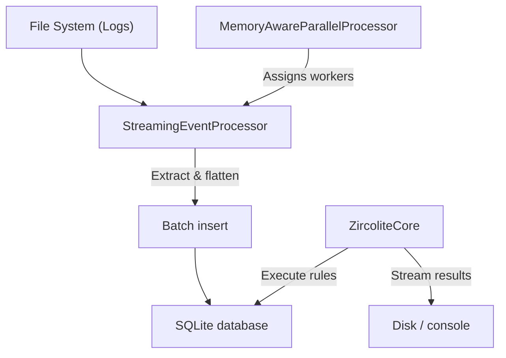
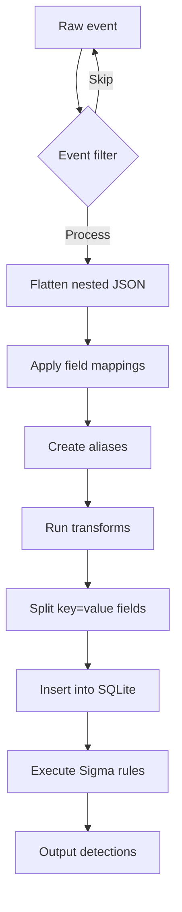
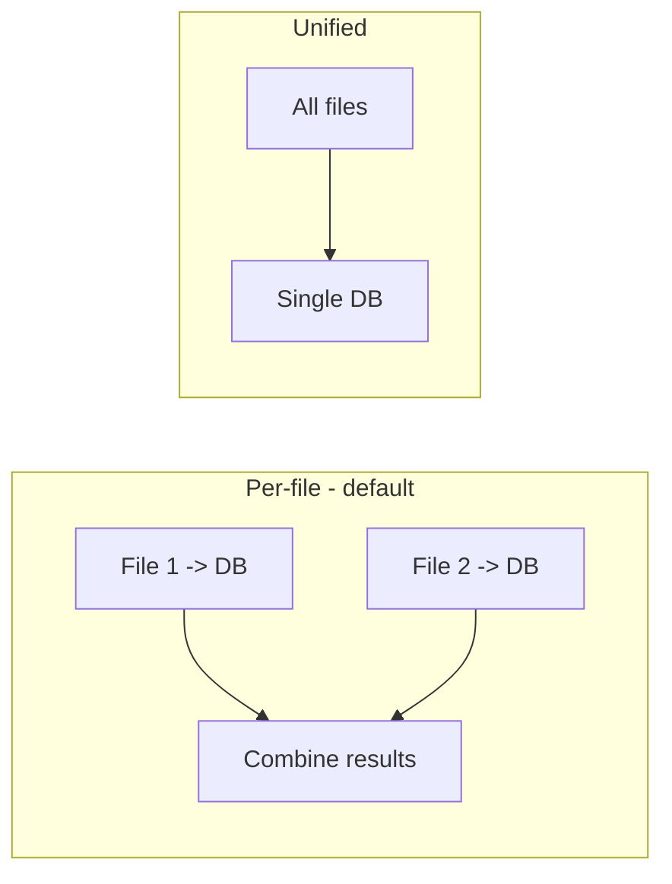

# Internals

Zircolite is more a workflow than a detection engine of its own. It leans on the Sigma
converter's ability to emit rules as SQLite `SELECT` statements: events are flattened
into an SQLite database, and each rule is a query run against it.

This page covers the architecture and the parts of the runtime whose behaviour is not
obvious from the command line. For how to *use* any of it, see
[Usage](Usage.md) and [Advanced](Advanced.md); for the dependency list, see
[Usage → Dependencies](Usage.md#dependencies).

## Architecture

```mermaid
graph TD
    FS["File System (Logs)"] --> SEP["StreamingEventProcessor"]
    SEP -->|"Extract & flatten"| IB["Batch insert"]
    IB --> DB["SQLite database"]

    MAPP["MemoryAwareParallelProcessor"] -->|"Assigns workers"| SEP

    ZC["ZircoliteCore"] -->|"Execute rules"| DB
    ZC -->|"Stream results"| OUT["Disk / console"]
```

Reading, flattening and insertion happen in a single pass. There is no intermediate
file and no alternative pipeline to select — what *is* selectable is how the database
is organised across input files.

## Event processing pipeline

```mermaid
flowchart TB
    A[Raw event] --> B{Event filter}
    B -->|Skip| A
    B -->|Process| C[Flatten nested JSON]
    C --> D[Apply field mappings]
    D --> E[Create aliases]
    E --> F[Run transforms]
    F --> G[Split key=value fields]
    G --> H[Insert into SQLite]
    H --> I[Execute Sigma rules]
    I --> J[Output detections]
```

| Stage | What it does | Example |
|-------|--------------|---------|
| **1. Filter** | Skip events whose Channel, or that channel's EventID bound, is claimed by no rule | Channel/EventID check |
| **2. Flatten** | Nested → flat structure | `Event.System.Channel` → `Channel` |
| **3. Mappings** | Rename fields | `Event.EventData.CommandLine` → `CommandLine` |
| **4. Aliases** | Duplicate a field under a new name | `CommandLine` → `cmdline` |
| **5. Transforms** | Sandboxed Python over the value | Extract the filename from a path |
| **6. Splits** | Parse key=value strings | `"a=1,b=2"` → `{a:1, b:2}` |

Transforms run before splitting, so a transform that *replaces* a value (rather than
writing an alias) changes what the split then parses. Splitting writes its derived fields
directly, so aliases do not apply to them.

Database columns are added as new fields are discovered, and events are inserted in
batches.

## Processing modes

Every mode reads events through the same pipeline. There are two database layouts, and
parallelism is an overlay on one of them rather than a third layout.

```mermaid
flowchart LR
    subgraph PerFile[Per-file - default]
        P1[File 1 -> DB] --> P3[Combine results]
        P2[File 2 -> DB] --> P3
    end

    subgraph Unified[Unified]
        U1[All files] --> U2[Single DB]
    end
```

| Layout | Flag | Database | Enables |
|--------|------|----------|---------|
| Per-file | default | One per file, reused | Parallel processing |
| Unified | `--unified-db` | One for all files | Cross-file correlation rules |

`analyze_files_and_recommend_mode` returns only `per-file` or `unified`. When the answer
is per-file and there is more than one input, the same function separately recommends
running those files across worker threads — one database per worker, which is why it is
available in per-file mode and not with `--unified-db`. `--no-parallel` declines it;
`--strict` and `--profile-rules` force it off, because a parse error and a per-rule timing
both need one file at a time.

The layout choice is made from file count, file sizes, available RAM and CPU count.
`--no-auto-mode` disables it and keeps per-file. The heuristics are documented in
[Advanced → Automatic processing optimization](Advanced.md#automatic-processing-optimization).

## Module map

All the logic lives in the `zircolite/` package. `zircolite.py` is a shim that calls
`zircolite/cli.py`; `python -m zircolite` goes through `__main__.py` and is equivalent.

| Module | Contents |
|--------|----------|
| `cli.py` | The whole command line: `parse_arguments`, `discover_files`, `main` |
| `__main__.py` | Entry point for `python -m zircolite` |
| `assets.py` | Resolution of the shipped `config/`, `rules/`, `templates/` and `gui/` |
| `streaming.py` | `StreamingEventProcessor` — single-pass read, flatten, transform, insert |
| `core.py` | `ZircoliteCore` — database management, indexes, rule execution, output |
| `detector.py` | `LogTypeDetector` — format, log source and timestamp-field detection |
| `processing.py` | Coordinates per-file, unified and parallel runs; aggregates results |
| `utils.py` | Logging, `MemoryTracker`, compressed-input handling, mode heuristics |
| `rules.py` | `RulesetHandler` (Sigma → Zircolite), `RulesUpdater`, `EventFilter` |
| `console.py` | Rich output: theme, detection tables, ATT&CK panels, hyperlinks, reports |
| `config_loader.py` | Loads and validates YAML run configurations; generates the template |
| `parallel.py` | `MemoryAwareParallelProcessor` — worker scaling and memory throttling |
| `sqlscan.py` | Quote-aware rule-SQL reader, and the OR-chain depth repair |
| `run_config.py` | `SETTINGS` — one row per option: YAML key, default, merge rule |
| `templates.py` | `TemplateEngine` (Jinja2 output), `ZircoliteGuiGenerator` (Mini-GUI) |
| `formats.py` | Input format registry: flag, YAML value, extension, encoding, reader |
| `extractor.py` | `EvtxExtractor` — log line / XML element → event dict |
| `config.py` | Dataclasses passed to the engine (`ProcessingConfig`, `ExtractorConfig`, …) |
| `attack.py` | MITRE ATT&CK technique and tactic IDs from Sigma tags |
| `shutdown.py` | SIGINT handling, so `Ctrl+C` finishes the current batch and writes results |
| `__init__.py` | The package's public re-export surface — and deliberately not `cli`, which would make `from zircolite import console` resolve to the submodule rather than the `Console` object |

`formats.py` is the single source of truth for input formats: the CLI, the YAML loader,
the streaming dispatcher and the extractor factory all resolve through the same table,
so a new format is a new row rather than an edit in each of them.

## Bundled asset resolution

`config/`, `rules/`, `templates/` and `gui/` ship with Zircolite, and the paths pointing
at them are relative, so they have to resolve whatever the working directory is.
`assets.py` does it, and lives outside `cli.py` because `config_loader` needs it too and
cannot import `cli` — `cli` imports it in turn.

For every value a user can override, a file of that name in the working directory wins and
anything else falls through to `bundled_asset`. That covers

- `--config`, for any relative path under `config/`, not only the default
- `--ruleset`, both the default and an explicit `-r rules/…`
- `--template`, and the templates behind `--timesketch` and `--navigator-output`
- the `rules` and `templates` entries of a `-Y` configuration file

`resolve_default_path` tests for a file. `resolve_asset_path` tests for existence instead,
and rulesets go through it because `--ruleset` also accepts a *directory* of native Sigma
YAML, which the file test would reject.

Only a value already rooted at the shipped directory falls back, so
`-r myrules/windows.json` keeps reporting itself missing instead of quietly loading
`rules/windows.json`.

Two paths deliberately do not follow that rule. `--package` reads the ZircoGui template
and `gui/zircogui.zip` from the bundle only: the two have to come from the same build, and
a copy of just one of them in the working directory would pair a new `data.js` with an old
GUI. `-U` writes to the installed `rules/` — the directory a later run will actually read
— and falls back to `./rules` only when that one cannot be written to.

`bundled_asset` returns the first root that holds the file:

| Order | Root | Applies to |
|-------|------|-----------|
| 1 | the directory holding the executable | PyInstaller builds only |
| 2 | `sys._MEIPASS`, where PyInstaller unpacks `datas` | PyInstaller builds only |
| 3 | the repository root, two levels up from `assets.py` | always |

The executable's own directory comes first so that the `config/`, `rules/`, `templates/`
and `gui/` shipped beside a binary can be edited: an updated ruleset dropped there takes
effect without a rebuild. When no root holds the file, the first candidate is returned,
so the error names a directory you can actually write to.

## SQLite behaviour

### Pragmas

Four pragmas apply to every database:

| Pragma | Value |
|--------|-------|
| `temp_store` | `MEMORY` |
| `mmap_size` | `268435456` (256 MB) |
| `page_size` | `4096` |
| `threads` | `min(8, cpu_count)` |

The rest depend on where the database lives:

| Pragma | In-memory | On disk |
|--------|-----------|---------|
| `journal_mode` | `OFF` | `WAL` |
| `synchronous` | `OFF` | `NORMAL` |
| `cache_size` | `-128000` (128 MB) | `-64000` (64 MB) |
| `locking_mode` | `EXCLUSIVE` | — |
| `wal_autocheckpoint` | — | `10000` |

### The `regexp` function

Sigma rules that match by regex need a `REGEXP` implementation, which SQLite does not
ship. Zircolite registers one that compiles patterns through an LRU cache, since the
same pattern is evaluated against every row.

Two details matter:

- **Patterns are validated before the query runs.** Sigma is written against PCRE, so a
  rule can carry a construct Python's `re` rejects (`\p{L}`, a possessive quantifier).
  Discovering that inside the function would mean discovering it once per row with
  nowhere to report it, and the rule would look like a clean non-match. Instead the
  patterns are compiled up front and a rule that fails is recorded as broken.
- **Values are coerced with `str()`.** A column takes its type from the first value
  observed for that field, so a field whose first event carried a number becomes
  `INTEGER` for the rest of that database. Passing an `int` to `re.search` raises, and
  SQLite reports that as a failure of the whole statement. Coercing to text matches what
  `LIKE` already does with a numeric column.

### Typing and collation

Columns are declared `TEXT` or `INTEGER`, both `COLLATE NOCASE`. `NOCASE` on an integer
column costs nothing — numeric equality and ranges are unaffected — and without it a
numeric first value would leave the column comparing text case-sensitively for the rest
of the run.

How far "the rest of that database" reaches depends on the mode. `--unified-db` really
is one table, so the first value seen anywhere in the corpus types the column. Per-file
and parallel modes rebuild the table between files, so each input is typed by its own
events; otherwise one file's schema would decide what every later file could match.

### Indexes

Which indexes exist, and how to change them, is covered in
[Usage → Database indexes](Usage.md#database-indexes). What matters here is the ordering.

Auto-indexes are applied once the ruleset is loaded, and `ANALYZE logs` runs immediately
after so the new indexes are covered. That analysis is not optional: rule widening (see
below) can more than double the column count, and with no statistics SQLite prices a row
by column count alone and starts abandoning selective indexes.

The built-in pair is `idx_eventid` and the composite `idx_channel_eventid`. A lone
`Channel` index prices a rule's channel test correctly and then leaves SQLite fetching
every row of that channel to re-check the eventID — which on a corpus carrying six
channels measured ~1.6× the rule-phase wall clock against the same detections. The
composite's leading column still serves channel-only rules, so it replaces the single
index rather than joining it. `idx_eventid` stays because a `(Channel, …)` index cannot
serve a rule that names only an eventID, and many do.

Both are created only when the column is actually present. SQLite would otherwise accept
`CREATE INDEX ... ON logs ("eventid")` against a table without that column by reading the
quoted name as a string literal, building an index over a constant: no error raised, and
nothing able to use it.

## Automatic SQL repairs

A rule whose SQL cannot be prepared matches nothing, and looks exactly like a rule that
found nothing. Zircolite therefore attempts two repairs, each at most once, before
giving up and recording the rule as broken in the run summary.

**Missing columns.** SQLite resolves column names when it prepares a statement, so a
rule naming one field the dataset never produced fails as a whole — losing the branches
that reference fields it does have. The absent columns are added as `NULL`, which makes
the rule evaluate exactly as it would against an event that simply lacks them. Rules
whose fields are *all* absent are widened too, so `|exists: false` becomes `IS NULL` and
matches every row.

Column names are read with `sqlscan.py`, not with a regex, for two reasons: the backend
backtick-quotes every field name that is not `^[a-zA-Z0-9_]*$` — which is every ECS and
Winlogbeat name (`event.code`, `@timestamp`, `Data[1]`) — and a name inside a string
literal is not a column, so `CommandLine LIKE '%user=bob%'` must not invent a `user`.

### Reading a statement

Four questions are asked of every rule statement: which channels it can match, which
eventIDs, which columns it names, and which patterns it hands to `REGEXP`. All four need
the same quote-aware lexer, and lexing is what reading a ruleset costs — roughly 100 ms
per megabyte of SQL, against merged rulesets carrying several.

So `sqlscan.scan_query` lexes a statement once, answers all four from that single token
list, and memoises the result; `column_refs`, `regex_literals`, `channel_constraints` and
`eventid_constraints` are folds over it. Every one of those answers is a pure function of
the statement text — no schema, no database, no config — so nothing can invalidate an
entry and there is no cache key beyond the SQL itself. Per-file and parallel modes ask the
same questions of the same statements once per input file, and after the first file they
are answered from memory.

The corollary is the rule to keep: anything schema-dependent stays out of `sqlscan.py`.
Deciding which of a statement's columns are *missing* needs the live table, so that stays
in `core.py`; only the list of names it mentions is cached.

**Over-deep expressions.** The SQLite backend emits value lists as a left-deep chain
(`a OR b OR c OR …`), whose parse-tree depth equals the number of terms. SQLite refuses
anything past `SQLITE_MAX_EXPR_DEPTH` (1000 by default), so rules listing a few thousand
hashes or filenames could not be prepared at all. Those chains are re-associated into a
balanced tree, bringing the depth down to O(log n). Chains of fewer than eight terms are
left alone.

Two properties keep the rewrite safe:

- **Only `OR` is re-associated, never `AND`.** The `AND` in `x BETWEEN a AND b` is syntax
  rather than a boolean operator; re-associating it compiles cleanly and silently returns
  the wrong rows. `OR` has the lowest precedence in SQL, so splitting on it and
  re-associating the operands always preserves meaning.
- **Anything unmodelled bails out**, returning the statement untouched: comments,
  unterminated quotes or `CASE`, unbalanced parentheses, an empty `OR` operand, a
  statement with no top-level `WHERE`, `UNION`/`INTERSECT`/`EXCEPT`, and any
  parenthesised group holding a `SELECT`. That last one matters because a
  subquery is not a boolean expression — re-associating the `OR`s inside
  `x IN (SELECT … OR …)` turns it into a truth value, which still compiles and quietly
  matches the wrong rows. Reporting a rule as broken is far better than emitting subtly
  wrong SQL.

Both repairs run only when SQLite itself raises the error, so a statement that already
compiles is never rewritten. The depth repair is memoised like the statement scan above,
because per-file and parallel modes run the same ruleset once per input file; widening
cannot be, since it alters the live table. They also chain: an over-deep statement is
rejected while parsing, before SQLite ever resolves column names, so widening only becomes
reachable once the expression has been rebalanced.

What this means for output is covered in
[Usage → Rules with very large value lists](Usage.md#rules-with-very-large-value-lists).
One further consequence: a repaired or re-planned query can return the same events in a
different order, because a query driven by one index visits rows in a different order than
one driven by another. Rules, counts and matched events are identical.
