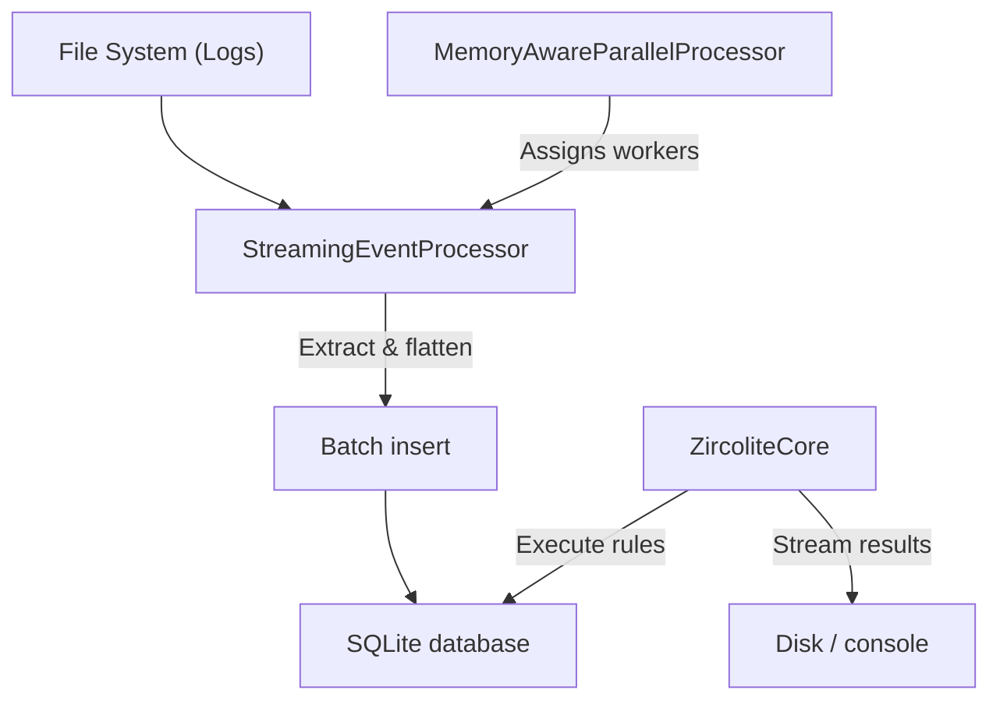
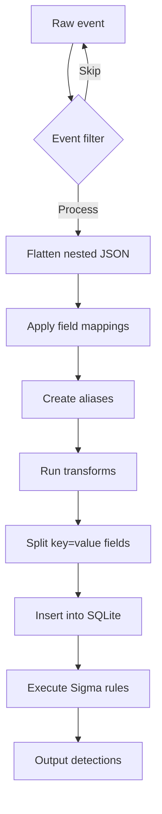
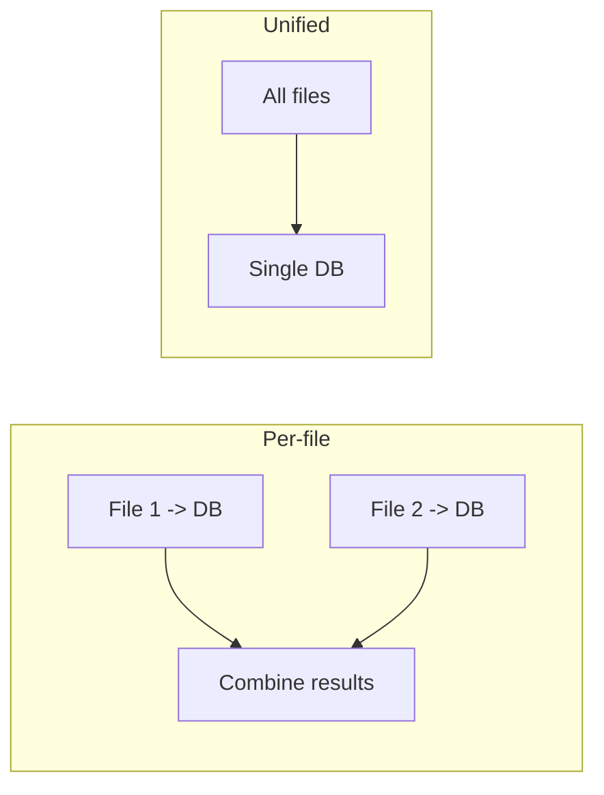
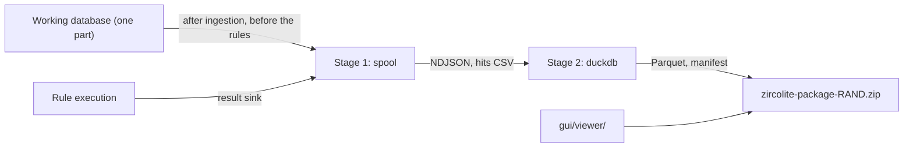

# Internals

Zircolite flattens events into SQLite and runs Sigma rules converted to SQL against them.
This page covers how, and the behaviour the command line does not make obvious. For how to
*use* any of it, see [Usage](Usage.md) and [Advanced](Advanced.md).

## Architecture


```mermaid
graph TD
    FS["File System (Logs)"] --> SEP["StreamingEventProcessor"]
    SEP -->|"Extract & flatten"| IB["Batch insert"]
    IB --> DB["SQLite database"]

    MAPP["MemoryAwareParallelProcessor"] -->|"Assigns workers"| SEP

    ZC["ZircoliteCore"] -->|"Execute rules"| DB
    ZC -->|"Stream results"| OUT["Disk / console"]
```

Reading, flattening and insertion happen in one pass, with no intermediate files.

## Event processing pipeline


```mermaid
flowchart TB
    A[Raw event] --> B{Event filter}
    B -->|Skip| A
    B -->|Process| C[Flatten nested JSON]
    C --> D[Apply field mappings]
    D --> E[Create aliases]
    E --> F[Run transforms]
    F --> G[Split key=value fields]
    G --> H[Insert into SQLite]
    H --> I[Execute Sigma rules]
    I --> J[Output detections]
```

| Stage | What it does | Example |
|-------|--------------|---------|
| **1. Filter** | Skip events whose Channel, or that channel's EventID set, no rule claims | Channel/EventID check |
| **2. Flatten** | Nested → flat structure | `Event.System.Channel` → `Channel` |
| **3. Mappings** | Rename fields | `Event.EventData.CommandLine` → `CommandLine` |
| **4. Aliases** | Copy a field under a new name | `CommandLine` → `cmdline` |
| **5. Transforms** | Sandboxed Python over the value | Extract the filename from a path |
| **6. Splits** | Parse key=value strings | `"a=1,b=2"` → `{a:1, b:2}` |

Transforms run before splitting, so a transform that *replaces* a value changes what the
split parses. Split fields are written directly (aliases do not apply to them), cleaned like
any field name, and merged only where the event has no field of that name in any case, so
log content cannot overwrite a real field or `row_id`.

**Typing.** Columns are added as fields appear, and events are inserted in batches. A
column takes its type from the first value it receives: `INTEGER`, `NUMERIC` for floats (so
ranges compare numerically), or `TEXT`. Integers beyond SQLite's signed 64-bit range are
stored as floats and may be rounded; the run warns once and names the fields.

**Spellings.** SQLite column names are case-insensitive, so `ProcessId` and `ProcessID`
share one column, named after the first spelling stored. Ingestion records every event that
spelled a field otherwise (tables `field_spellings` and `logs_spelling`), and output prints
each event with its own spelling, so per-file, unified and parallel runs print an event the
same way. The time field is the exception: it always prints under its `--timefield` name,
which the Timesketch template and the Viewer look up. Rule SQL never reads those tables.

**Readers.** JSON arrays are validated incrementally, accelerated by `ijson` when present.
ZIP members stream from the archive; 7-Zip members spool to temporary files. CSV raises the
field-size limit to the platform's maximum. XML and EVTXtract readers skip comments and
processing instructions between records.

When a rule has several SQL statements, an event matched by more than one is kept once, by
`row_id`, before `--limit` applies.

### Event filter bounds

The [early event filter](Advanced.md#early-event-filtering) maps each channel the ruleset
names to the EventIDs its rules can match. Those IDs are read from each rule's **SQL**, not
its `eventid` metadata, which collects values from every detection group, negated filters
included:

```yaml
detection:
    selection:
        Channel: Security
    filter:
        EventID: 4624
    condition: selection and not filter
```

That rule's metadata says `eventid: [4624]`, the one ID it excludes. A channel stays
unbounded (every EventID kept) when a rule on it constrains `EventID` under a `NOT`, has an
`OR` branch without an `EventID` constraint, constrains it in a form the scan cannot read
(`BETWEEN`, `>`, `LIKE`), or does not mention it. A rule constraining EventIDs but no
channel switches the filter to two global axes, each filtering only when every rule
constrains it. A legacy correlation rule (backend 1) with no channel in its SQL turns the
filter off for the run.

The filter reads its values from the raw event, before flattening. When an event carries
several of the configured fields with different values, it keeps the event, since the
flattener decides which value lands in the column.

## Rule execution

**Census pruning.** Before the rules run, `execute_ruleset` reads the distinct
`(Channel, EventID)` pairs present, through `idx_channel_eventid`. A rule is skipped when
every statement is a plain `SELECT * FROM logs WHERE …` whose `sqlscan` bounds (the same
the event filter uses) miss all of them. Statements without bounds, correlations, aggregate
projections, columns holding values SQLite would coerce, and tables with unusual
collations always run. The saving is statement preparation, about 0.3 ms per rule per file.

**Correlation plans.** A rule with a `correlation_plan` (SQLite backend 2) never runs its
`rule` SQL. `core.py` hands the plan to the backend's `runtime.execute_plan`, which widens
`logs` with the plan's `required_fields`, materialises each stage as an indexed TEMP table,
runs the result and diagnostic queries, fetches the evidence by `row_id` and drops the
tables. A progress handler checks for Ctrl+C every 10,000 SQLite instructions. Plans are
never repaired, scanned, prefiltered or used to pick indexes. A plan this install cannot run
(version, SQLite) is reported at load and recorded as a rule error.

**Literal prefilter.** Most rules match with `LIKE` patterns. The prefilter reads the fields
those patterns name once, finds which events contain each pattern's necessary literal
(Aho–Corasick search, row IDs in Roaring bitmaps), and runs each query only over those
candidate events. SQLite still evaluates the whole condition on every candidate, so
detections are identical with the filter on or off.

- `auto` builds it for databases of 1,000 events or more and rulesets with 32 or more
  eligible queries; `literal` forces it, `off` disables it.
- Only plain `SELECT * FROM logs WHERE …` statements qualify. A pattern contributes its
  longest literal run of three characters or more, or one holding a non-ASCII character.
  AND intersects candidates, OR unions them, NOT gives no bound. `REGEXP` queries take the
  normal path.
- Candidates reach SQLite as `logs.row_id IN (SELECT value FROM json_each('[...]'))` ahead
  of the original predicate. A rule with no candidates runs `SELECT 1 WHERE 0`. A candidate
  set holding at least half the rows the rule's bounds select is bypassed.
- Construction is capped (one million pattern characters, sixteen row IDs per event); a
  column over budget becomes unbounded. It needs SQLite's JSON1, and stays off without it.

## Processing modes


```mermaid
flowchart LR
    subgraph PerFile[Per-file]
        P1[File 1 -> DB] --> P3[Combine results]
        P2[File 2 -> DB] --> P3
    end

    subgraph Unified[Unified]
        U1[All files] --> U2[Single DB]
    end
```

| Layout | Selected by | Database | Enables |
|--------|-------------|----------|---------|
| Per-file | Auto mode, or the default with `--no-auto-mode` | One per file, reused | Parallel processing |
| Unified | Auto mode, or `--unified-db` | One for all files | Cross-file correlation rules |

`analyze_files_and_recommend_mode` returns only `per-file` or `unified`. For a per-file run
of several inputs it separately recommends running them across workers, one database per
worker, which is why parallelism exists only for per-file runs. `--strict` and
`--profile-rules` turn it off, because a parse error and a per-rule timing both need one file
at a time. The heuristics are in
[Advanced → Automatic processing optimization](Advanced.md#automatic-processing-optimization).

**Executors.** Threads share one GIL, which every SQLite row step releases and takes back,
so thread workers queue behind each other: on 450 EVTX files of 16 MiB, twenty threads ran
2.4 times slower than one file at a time, and ten processes 3.9 times faster. Hence
`--executor auto` picks processes from 32 MiB of input. Processes return summaries and
temporary output paths rather than pickling match lists, share a shutdown event, and split
the EVTX parser threads across the CPU budget. Compressed sizes feed scheduling estimates
only; runtime memory throttling still applies.

**Working storage.** With `--working-db disk`, each core owns a temporary directory and an
SQLite file, removed with its WAL sidecars on close. `--dbfile` exports through SQLite's
backup API either way.

**Kernel.** Flattening uses the compiled kernel when it was built from the current
`flatten_kernel.py`, and otherwise runs the same source as Python.

**Timers.** Nested stage timers pause their parent, so index and output time does not also
count as ingestion or detection. Worker stage times are summed apart from wall time, and RSS
is sampled in a background thread.

## Package pipeline

`--package` copies every ingested event out of the working databases, links the detections
to them, and writes Parquet into a zip beside a prebuilt viewer. How to use a package is on
the [Zircolite Viewer](Viewer.md) page. It runs in two stages, so only the main process ever
loads duckdb:


```mermaid
flowchart LR
    DB["Working database (one part)"] -->|"after ingestion, before the rules"| S1["Stage 1: spool"]
    R["Rule execution"] -->|"result sink"| S1
    S1 -->|"NDJSON, hits CSV"| S2["Stage 2: duckdb"]
    S2 -->|"Parquet, manifest"| Z["zircolite-package-RAND.zip"]
    V["gui/viewer/"] --> Z
```

### Stage 1: the spool

`package_spool.py` runs wherever a working database lives, process workers included, using
only the standard library and orjson. Each working database is one **part**.

- **Events.** `PartWriter.export_events` copies `logs` right after ingestion (where
  `--dbfile` saves) and before the first rule, which adds columns, indexes and statistics
  the package must not carry. Rows go out in `row_id` order as gzip NDJSON, a new file every
  100,000 rows, each with `_zl_part`, `_zl_rid`, `_zl_time` (microseconds, parsed as
  `--after`/`--before` parse it) and `_zl_spelling` where needed. The same pass records each
  column's types and non-null count, the columns of each `(Channel, EventID)` family and the
  time range, so stage two never scans for them.
- **Hits.** `PartWriter.sink` is the result sink every rule's result passes through. Matches
  become `rule_idx,part,row_id` lines; alerts become NDJSON, and their evidence events count
  as hits of the correlation. The sink keeps the first `PackageError`, `OSError`,
  `ValueError` or `TypeError` and fails the package with it at `finish`, so a package error
  never stops the rule loop or loses the detections output.
- **Refusals.** A field starting with the reserved `_zl_` prefix, a `row_id` outside
  `0`…`2³² − 1`, or an alert citing a table other than `logs` fails the package.

Each mode spools at one place in `processing.py`, through `_start_package_part`: part 0 for
a unified run, the file's index for per-file and parallel runs (assigned before any worker
starts), the database's position for `-D`. A failed part is recorded; the run still writes
its detections, then reports the error, writes no package and exits `1`.

### Stage 2: Parquet

`PackageBuilder.build_data`, in the main process, first checks that the parts hold exactly
the events ingested. It then runs an in-memory duckdb (2 GB limit, one thread, insertion
order kept, spill directory in the package's temporary directory, extension autoloading
off); `check_duckdb` refused a duckdb without JSON and Parquet built in before ingestion.

- **Events.** `read_json` over the spool, in part order, through
  `COPY … (FORMAT parquet, COMPRESSION zstd, ROW_GROUP_SIZE 20000)`. One thread and 20,000-row
  groups keep the writer near 1.6 GB at 386 columns, where 100,000-row groups need 6 to 7 GB.
- **Types.** Integers only → `BIGINT`, reals only → `DOUBLE`, anything else `VARCHAR`, so no
  integer above 2⁵³ goes through a double.
- **Names.** A column takes the spelling of the lowest-numbered part that has it, except the
  time field. Other spellings go into the manifest and `_zl_spelling`.
- **Identity.** Every event is `_zl_uid = part × 2³² + row_id`, below 2⁵³ for fewer than 2²¹
  parts, so JavaScript holds it exactly.
- **Limits.** `events.parquet` above `EVENTS_PARQUET_LIMIT` (1 GiB) is an error, since the
  browser holds it in 4 GB of WebAssembly memory. `text.parquet` above `TEXT_PARQUET_LIMIT`
  (1 GiB) is left out, with a manifest warning.

| File | Contents |
|------|----------|
| `events.parquet` | `_zl_uid`, `_zl_part`, `_zl_time` (`TIMESTAMP`, UTC), `_zl_spelling`, then every column |
| `rules.parquet` | One row per matched ruleset entry: `key`, title, level and `level_rank`, tags, tactics, techniques, counts |
| `hits.parquet` | Distinct `(rule_idx, _zl_uid)` pairs, sorted |
| `alerts.parquet` | One row per correlation alert |
| `alert_events.parquet` | `(alert_idx, _zl_uid, ord)`: each alert's evidence, in order |
| `text.parquet` | `(_zl_uid, _zl_text)`: each event's values, lowercased and joined by `chr(31)`, for full-text search |

`data/manifest.js` carries the format and Zircolite versions, the creation time, the run
settings (never the command line), the totals, every column with its type, the parts, the
failed inputs, the warnings, and every file with its size, SHA-256 and chunks.

### Wrapping for `file://`

A page opened from `file://` may run the scripts beside it but not fetch files, so every
binary becomes scripts: each 3 MiB chunk is `__zircolite.chunk("<name>", <seq>, "<base64>")`,
streamed into the zip, and the manifest is `__zircolite.manifest({…})`.

```
index.html  app.js  app.css  README.txt  THIRD_PARTY_NOTICES.txt
assets/duckdb-eh.wasm.gz.NNNN.js  assets/duckdb-browser-eh.worker.js.NNNN.js
assets/parquet.duckdb_extension.wasm.NNNN.js
data/manifest.js  data/{events,rules,hits,alerts,alert_events,text}.parquet.NNNN.js
```

`gui/viewer/viewer.json` lists which viewer files are copied and which wrapped, and the
`data_format` the viewer reads, which must equal `PACKAGE_FORMAT` in `package.py`. The zip
is written in a temporary directory inside the destination and moved into place with
`os.replace`.

### The viewer

`gui/source/` holds the sources (Svelte 5, TypeScript, Vite); `gui/viewer/` is the committed
build, and the only part of `gui/` that ships.

- **Boot.** `manifest.js` loads first, so the summary shows before the data. Chunks follow,
  six at a time, each file checked against the manifest's chunk count and size. The engine
  is gunzipped and handed to DuckDB-WASM as a `data:` URL, because a worker started from
  `file://` cannot fetch a `blob:` URL in Chromium or WebKit. Parquet support loads from the
  package through a `data:` extension repository, then autoloading is switched off. The
  engine's event and hit counts must equal the manifest's.
- **Queries.** One connection; `QueryScheduler` runs one query at a time and can cancel it.
  Each request names a **lane**, and a newer request supersedes the older one in its lane;
  **Stop** cancels every lane. SQL is built only from checked identifiers and escaped
  literals. Full-text matches are computed once per pattern into a temporary table, in
  slices a Stop can interrupt.
- **The console.** User SQL reaches DuckDB only as a string literal passed to the `query()`
  table function, which accepts exactly one SELECT, so a second statement is a parse error.
- **Text, never markup.** `tests/test_viewer_source.py` fails on `{@html}`, `innerHTML`,
  `eval` and similar sinks anywhere in `gui/source/src`, and on a page without its content
  security policy.

## Module map

All the logic lives in the `zircolite/` package. `zircolite.py` is a shim that calls
`zircolite/cli.py`; `python -m zircolite` goes through `__main__.py`.

| Module | Contents |
|--------|----------|
| `cli.py` | The whole command line: `parse_arguments`, `discover_files`, `main` |
| `__main__.py` | Entry point for `python -m zircolite` |
| `assets.py` | Resolution of the shipped `config/`, `rules/`, `templates/` and `gui/viewer/` |
| `streaming.py` | `StreamingEventProcessor`: single-pass read, flatten, transform, insert |
| `flatten_kernel.py` | Flattening kernel; the Python reference, also compiled as `_flatten_native` |
| `jsonstream.py` | Validating JSON-array reader with an optional C parser |
| `results.py` | Temporary detection row storage and incremental JSON output |
| `spellings.py` | Field spellings a column does not carry, recorded and restored on output |
| `core.py` | `ZircoliteCore`: database management, indexes, rule execution, output |
| `correlations.py` | Correlation plan checks, alert rows and diagnostics wording |
| `prefilter.py` | Literal prefilter: candidate rows for a rule's `LIKE` literals |
| `performance.py` | Stage timers, per-file metrics and the `--performance-json` report |
| `detector.py` | `LogTypeDetector`: format, log source and timestamp-field detection |
| `processing.py` | Coordinates per-file, unified and parallel runs; aggregates results |
| `utils.py` | Logging, `MemoryTracker`, compressed-input handling, mode heuristics |
| `rules.py` | `RulesetHandler` (Sigma → Zircolite), `RulesUpdater`, `EventFilter` |
| `console.py` | Rich output: theme, detection tables, ATT&CK panels, hyperlinks, reports |
| `config_loader.py` | Loads and validates YAML run configurations; generates the template |
| `parallel.py` | `MemoryAwareParallelProcessor`: worker scaling and memory throttling |
| `sqlscan.py` | Quote-aware rule-SQL reader, and the OR-chain depth repair |
| `run_config.py` | `SETTINGS`: one row per option, with YAML key, default and merge rule |
| `templates.py` | `TemplateEngine` (Jinja2 output) |
| `package_spool.py` | Stage one of `--package`: spools each working database's events, hits and alerts |
| `package.py` | Stage two of `--package`: Parquet tables, the manifest and the viewer zip |
| `formats.py` | Input format registry: flag, YAML value, extension, encoding, reader |
| `extractor.py` | `EvtxExtractor`: log line or XML element → event dict |
| `config.py` | Dataclasses passed to the engine (`ProcessingConfig`, `ExtractorConfig`, …) |
| `attack.py` | MITRE ATT&CK technique and tactic IDs from Sigma tags |
| `shutdown.py` | SIGINT handling, so `Ctrl+C` finishes the current batch and writes results |
| `__init__.py` | The public re-exports — deliberately not `cli`, which would make `from zircolite import console` resolve to the submodule |

`formats.py` is the single source of truth for input formats: the CLI, the YAML loader, the
streaming dispatcher and the extractor factory all read the same table, so a new format is a
new row.

### Dependencies

| Package | Purpose |
|---------|---------|
| `orjson` | Fast JSON parsing |
| `ijson` | Incremental JSON-array parsing |
| `pyahocorasick`, `pyroaring` | Literal prefilter |
| `regex` | Rule `REGEXP` matching with a per-value time limit |
| `rich`, `rich-argparse` | Terminal output and coloured help |
| `RestrictedPython` | Sandbox for field transforms |
| `requests` | Ruleset updates (`-U`) |
| `pySigma` and backends | Native Sigma rule conversion |
| `evtx` (pyevtx-rs) | EVTX parsing |
| `jinja2` | Output templates |
| `lxml` | XML input |
| `chardet` | Encoding detection |
| `psutil` | Memory tracking and parallel-processing heuristics |
| `pyyaml` | YAML configuration |
| `py7zr` | 7-Zip archives, imported only when a `.7z` is opened |
| `duckdb` | Writing `--package` Parquet tables |

`evtx` publishes wheels for Linux (x86_64, ARM64), macOS and Windows x64, and Zircolite
cannot start without it.

## Bundled asset resolution

`assets.py` resolves shipped paths under `config/`, `rules/`, `templates/` and `gui/viewer/`
independently of the working directory, for both the CLI and the configuration loader.

For every value a user can override — `--config`, `--ruleset` (default or `rules/…`),
`--template` and the templates behind `--timesketch` and `--navigator-output`, and the
`rules` and `templates` of a `-Y` file — a file of that name in the working directory wins;
anything else falls through to `bundled_asset`. Only a value already rooted at the shipped
directory falls back, so `-r myrules/windows.json` still reports itself missing.
`resolve_asset_path` tests for existence rather than for a file, because `--ruleset` also
takes a directory of Sigma YAML.

`shipped_copy_shadowed_by` tells whether a working-directory copy won over the shipped one;
the CLI warns about it for the defaults the user did not name. `-c` records an explicit value
with a custom argparse action, because its default is also its most common explicit value.
`--package` always takes the viewer from Zircolite's own files, never the working directory.

`bundled_asset` returns the first root that holds the file:

| Order | Root | Applies to |
|-------|------|-----------|
| 1 | the directory holding the executable | frozen builds only |
| 2 | `sys._MEIPASS`: the `_internal/` beside the executable | frozen builds only |
| 3 | two levels up from `assets.py`: the repository root, or `_internal/` in a binary | always |

The executable's directory comes first, so the editable copies a release ships beside the
binary take effect without a rebuild; `_internal/` lets a bare PyInstaller build run on its
own. When no root holds the file, the first candidate is returned, so the error names a
directory you can write to. `bundled_dir`, used by `-U`, skips roots inside
`sys._MEIPASS`, and `RulesUpdater` falls back to `./rules` when that one is read-only.

## Packaging

The standalone binaries are PyInstaller *onedir* builds from `Zircolite.spec`.
`tools/package-release.py` adds editable copies of `config/`, `rules/`, `templates/` and
`gui/viewer/` beside the executable, plus `docs/`, `pics/`, `README.md`, `LICENSE` and a
generated `THIRD_PARTY_LICENSES`, and zips it. Linux and macOS archives record Unix modes
and symlinks, so `unzip` restores them. Building, testing and the CI gates are in
[CONTRIBUTING.md](https://github.com/wagga40/Zircolite/blob/master/CONTRIBUTING.md#building-the-standalone-binary).

### Why onedir

A onefile executable unpacks its runtime into a temporary directory on every start: 2–4 s
per run on macOS, against about 0.37 s for onedir or source, and it needs an executable
temporary location. The spec keeps PyInstaller's `_internal/` directory: flattening it
(`contents_directory='.'`) would put the `zircolite/` package beside the `Zircolite`
executable, and the two collide on case-insensitive filesystems.

### Why PyInstaller

Evaluated on macOS arm64 with Python 3.14; historical medians, not a comparison of the
tools' latest releases. PBS is python-build-standalone.

| | PyInstaller onedir | Nuitka 4.2.1 standalone | PyApp + PBS |
|---|---|---|---|
| Parity with source | all pass | all pass, with local loader patches | all pass |
| `--version` start-up | 0.375 s, as source | **0.27 s** | 0.32 s, after a first run of 2–3 s extracting ~180 MB into the home directory |
| Run time against source | −4 % to +1 % | 5–18 % slower | 11–29 % faster, from the PBS interpreter |
| Local build time | 17–30 s | 105–180 s | 81 s, plus a Rust toolchain |

PyInstaller met the portable-directory requirement with short builds and no patches;
PyApp's persistent per-user install did not. Linux release builds use a PBS interpreter.

### Support floors

| Target | Floor | What sets it |
|--------|-------|--------------|
| `linux-x64`, `linux-arm64` | glibc 2.28: RHEL 8, Debian 10, Ubuntu 20.04 | The build runs in a `manylinux_2_28` container on a PBS Python; a runner's own Python would carry the runner's glibc |
| `macos-arm64` | macOS 15.0 | The `macos-15` runner with `MACOSX_DEPLOYMENT_TARGET=15.0`; the wheels it selects target macOS 15 |
| `windows-x64`, `windows-arm64` | Windows 10 | Python 3.14 supports nothing older |

### Windows ARM64

`pdm.lock` cannot install on Windows ARM64: `evtx` publishes neither a `win_arm64` wheel nor
an sdist, and `jq`, which pySigma requires, does not build there. `tools/install-win-arm64.py`
exports the locked requirements without those two, installs them into a uv environment with
`--no-deps`, adds an `evtx` wheel built with maturin from pyevtx-rs, installs Zircolite
editable so the kernel compiles where the spec looks for it, and points PDM at that
environment. pySigma imports `jq` only for a transformation Zircolite never uses.

## SQLite behaviour

### Pragmas

Every database gets `page_size` `4096` and `threads` `min(8, cpu_count)`. The rest depend on
where it lives:

| Pragma | In memory | On disk |
|--------|-----------|---------|
| `temp_store` | `MEMORY` | `FILE` |
| `mmap_size` | `268435456` (256 MB) | `0` |
| `journal_mode` | `MEMORY` | `WAL` |
| `synchronous` | `OFF` | `NORMAL` |
| `cache_size` | `-128000` (128 MB) | `--sqlite-cache-mib` × `-1024` (default `-65536`) |
| `locking_mode` | `EXCLUSIVE` | — |
| `wal_autocheckpoint` | — | `10000` |

### The `regexp` function

SQLite ships no `REGEXP`; Zircolite registers one, with compiled patterns in an LRU cache.

- **Patterns are validated first** with Python's `re`; unsupported constructs such as
  `\p{L}` mark the rule as broken.
- **Values are coerced with `str()`**, as `LIKE` converts numbers to text.
- **Each match has a one-second budget** (`REGEX_TIMEOUT_SECONDS`). The logs choose the
  input to every rule regex, and a backtracking pattern such as
  `-f(?:.*\)){1,}.*"` (Invoke-Obfuscation VAR+) could run for hours on a crafted command
  line. Matching uses the `regex` module; a value over budget is a non-match for that event,
  with a warning naming the rule, and the summary counts these events.

### Typing and collation

Columns are `INTEGER`, `NUMERIC` or `TEXT` with `COLLATE NOCASE`, which changes text
comparison but not numeric equality or ranges. A ruleset converted with the backend's
`collate_nocase` option therefore compares exactly as the bare equality does, and the
bounds, census and prefilter read an explicit `COLLATE NOCASE` on an equality as that
equality. Any other collation leaves the statement unplanned.

In unified mode, column types come from the first values seen across the corpus. Per-file
and parallel modes rebuild the table between files, so each input has its own schema.

### Indexes

The built-in indexes are `idx_eventid` and `idx_channel_eventid`, or `idx_channel` when the
data has a Channel but no EventID ([Usage → Database indexes](Usage.md#database-indexes)).
A lone Channel index leaves SQLite fetching every row of the channel to re-check the
EventID, about 1.6 times the rule-phase time on a six-channel corpus; the composite's
leading column still serves channel-only rules. `idx_eventid` stays for rules naming only
an EventID. Each index is created only when its column exists: SQLite would otherwise read
the quoted name as a string literal and index a constant.

Auto-indexes are applied once the ruleset is loaded, followed by `ANALYZE logs`. That is not
optional: widening (below) can more than double the column count, and without statistics
SQLite prices rows by column count and starts abandoning selective indexes.

## Automatic SQL repairs

When SQLite cannot prepare a rule, Zircolite tries each applicable repair once. A rule that
still fails is reported at the end of the run (`--debug` shows the SQL error). Both repairs
run only when SQLite raises the error, so a statement that compiles is never rewritten.

**Missing columns.** SQLite resolves column names at preparation, so a rule naming one field
the data never produced fails as a whole. The absent columns are added as `NULL`, which
evaluates the rule exactly as against events lacking those fields; `|exists: false` becomes
`IS NULL`. A backend-2 ruleset's `required_fields` are added too, since a field used only
inside a function call is invisible to the scan.

**Over-deep expressions.** Some rules list thousands of values, such as vulnerable driver
hashes. The backend emits them as a left-deep `a OR b OR c …` chain whose depth equals the
number of terms, past SQLite's `SQLITE_MAX_EXPR_DEPTH` (1000). Chains of eight terms or more
are rebalanced into a tree of depth O(log n). Two properties keep this safe:

- **Only `OR` is re-associated, never `AND`.** The `AND` in `x BETWEEN a AND b` is syntax;
  re-associating it compiles cleanly and returns the wrong rows. `OR` has the lowest
  precedence, so splitting on it always preserves meaning.
- **Anything unmodelled bails out**, leaving the statement untouched: comments, unterminated
  quotes or `CASE`, unbalanced parentheses, no top-level `WHERE`, set operations, and any
  parenthesised group holding a `SELECT`.

The repairs chain: an over-deep statement fails while parsing, before column names resolve,
so widening becomes reachable only after rebalancing. The `sigma` field in
`detected_events.json` always reports the declared SQL, and `--save-ruleset` writes it as
pySigma produced it. A repaired query can return the same events in another order.

### Reading a statement

Four questions are asked of every statement: which channels, which EventIDs, which columns,
which `REGEXP` patterns. All need the same quote-aware lexer, and lexing is what reading a
ruleset costs (about 100 ms per megabyte of SQL). `sqlscan.scan_query` lexes each statement
once and caches the result by text; `column_refs`, `regex_literals`, `channel_constraints`
and `eventid_constraints` are folds over it.

The lexer, not a regex, finds column names because the backend backtick-quotes every name
outside `^[a-zA-Z0-9_]*$` (every ECS name, such as `event.code` or `@timestamp`), because a
name inside a string literal is not a column (`CommandLine LIKE '%user=bob%'` must not
invent `user`), and because a name bound with `AS` is not one either: a NULL `event_count`
column would otherwise shadow a correlation's `HAVING event_count >= 3`.

### Negated conditions on absent fields

Sigma reads a condition on a missing field as false, so `selection and not filter` matches
when the filter names a field the event lacks. SQLite evaluates that comparison to `NULL`,
and `NOT NULL` is `NULL`, so the row would be dropped: a Sysmon network event without
`CommandLine` would escape a negated command-line filter.

This rewrite applies to every statement before it runs. `sqlscan.normalize_rule_sql` wraps
the operand of each prefix `NOT` in `COALESCE((…), 0)`, turning that `NULL` back into the
false Sigma means. `NOT LIKE`, `NOT IN` and `IS NOT NULL` compare rather than negate and are
left alone, as is a `NOT` over a `BETWEEN` or `CASE`. The prefilter plans the rewritten
form, and the event filter bounds read from it are unchanged.
