# Usage

## Requirements and installation

Zircolite runs on Linux, macOS and Windows. Pick one way to run it:

| Route | Needs | Start with |
|-------|-------|------------|
| [Standalone binary](#standalone-binaries) | Nothing | Unzip, then run `./Zircolite` |
| [Docker](#docker) | Docker | `docker pull wagga40/zircolite` |
| [From source](#from-source) | Python 3.10+ and, ideally, a C compiler | `pdm install`, `uv sync` or `poetry install` |

The examples in this documentation run `python3 zircolite.py`. With a binary, use the path
to the executable instead.

### Standalone binaries

Each [GitHub release](https://github.com/wagga40/Zircolite/releases) publishes one zip per
platform. It carries its own Python, every dependency, the compiled flattening kernel and
the pySigma pipelines `sysmon`, `windows-logsources` and `windows-audit`.

| Target | Archive | Minimum platform |
|--------|---------|------------------|
| `linux-x64` | `Zircolite-<version>-linux-x64.zip` | glibc 2.28: RHEL 8, Debian 10, Ubuntu 20.04 |
| `linux-arm64` | `Zircolite-<version>-linux-arm64.zip` | glibc 2.28 |
| `macos-arm64` | `Zircolite-<version>-macos-arm64.zip` | macOS 15, Apple silicon |
| `windows-x64` | `Zircolite-<version>-windows-x64.zip` | Windows 10 |
| `windows-arm64` | `Zircolite-<version>-windows-arm64.zip` | Windows 10, ARM64 |

There is no binary for Intel Macs or for musl-based distributions such as Alpine: use
Docker or a source install there.

Extract the zip with `unzip` or Archive Utility, which keep the executable bit and the
symlinks a macOS build needs. After a tool that drops them, run `chmod +x Zircolite` on
Linux, or extract again on macOS:

```
Zircolite-<version>-<target>/
├── Zircolite                         Zircolite.exe on Windows
├── _internal/                        Python, the libraries, built-in copies of the directories below
├── config/  rules/  templates/  gui/viewer/     editable; they override the built-in copies
└── docs/  pics/  README.md  LICENSE  THIRD_PARTY_LICENSES
```

Keep the directory whole: the executable cannot run without `_internal/`.

```shell
unzip -q Zircolite-<version>-linux-x64.zip -d ~/tools
~/tools/Zircolite-<version>-linux-x64/Zircolite --events /cases/host1/
```

- **Run it from anywhere.** Relative paths to shipped files (`rules/…`, `templates/…`,
  `config/…`) resolve against the working directory first, then against the package. When
  a default you did not name — the `-c` config, the default ruleset, or the template behind
  `--timesketch` or `--navigator-output` — comes from the working directory, Zircolite warns:
  a copy inside a directory you received would otherwise change mappings, rules or output
  silently. Naming the file yourself silences the warning.
- **macOS.** The binaries are not signed. Clear the quarantine flag from the whole extracted
  directory before the first run: `xattr -dr com.apple.quarantine Zircolite-<version>-macos-arm64`.
- **Updating rules.** `-U` writes to the `rules/` beside the executable, or to `./rules`,
  with a warning, when that directory is read-only. It never writes into `_internal/`.
- **Pipelines.** A binary applies only the pipelines it was built with (`-pl` lists them).

Each release publishes `SHA256SUMS` and a build provenance attestation for every archive.
`gh attestation verify` needs the [GitHub CLI](https://cli.github.com/):

```shell
sha256sum --check --ignore-missing SHA256SUMS         # Linux
shasum -a 256 --check --ignore-missing SHA256SUMS     # macOS
Get-FileHash Zircolite-<version>-windows-x64.zip      # Windows: compare with SHA256SUMS
gh attestation verify Zircolite-<version>-<target>.zip --repo wagga40/Zircolite
```

### Docker

The [wagga40/zircolite](https://hub.docker.com/r/wagga40/zircolite) image carries every
dependency and the rulesets `-U` installed when it was built. It is not rebuilt for every
ruleset update. Mount the logs read-only and a results folder writable, using absolute
host paths:

```shell
docker run --rm --tty \
    -v <logs folder>:/case/input:ro \
    -v <results folder>:/case/output \
    wagga40/zircolite:latest \
    --events /case/input \
    -o /case/output/detected_events.json
```

- Put your own rules in a mounted directory: `--ruleset /case/input/my_rules.yml`.
- Outputs that go to the working directory by default, such as `--package` or `--keepflat`,
  disappear with the container: send the package to `--package-dir /case/output`.
- The image runs as an unprivileged user. Docker Desktop and OrbStack on macOS remap the
  mounts, so that works as is. On a Linux host, run as yourself and put the log file beside
  the results: add `--user "$(id -u):$(id -g)"` and `-l /case/output/zircolite.log`.
- Build the image yourself with `docker build . -t <name>` or `task docker-build`.

### From source

Clone the repository, then install with the tool you already use. `pyproject.toml`
declares the dependencies and `pdm.lock` is the tracked lock file.

| Tool | Install | Run |
|------|---------|-----|
| [PDM](https://pdm-project.org/latest/) | `pdm install` | `pdm run python3 zircolite.py …` |
| [Poetry](https://python-poetry.org) 2.2+ | `poetry install` | `poetry run python3 zircolite.py …` |
| [uv](https://docs.astral.sh/uv/) | `uv sync` | `uv run python3 zircolite.py …` |

```shell
git clone https://github.com/wagga40/Zircolite.git
cd Zircolite
pdm install
pdm run python3 zircolite.py --events sample.evtx
```

Each tool manages its own virtual environment: activate it, or prefix commands as in the
table. All three install the `dev` group (tests, linters, PyInstaller); `pdm install --prod`,
`uv sync --no-dev` or `poetry install --without dev` leave it out. Once the environment is
active, `python3 -m zircolite` works from any directory.

Windows ARM64 has no `evtx` package on PyPI; see
[Internals → Windows ARM64](Internals.md#windows-arm64), or use a binary.

<a id="the-c-compiler-is-a-prerequisite-not-an-option"></a>

#### C compiler for native acceleration

Installing compiles the flattening kernel with Cython, which flattens events more than
twice as fast as the Python kernel. Without a compiler, installation warns and continues
with Python, which runs the same code. Install the toolchain first:

| Platform | Prerequisite |
|----------|--------------|
| Debian, Ubuntu | `apt install build-essential python3-dev` |
| RHEL, Fedora, Rocky | `dnf install gcc python3-devel` |
| Alpine | `apk add build-base python3-dev` |
| macOS | `xcode-select --install` |
| Windows | [Build Tools for Visual Studio](https://visualstudio.microsoft.com/visual-cpp-build-tools/), "Desktop development with C++" |

- The summary panel's **Flattening** row shows the kernel a run used (`auto → cython` or
  `auto → python`, with the reason). `--flatten-backend cython` refuses to run without it.
- `ZIRCOLITE_REQUIRE_NATIVE=1` makes the install fail instead of falling back. CI, the
  Docker image and the release builds set it.
- Reinstall after editing `zircolite/flatten_kernel.py`: a kernel built from an older copy
  is detected and ignored.

## Basic usage

```shell
python3 zircolite.py --events <logs> --ruleset <ruleset>
```

- `--events` (`-e`, also spelled `--evtx`) takes a file or a directory. The format is
  detected: EVTX, XML, JSON lines, JSON array, CSV, Auditd, Sysmon for Linux and EVTXtract,
  plain or [compressed](#compressed-and-archived-logs).
- `--ruleset` (`-r`) takes a Zircolite ruleset (JSON) or native Sigma rules (a YAML file or
  a directory). Repeat it to use several. Without it, Zircolite uses
  `rules/rules_windows_merged.json`.

```shell
python3 zircolite.py --events sample.evtx \
    --ruleset rules/rules_windows_merged.json --ruleset schtasks.yml
```



The terminal shows a detection table and a summary. Detections go to
`detected_events.json` and the log to `zircolite.log`, both in the working directory. `-o`
names the output file, `--csv` writes CSV instead, and `--nolog` writes neither file. Each
detection names the rule, the SQL it ran and the events it matched, with all their fields:

```json
[
  {
    "title": "File Download Via Bitsadmin - Sysmon",
    "id": "d059842b-6b9d-4ed1-b5c3-5b89143c6ede",
    "description": "Detects usage of bitsadmin downloading a file",
    "sigmafile": "rules/windows/process_creation/proc_creation_win_bitsadmin_download.yml",
    "sigma": ["SELECT * FROM logs WHERE Channel='Microsoft-Windows-Sysmon/Operational' AND …"],
    "rule_level": "medium",
    "tags": ["attack.execution", "attack.t1197", "attack.t1105", "…"],
    "count": 1,
    "matches": [
      {
        "SystemTime": "2025-12-10T04:33:20.562782Z",
        "Computer": "swachchhanda",
        "Image": "C:\\Windows\\System32\\bitsadmin.exe",
        "CommandLine": "bitsadmin  /transfer n https://www.atomicredteam.io/… hello.html",
        "OriginalLogfile": "sample_bitsadmin.evtx",
        "…": "…"
      }
    ]
  }
]
```

Given a directory, Zircolite reads every file with the format's extension, including
subdirectories. `--fileext`, `--file-pattern`, `--no-recursion`, `--select` and `--avoid`
narrow that down — see [Advanced → Filtering](Advanced.md#filtering).

### Interrupting a run

`Ctrl+C` finishes the work in flight, removes temporary files, closes the database and exits
`130`. A second `Ctrl+C` quits at once, and the output file may be incomplete.

<a id="rulesets--rules"></a>

## Rulesets and rules

A Zircolite ruleset is one JSON file of Sigma rules already converted to SQL. `rules/`
ships ready-made ones, as do the release archives and the Docker image;
[Zircolite-Rules-v2](https://github.com/wagga40/Zircolite-Rules-v2) publishes updates.

| Ruleset | Use it for |
|---------|------------|
| `rules_windows_merged.json` | Sysmon and the generic Windows channels. The default |
| `rules_windows_sysmon.json` | Sysmon only |
| `rules_windows_generic.json` | Windows logs without Sysmon (Security, System, …) |
| `rules_linux.json` | Auditd and Sysmon for Linux |
| `rules_windows_all.json` | SigmaHQ and every community source combined, without duplicates |
| `rules_<source>_*.json` | One community source: Hayabusa, Joe Security, Micah Babinski, mdecrevoisier or tsale |
| `experimental/*.json` | [Correlation rules](#sigma-correlation-rules) |

Rulesets carry every level; `--min-level medium` (or `high`, …) loads only the rules at
that level and above. The `_high` and `_medium` variants older installs carry are no longer
published, and `-U` leaves them as they are. Each community ruleset keeps its source's licence (DRL 1.1, GPL 3.0
or CC0 1.0); the texts are in `rules/licenses/`.

**Updating.** `python3 zircolite.py -U` (or `task update-rules`) refreshes `rules/`.
Every download is checked against the rules repository's release manifest first: a
mismatch leaves `rules/` untouched and exits `1`. A source that failed to rebuild upstream
keeps its last published rulesets, reported as stale with their age and error.

A JSON ruleset is an array of rules, each with its `title`, `level`, `tags` and the SQL it
runs (`rule`). Rulesets from pySigma's SQLite backend 2 add `schema_version: 2`, the fields
each rule reads (`required_fields`) and, for a correlation, its `correlation_plan`. A
ruleset of a newer schema is refused rather than run.

### Native Sigma rules

Pass YAML rules directly; Zircolite converts them with
[pySigma](https://github.com/SigmaHQ/pySigma):

```shell
python3 zircolite.py --events sample.evtx -r schtasks.yml
python3 zircolite.py --events sample.evtx -r ./sigma/rules/windows/process_creation
```

Conversion prints one line per path, such as
`[✓] Converted 245 rules (3 invalid skipped, 2 failed)`. A file that fails is named, and
the rest of its directory still converts. `-sr`/`--save-ruleset` saves the converted
ruleset as JSON.

### Pipelines

pySigma pipelines adapt rules to a log source, for instance by adding `EventID=1` to Sysmon
process-creation rules, so pick the ones that match your logs. None applies by default;
`sysmon`, `windows-logsources` and `windows-audit` ship with Zircolite.

```shell
python3 zircolite.py -pl
python3 zircolite.py --events sample.evtx -r schtasks.yml -p sysmon -p windows-logsources
```

Every pipeline applies to the whole conversion, not to one ruleset. An unknown name exits
`2` before any rule is converted. Add others with `pdm add pysigma-pipeline-<name>` (or
`uv add`, `poetry add`).

### Sigma correlation rules

Zircolite runs [Sigma correlation rules](https://sigmahq.io/docs/meta/correlations.html):
`event_count`, `value_count`, `value_sum`, `value_avg`, `value_median`, `value_percentile`,
`temporal` and `temporal_ordered`, extended conditions such as `a and not b`, field aliases,
and correlations of correlations. They need SQLite 3.38 or newer.

- **Compiled:** run one of the rulesets `-U` installs with `-r rules/experimental/<file>.json`.
- **Native Sigma:** pass the YAML. All the YAML paths of a run form one collection, so a
  correlation can refer to a rule defined in another file:

  ```shell
  python3 zircolite.py --events logs/ -r my_correlations/ -r ./sigma/rules/windows/process_creation -p sysmon -p windows-logsources
  ```

  A rule that only feeds a correlation is not reported on its own unless it says
  `generate: true`. A correlation naming a rule no path defines is reported and skipped.

A correlation match is an **alert**, not an event. Each alert carries its group keys,
window, metric and the evidence events behind it:

```json
{
  "title": "Many cmd.exe on one host",
  "result_type": "correlation",
  "count": 2,
  "alert_count": 2,
  "event_count": 6,
  "diagnostics": {"invalid_timestamp": 0, "missing_group_key": 0},
  "matches": [
    {
      "alert_id": "sigma_alert_83a6d54d5c8f54f4:1",
      "group_keys": {"Computer": "iewin7"},
      "window_start": 1556655912.45,
      "window_end": 1556656512.45,
      "metric_name": "event_count",
      "metric_value": 5,
      "event_ids": ["0:118", "0:121", "0:130", "0:131", "0:140"],
      "evidence": [{"event_id": "0:118", "event": {"Computer": "IEWIN7", "Image": "C:\\Windows\\System32\\cmd.exe"}}],
      "SystemTime": "2019-04-30T20:35:12.450Z"
    }
  ]
}
```

- **Counts.** `count` and `alert_count` count alerts, `event_count` the distinct events
  behind them. `--limit` counts alerts.
- **Time.** The time field holds the moment the alert occurred, so timelines place it like
  an event. Times inside the alert are Unix seconds. String group keys are lower-cased; the
  evidence keeps the original.
- **Windows.** Counts look back over `[t - timespan, t]` from each event, and every
  qualifying moment is its own alert. Ordered stages need strictly increasing timestamps.
  An absence condition (`a and not b`) waits for its window to end; a window still open at
  the last timestamp of the input is reported as `incomplete_window`.
- **Timestamps.** The time field must hold ISO 8601 text, as EVTX, XML, Sysmon for Linux
  and Auditd events do. For Unix time, convert the YAML with `--timestamp-format unix`,
  `unix_ms` or `unix_us`; a compiled ruleset keeps what it was converted with, and those `-U`
  installs expect `SystemTime` in ISO 8601. Events whose time cannot be read, or that lack a group-by field, are counted in
  `diagnostics`, and a warning at the end of the run names the rule.
- **One database.** A correlation sees the events of its own database. With several input
  files and a correlation rule loaded, Zircolite uses the
  [unified database](Advanced.md#automatic-processing-optimization) whatever auto mode,
  `--executor` or `--parallel-workers` say; `--no-auto-mode` keeps one database per file,
  with a warning. Several `--db-input` databases are always analysed apart. While a
  correlation is loaded, the [event filter](Advanced.md#early-event-filtering) is off.
- **Cost.** A correlation builds indexed temporary tables from the whole events table, and
  an event inside many windows appears in each of their alerts. `--limit` discards a noisy
  rule's alerts, not the work. `--working-db disk` keeps large inputs out of memory.
- **Output.** CSV and the Elasticsearch, Zinc and Timesketch templates write `group_keys`,
  `event_ids` and `evidence` as JSON text; Splunk, NDJSON and SARIF keep them nested.

### Why you should build your own rulesets

The default rulesets convert SigmaHQ's `rules/windows` and `rules/linux` without
filtering for your environment, so some rules will be noisy or slow on your data. Review
the detections, find slow rules with [`--profile-rules`](#rule-performance-profiling),
skip rules with `--rulefilter`, or convert only what fits your log sources with
[sigma-cli](https://github.com/SigmaHQ/sigma-cli):

```shell
uv tool install sigma-cli --with pysigma-backend-sqlite --with pysigma-pipeline-sysmon --with pysigma-pipeline-windows
git clone https://github.com/SigmaHQ/sigma.git && cd sigma

sigma convert -t sqlite -f zircolite -p sysmon -p windows-logsources rules/windows/ -s -o rules.json         # Sysmon
sigma convert -t sqlite -f zircolite -p windows-audit -p windows-logsources rules/windows/ -s -o rules.json   # without Sysmon
```

`-f zircolite` selects Zircolite's format, `-p` names a pipeline and `-s` skips rules that
fail. For correlation rules, add `-O timestamp_field=SystemTime -O event_id_field=row_id`
(and `-O timestamp_format=unix` for Unix time). Converting with `-r` does this for you.

### Rule testing

`--test-rules` checks a ruleset against test events, without any logs — for regression
tests after changing rules or field mappings, and for CI:

```shell
python3 zircolite.py --ruleset rules/rules_windows_merged.json --test-rules rule_tests.json
```

The file is a JSON array with one entry per rule, matched by `title` or `id`. Events are
flat objects keyed by column names, after field mappings:

```json
[
  {
    "title": "Detect PowerShell",
    "id": "ps-001",
    "true_positive": [{ "CommandLine": "powershell.exe -c Get-Process", "EventID": "4688" }],
    "true_negative": [{ "CommandLine": "notepad.exe document.txt", "EventID": "4688" }]
  }
]
```

`true_positive` events must trigger the rule, `true_negative` events must not. Zircolite
prints a results table and exits `0` when every case passes, `1` otherwise or when a case
names no rule in the ruleset. Rules without a test case are listed and skipped. Test events
are typed as in a real run, so numeric comparisons behave the same.

## Input formats

### Automatic log type detection

Zircolite detects the format and the timestamp field, so format flags are rarely needed.
It reads the file's magic bytes, then its structure in a 64 KB sample, then its extension,
and reports what it found with a confidence level:

```
[+] Auto-detected log type: sysmon_windows (json) - confidence: high
[+] Auto-detected timestamp field: UtcTime
```

| Log source | Recognised by | Timestamp field |
|------------|---------------|-----------------|
| Windows EVTX (binary) | Magic bytes `ElfFile\x00` | `SystemTime` |
| Windows EVTX JSON | Nested `Event.System` with `Channel`/`EventID` | `SystemTime` |
| Windows EVTX XML | The Microsoft Event namespace, or `<Event>` tags without it | `SystemTime` |
| Sysmon (Windows) | Channel `Microsoft-Windows-Sysmon/Operational` | `UtcTime` |
| Sysmon for Linux | Syslog header with embedded `<Event>` XML | `UtcTime` |
| Auditd | `type=XXXX msg=audit(...)`, or a JSON `type` field with an auditd value | `timestamp` |
| ECS / Elastic | `@timestamp` or `event.module` | `@timestamp` |
| EVTXtract output | "Found at offset", "Record number" | `SystemTime` |
| Saved database | SQLite magic bytes | — |
| CSV | `Channel`/`EventID` headers, or a known timestamp column | Detected |
| Other JSON, JSON lines or XML | Field scan with a regex fallback | Detected |

Compressed and archived files are opened first, and their content is detected. For a
directory, Zircolite looks for `.evtx` files and, finding none, samples the directory and
rescans with the detected extension; `--fileext` and `--file-pattern` always win. A format
flag (`--json-input`, `--xml-input`, …) skips detection.

### Timestamp detection

The timestamp field is the first of: a known name (`timestamp_detection.detection_fields`
in `config/config.yaml`: `SystemTime`, `UtcTime`, `TimeCreated`, `@timestamp`, `timestamp`,
…), the best-scoring field by name and value, or a field whose whole value matches a
timestamp pattern. A date inside free text does not count.

A detected name goes through `mappings` (`mappings: {timestamp: SystemTime}` makes it use
the `SystemTime` column); without a mapping, non-alphanumeric characters are dropped, so
`@timestamp` becomes `timestamp`. To choose it yourself, give `--timefield` the column name
**after field mappings**:

```shell
python3 zircolite.py --events logs/ --json-input --timefield timestamp
```

### EVTX

Parsing is lenient by default: on a parse error Zircolite keeps the recovered events, warns
and moves on. `--strict` stops at the first error with exit code `1`, and processes files
one at a time. Either way, a file read only in part is named on the console.

### XML

Text files of XML events: one `<Event>` per line, a wrapping `<Events>` element, or events
back to back as `evtx_dump`, `wevtutil qe <log> /f:xml` and
`Get-WinEvent | ForEach-Object { $_.ToXml() }` write them, UTF-16 included.

```shell
python3 zircolite.py --events Microsoft-Windows-SysmonOperational.xml --xml-input
./evtx_dump -o xml <EVTX_FILE> -f <OUTPUT_XML_FILE> --no-indent --dont-show-record-number   # making one
```

Characters XML does not allow, which some exports copy from the event data, are dropped with
a warning, and the file counts as read in part. EVTXtract output is read the same way.

### EVTXtract

[EVTXtract](https://github.com/williballenthin/EVTXtract) recovers EVTX records from raw
data such as unallocated space or memory images. Read its output with `--evtxtract-input`.

### Auditd

Auditd logs (`--auditd-input`) are detected automatically, and their timestamps are rendered
in UTC. In the default `ENRICHED` format, auditd appends interpreted fields named in upper
case (`syscall=59` … `SYSCALL=execve EUID="www-data"`). Field names are case-insensitive,
so the two spellings share a column:

| Field | Column holds | Other value kept as |
|-------|--------------|---------------------|
| `SYSCALL`, `ARCH` | the interpreted name (`execve`, `x86_64`) | `syscallRaw`, `archRaw` (`59`, `c000003e`) |
| any other (`UID`, `AUID`, `EUID`, …) | the raw value (`33`) | `EUIDEnriched`, `AUIDEnriched`, … (`www-data`) |

That is how Sigma rules use them (`SYSCALL: execve`, `euid: 33`). Logs in the `RAW` format
carry no interpreted fields, so their `syscall` stays numeric.

### Sysmon for Linux

One XML event per line in a text log, read with `--sysmon-linux-input`. The encoding is
ISO-8859-1 unless `-LE`/`--logs-encoding` says otherwise.

### JSON lines and JSON arrays

`--json-input` reads one event per line, as NXLog and most exporters write them.
`--json-array-input` reads one large array.

### CSV

Field names go on the first line, and the delimiter (comma, semicolon, tab or pipe) is
detected. Read CSV with `--csv-input`, and add `-LE` for files that are not UTF-8. `--csv`
is the *output* option.

### Compressed and archived logs

| Suffix | Notes |
|--------|-------|
| `.gz`, `.bz2` | Inner format from the name, such as `logs.json.gz` |
| `.zip` | One file inside. Encrypted archives must use ZipCrypto: Python cannot read WinZip AES, so repack those as `.7z` |
| `.7z` | One file inside. Uses `py7zr` |

```shell
python3 zircolite.py --events logs.json.gz
python3 zircolite.py --events export.json.7z --ask-archive-password
```

The password of an encrypted archive comes from `--ask-archive-password` (a prompt that
does not echo) or `--archive-password`, otherwise from the `ZIRCOLITE_ARCHIVE_PASSWORD`
environment variable, which suits unattended runs. Avoid `--archive-password` on shared
hosts: other local users can read a running process's command line. Without a password,
detection falls back to the outer name (`data.json.7z` → JSON); a wrong or missing one is
reported, never guessed at.

### SQLite database files

Events are loaded into SQLite, in memory by default or in temporary files with
`--working-db disk`. `--dbfile` saves that database; re-running against it with
`--db-input` skips parsing and flattening:

```shell
python3 zircolite.py --events logs/ --unified-db --dbfile output.db
python3 zircolite.py --events output.db --db-input
```

- A unified run (`--unified-db`, or auto mode or correlation rules choosing it) writes one
  database at exactly that path.
- Otherwise each input gets its own, named after it even when there is only one:
  `--dbfile save.db` over `a.json` and `b.json` writes `save_a.json.db` and
  `save_b.json.db`, and inputs sharing a name get numbered. Several files then need `--no-parallel`, since parallel workers cannot share a
  file. Every name is checked before processing starts. Point `--db-input` at the directory
  to run the rules over all of them.
- A database that cannot be read, or has no `logs` table, is skipped and the run is marked
  partial. If none can be analysed, the run exits `1`.

#### Database indexes

Zircolite indexes `EventID`, and `(Channel, EventID)` together when both exist
(`idx_eventid`, `idx_channel_eventid`); a dataset with only `Channel` gets `idx_channel`.
Indexes are named `idx_<column>`.

```shell
python3 zircolite.py --events logs/ --add-index Computer SystemTime     # add
python3 zircolite.py --events logs/ --remove-index idx_channel_eventid  # drop by name
python3 zircolite.py --events logs/ --auto-index 8                      # let Zircolite choose
```

`--auto-index N` indexes the N columns (5 when the flag is bare) that the most rules filter
on, skipping columns already indexed, removed, or absent from the data. It combines with
`--add-index`.

## Output

### Terminal

By default the terminal shows a banner, the workload analysis, progress bars, the detection
table, a summary panel and an ATT&CK tactics heatmap, then the output path as a link. `-q`
keeps only the summary panel and errors; `--debug` adds debug messages and full tracebacks.
The log file keeps full detail either way, unless `-n` turns it off.

- **Detection table.** Severity, rule, matches (events, or `N alerts` for a correlation)
  and ATT&CK techniques, sorted by severity, then by count. With several files processed one
  by one, each file gets its own table.
- **Summary panel.** Duration and throughput, time per stage, the flattening kernel, the
  executor, file and event counts, sampled peak memory, detections by severity, rule
  coverage and the top five detections. The [event filter](Advanced.md#early-event-filtering)
  and the `--after`/`--before` time filter are reported on separate rows.

### CSV detection output

`--csv` writes one flat table: the event fields plus `rule_title`, `rule_description`,
`rule_level` and `rule_count`, without `row_id`. Correlation alerts add their own columns,
with nested values as JSON text. `--csv` accepts a single ruleset.

- Fields that differ only by case (Sysmon's `ProcessId`, the Windows Filtering Platform's
  `ProcessID`) get one column each, and each row fills the one its event used.
- Newlines inside a value become spaces, and a value starting with `=`, `+`, `-`, `@` or a
  tab gets a leading `'`, so it cannot run as a spreadsheet formula. Use JSON for exact
  values.
- With several files, rows wait until every column is known, because the header must cover
  them all.

### Rule performance profiling

`--profile-rules` times every rule and prints the 20 slowest, highlighting those over 100 ms
and 500 ms. Files are processed one at a time while profiling, so that the timings compare.
Skip what is too slow with `--rulefilter`.

### Templates, the Viewer and saved data

- `--template` reshapes detections for Splunk, Elastic, Timesketch, SARIF and others; see
  [Advanced → Templating](Advanced.md#templating-and-formatting).
- `--package` writes every event and detection into one zip that opens offline in a
  browser; see [Zircolite Viewer](Viewer.md).
- `--dbfile` keeps the SQLite database, to query later or re-run rules with `--db-input`
  ([SQLite database files](#sqlite-database-files)).
- `--keepflat` saves the flattened events as JSON lines in `flattened_events_<RAND>.json`.
  It holds only events that passed the event and time filters; use `--no-event-filter` and
  drop the time bounds to keep everything.

## Configuration

Two separate files shape a run:

| File | Flag | Decides |
|------|------|---------|
| Field configuration, `config/config.yaml` by default | `-c`, `--config` | How events are reshaped: mappings, exclusions, aliases, splits, [transforms](Advanced.md#field-transforms), the [event filter](Advanced.md#early-event-filtering), timestamp detection |
| Run configuration, any YAML file | `-Y`, `--yaml-config` | Which logs, which rules, which outputs: the command line, in a file |

### Field mappings, exclusions and aliases

Logs often need reshaping before rules can match them. Edit `config/config.yaml`, or point
`-c` at your own copy (YAML, or JSON for older files). `config/fieldMappings.yaml` was
removed in 4.0; a kept copy still loads, with a warning.

```yaml
exclusions:               # drop these fields
  - xmlns

useless:                  # drop a field when its value is one of these
  - null
  - ""

mappings:                 # rename a (possibly nested) field
  Event.System.EventID: EventID
  Event.EventData.CommandLine: CommandLine

alias:                    # copy a field under a new name
  CommandLine: cmd

split:                    # parse key=value strings into separate fields
  Hashes:
    separator: ","
    equal: "="
```

- **Mappings** rename a field and drop the original name. This is how nested paths become
  simple column names.
- **Aliases** copy a field and keep the original. They apply to raw and mapped names, not to
  fields made by splitting. The shipped file defines none.
- **Unnamed `<Data>` elements**, which many Application-log sources use, are joined with
  newlines into `Data` (what rules test with `Data|contains`) and copied to `Message` when the
  event has none.

### Field splitting

Splitting turns a packed `key=value` string into separate fields that rules can match
directly. The shipped configuration splits `Hash`, `Hashes` and `ConfigurationFileHash`:


```json
{ "Hashes": "SHA1=XX,MD5=X,SHA256=XXX,IMPHASH=XXXX" }
```

becomes, for the rules, `SHA1`, `MD5`, `SHA256` and `IMPHASH` fields beside `Hashes`. The
new names are cleaned like any field name (letters and digits only), and they never replace
a field the event already has, in any letter case. Splitting runs *after* transforms, so a
transform that replaces a value changes what gets split.

### Event filter and timestamp configuration

`config/config.yaml` also holds `event_filter`, described with the filter in
[Advanced → Early event filtering](Advanced.md#early-event-filtering), and
`timestamp_detection`:

```yaml
timestamp_detection:
  auto_detect: true
  default_field: SystemTime     # when no detection field is present
  detection_fields:
    - SystemTime                # Windows EVTX
    - UtcTime                   # Sysmon
    - "@timestamp"              # Elasticsearch / ECS
    - timestamp
    - _time                     # Splunk
```

A field named with `--timefield`, or `processing.time_field` in a run configuration, always
wins over detection.

### YAML configuration

A run configuration holds the options you would otherwise type:

```shell
python3 zircolite.py --generate-config my_config.yaml
python3 zircolite.py --yaml-config my_config.yaml
python3 zircolite.py --yaml-config my_config.yaml --events ./other_logs/   # the CLI wins
```

`--generate-config` writes every supported key, commented, at its default; it is the
reference for the schema, and `config/zircolite_example.yaml` is the same file. It refuses
to overwrite an existing file or follow a symlink. Feeding a fresh one back with `-Y`
changes nothing: keys whose default depends on something else (`output.file`,
`processing.time_field`) ship commented out.

- `input.format` accepts `evtx`, `json`, `json_array`, `xml`, `csv`, `sysmon_linux`,
  `auditd`, `evtxtract` and `sqlite` (`-D`).
- Quote `rule_prefilter: 'off'`: YAML reads a bare `off` as `false`.
- `parallel.min_workers` (default 1) and `parallel.adaptive` (default `true`) exist only in
  the file.
- Invalid configuration stops the run, listing every problem at once.

Command-line arguments override the file, except `--transform-category`, `--add-index` and
`--remove-index`, which add to what the file lists.

Some options have no equivalent key and must be passed on the command line: `-c`/`--config`, `-q`/`--quiet`, `--profile-rules`, `--archive-password`, `--ask-archive-password`, `--test-rules`, `--timesketch`, `--navigator-output`, `--transform-list`, `--pipeline-list`, `-U`/`--update-rules`, `-v`/`--version`, `--generate-config` and `-Y`/`--yaml-config` itself.

## Troubleshooting

| Issue | What to try |
|-------|-------------|
| **Wrong format detected** | Pass a format flag (`--json-input`, `--xml-input`, …) |
| **Missing or wrong timestamp field** | `--timefield <column>` |
| **No detections** | Check that the ruleset fits the logs: `rules_windows_merged.json` covers Sysmon and the generic Windows channels, the Sysmon and generic rulesets only their own. Then check that field names match what the rules expect |
| **Out of memory** | `--working-db disk`, `--no-parallel`, or fewer `--parallel-workers` |
| **A run is slow** | `--profile-rules` finds the expensive rules; `--rulefilter` skips them |
| **Ruleset file not found** | Rulesets ship in `rules/`; `-U` reinstalls them |
| **`evtx` fails to install** | Only Windows ARM64 lacks a package: see [Internals → Windows ARM64](Internals.md#windows-arm64), or use a binary |
| **Exit `2` naming an unknown pipeline** | `-pl` lists the installed ones. A binary carries only those it was built with |
| **macOS refuses to open the binary** | `xattr -dr com.apple.quarantine <extracted directory>` |
| **`GLIBC_2.xx not found`** | The distribution predates glibc 2.28: use Docker or a source install |
| **`-U` reports stale sources** | The rules repository could not rebuild them; the previous rulesets are installed. Retry later |
| **`-U` exits `1` on a manifest mismatch** | Nothing was installed: the download was incomplete or caught mid-update. Retry later |
| **`-U` writes to `./rules` with a warning** | The binary's directory is read-only for you. Runs from that working directory still use the new rules |
| **A correlation raises no alert, and events were set aside** | The time field does not hold what the rule expects: check `--timefield`, and `--timestamp-format` for Unix time |
| **Correlations need SQLite 3.38** | This Python links an older SQLite (Ubuntu 22.04's, for one): use a newer Python, a binary or Docker |

`--debug` gives full tracebacks.

## Command-line options

`python3 zircolite.py -h` is always current. Some options have older spellings, kept for
compatibility:

| Documented form | Also accepted |
|-----------------|---------------|
| `-e`, `--events` | `--evtx` |
| `-j`, `--json-input` | `--jsononly`, `--jsonline`, `--jsonl` |
| `--json-array-input` | `--jsonarray`, `--json-array` |
| `-D`, `--db-input` | `--dbonly` |
| `-S`, `--sysmon-linux-input` | `--sysmon4linux`, `--sysmon-linux` |
| `-AU`, `--auditd-input` | `--auditd` |
| `-x`, `--xml-input` | `--xml` |
| `--evtxtract-input` | `--evtxtract` |
| `--csv-input` | `--csvonly` |
| `--csv` | `--csv-output` |
| `--keepflat` | `--keep-flat` |
| `-d`, `--dbfile` | `--db-file` |
| `-l`, `--logfile` | `--log-file` |
| `-L`, `--limit` | `--limit-results` |
| `-n`, `--nolog` | `--no-log` |
| `--timefield` | `--time-field` |
| `--unified-db` | `--all-in-one` |
| `-T`, `--templateOutput` | `--template-output` |

### Input files and filtering

| Option | Description |
|--------|-------------|
| `-e`, `--evtx`, `--events` | Log file or directory |
| `-s`, `--select` | Keep only files whose *name* contains one of these strings (case-insensitive) |
| `-a`, `--avoid` | Skip files whose *name* contains one of these strings; applied after `--select` |
| `-f`, `--fileext` | File extension to look for |
| `-fp`, `--file-pattern` | Glob pattern, for a directory input |
| `--no-recursion` | Do not descend into subdirectories |
| `-A`, `--after` | Only events at or after this timestamp. Ignored with `--db-input` |
| `-B`, `--before` | Only events at or before this timestamp. Ignored with `--db-input` |
| `--no-event-filter` | Turn off the [early event filter](Advanced.md#early-event-filtering) |
| `--ask-archive-password` | Prompt for the password of encrypted ZIP or 7-Zip archives |
| `--archive-password` | The same password on the command line, visible to other local users |

### Input formats

| Option | Format | Default extension |
|--------|--------|-------------------|
| *(none)* | EVTX, or detected | `.evtx` |
| `-j`, `--json-input` | JSON lines | `.json` |
| `--json-array-input` | JSON array | `.json` |
| `-D`, `--db-input` | A saved database, or a directory of them | `.db`, `.sqlite`, `.sqlite3` |
| `-S`, `--sysmon-linux-input` | Sysmon for Linux | `.log` |
| `-AU`, `--auditd-input` | Auditd | `.log` |
| `-x`, `--xml-input` | XML | `.xml` |
| `--evtxtract-input` | EVTXtract output | `.log` |
| `--csv-input` | CSV | `.csv` |

### Rules and rulesets

| Option | Description |
|--------|-------------|
| `-r`, `--ruleset` | Ruleset (JSON) or Sigma rules (YAML file or directory); repeatable |
| `-sr`, `--save-ruleset` | Save the converted ruleset |
| `-p`, `--pipeline` | pySigma pipeline; repeatable |
| `-pl`, `--pipeline-list` | List installed pipelines and exit |
| `--timestamp-format` | Time field format for converted correlation rules: `iso` (default), `unix`, `unix_ms`, `unix_us` |
| `--min-level` | Load only rules at this level or above: `informational`, `low`, `medium`, `high`, `critical`. A rule without a level counts as `informational` |
| `-R`, `--rulefilter` | Skip rules whose title contains this text (case-sensitive); repeatable |
| `--test-rules` | Run [rule tests](#rule-testing) from a JSON file and exit |

### Output

| Option | Description |
|--------|-------------|
| `-o`, `--outfile` | Detections file (default `detected_events.json`) |
| `--csv`, `--csv-output` | Write detections as CSV; one ruleset only |
| `--csv-delimiter` | CSV delimiter, one character (default `;`) |
| `-L`, `--limit` | Drop the results of any rule matching more than this many events (alerts, for a correlation), counted per database; `-1` disables it |
| `--keepflat` | Save the flattened events to `flattened_events_<RAND>.json` (JSON lines) |
| `-d`, `--dbfile` | Save the logs to an SQLite database |
| `-l`, `--logfile` | Log file name |
| `-n`, `--nolog` | Write neither the log file nor the detections file. Outputs asked for by name (`--template`, `--dbfile`, `--keepflat`, `--package`) are still written |
| `--profile-rules` | Time each rule and print a report; processes files one at a time |

### Templates and the Viewer

| Option | Description |
|--------|-------------|
| `-t`, `--template` | Jinja2 template; repeatable |
| `-T`, `--templateOutput` | Output file for the matching template |
| `--template-append` | Append to template output instead of overwriting; see [Append mode](Advanced.md#append-mode) |
| `--timesketch` | Timesketch template → `timesketch-<RAND>.json` |
| `--navigator-output` | ATT&CK Navigator layer → `navigator-<RAND>.json`, or a name you give |
| `-G`, `--package` | Write a [Zircolite Viewer](Viewer.md) package |
| `--package-dir` | Existing directory for the package (default: the working directory) |

### Processing

| Option | Description |
|--------|-------------|
| `-c`, `--config` | Field configuration file, YAML or JSON (default `config/config.yaml`) |
| `-LE`, `--logs-encoding` | Encoding of text-based inputs: Sysmon for Linux, Auditd, EVTXtract, CSV |
| `--timefield` | Timestamp column. Unset, it is detected, falling back to `SystemTime` |
| `--strict` | Stop at the first malformed EVTX chunk instead of skipping it |
| `--unified-db` | One database for all files, as cross-file correlation needs |
| `--no-auto-mode` | Turn off [automatic mode selection](Advanced.md#automatic-processing-optimization) |
| `-P`, `--no-parallel` | Process files one at a time |
| `-w`, `--parallel-workers` | Maximum worker count (default: auto) |
| `--executor` | Worker type: `auto` (default), `thread` or `process` |
| `--parallel-memory-limit` | Memory use, in percent, above which new work waits (default 85) |
| `--add-index` | Index these columns |
| `--remove-index` | Drop these indexes by name |
| `--auto-index` | Index the N columns most rules filter on (N = 5 when bare, 0 when omitted) |
| `--all-transforms` | Enable every [transform](Advanced.md#field-transforms), ignoring `source_condition` |
| `--transform-category` | Enable transforms by category; repeatable |
| `--transform-list` | List transform categories and exit |

### Performance

| Option | Description |
|--------|-------------|
| `--performance-json` | Write a JSON report of stage timings, the kernel, prefilter use per file and sampled memory |
| `--flatten-backend` | `auto` (default): compiled kernel if current, else Python; `python`; `cython`: stop when the compiled kernel cannot be used |
| `--rule-prefilter` | Literal prefilter: `auto` (default), `literal` (always build it) or `off` |
| `--working-db` | `memory` (default) or `disk`: keep working databases in temporary files. Unrelated to `--dbfile` |
| `--working-db-dir` | Existing directory for those files (default: the system temporary directory) |
| `--sqlite-cache-mib` | Page cache per on-disk working database, in MiB (default 64) |

The performance report's `status` is `complete`, `partial`, `failed` or `interrupted`. In
parallel runs its stage times are summed across workers and can exceed the wall-clock time.

### General

| Option | Description |
|--------|-------------|
| `-Y`, `--yaml-config` | [Run configuration](#yaml-configuration) file |
| `--generate-config` | Write a commented run configuration and exit |
| `-U`, `--update-rules` | Update the rulesets in `rules/` |
| `-q`, `--quiet` | Only the summary panel and errors |
| `--debug` | Debug logging and full tracebacks |
| `-v`, `--version` | Print the version |

### Exit codes

| Code | Meaning |
|------|---------|
| `0` | The run completed, with or without detections. Files read only in part are named on the console |
| `1` | The run did not happen or did not finish: no matching file, no rule loaded, a `--strict` parse error, an unreadable `--timefield` value or time bound, an inverted time range, a `--limit` of `0` or below `-1`, a missing template, a per-file database name (`save_a.json.db`) that already exists, a failing `--test-rules` case, a failed package or report, or a configuration that cannot be honoured |
| `2` | The command line cannot run as given: an unknown or conflicting flag, no events path, `--csv` with several rulesets, a `--csv-delimiter` longer than one character, `--all-transforms` with `--transform-category`, an output that is also an input, `--dbfile` on an existing path or with parallel files, an unknown pipeline, or a `--generate-config` that could not be written |
| `130` | Interrupted with `Ctrl+C` |
