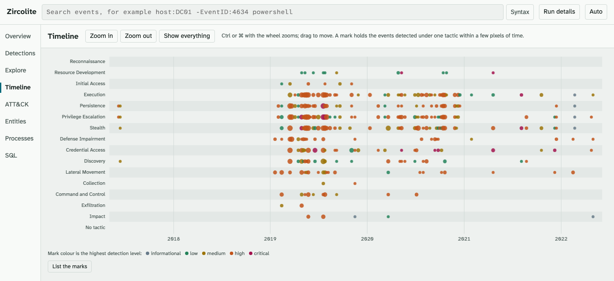

# Zircolite Viewer

`--package` writes one zip holding **every event** of a run, not only the matched ones,
together with the detections, the correlation alerts and a summary of the run. Extract it
and open `index.html`: the Zircolite Viewer runs in the browser, offline, with nothing to
install and no network request (its content security policy forbids them). Whoever receives
the zip can search the events and move between detections, hosts, accounts and processes.

The viewer is tested in current Chromium, Firefox and WebKit. On large packages, Chromium
browsers and Safari answer faster than Firefox.


## Making a package

```shell
python3 zircolite.py --events logs/ --package
python3 zircolite.py --events logs/ --package --package-dir /cases/host1
```

`--package` (`-G`) writes `zircolite-package-<RAND>.zip` to the working directory, or to
`--package-dir`, which must exist. In a [run configuration](Usage.md#yaml-configuration)
the keys are `output.package` and `output.package_dir`.

- **Every event is kept.** The [event filter](Advanced.md#early-event-filtering) is off for
  the run. The time and file filters still apply: use them to make a smaller package.
- **It is written even when no rule matched**, beside the usual detections output.
- **Problems surface before the run.** The destination, the viewer files and duckdb's
  built-in JSON and Parquet support are checked before any log is read. duckdb is never
  allowed to download anything.
- **A package is whole or absent.** It is assembled in a `tmp-zircolite-package-*`
  directory inside the destination and moved into place when complete. That directory needs
  several times the package's size: 867 MB at peak for a 175 MB package of 1.87 million
  events. If the package fails, the run exits `1` after writing its detections.
- **The command line is not recorded**, so an archive password cannot leak into it. The
  package keeps the settings that shape what it shows: processing mode, time field, time
  bounds, `--limit`, number of rules.

The browser holds the events in WebAssembly memory, which stops at 4 GB, so Zircolite
refuses a package whose events exceed 1 GiB as Parquet and suggests narrowing the run with
`--after`/`--before` or `-s`. A full-text index over 1 GiB is left out, with a warning:
bare-word searches then scan every field, which is slower.

### Who should see a package

A package holds everything the logs recorded: account and host names, command lines, IP
addresses, file paths. Share and store it as you would the logs themselves. The
`README.txt` inside says the same.

## Opening a package

1. Extract the whole zip.
2. Open `index.html` from the extracted folder; double-clicking usually works.

The page cannot run from inside the zip, because it loads the files beside it. While it
loads, it checks that every file arrived whole and that the engine holds exactly the events
and matches the package lists. A truncated package is reported, never shown incomplete.
These checks compare counts and sizes, not checksums.

All times are UTC.

**Filters.** The search box, the time range and **Detections only** (events at least one
rule matched) apply to every view, unless a view says otherwise. Each active filter shows as
a chip with an ×. The filters, the view, the table columns and the open event live in the
page's address, so **Back** steps through an investigation and a bookmark reopens it.

**Top bar.** **Syntax** opens the search help. **Run details** shows the run summary — events,
inputs, time range, rules matched, alerts, processing mode, time field, filter state, and the
Zircolite version that made the package — followed by its warnings: a `--limit`, narrowed
time bounds, events without a readable time, inputs read in part or failed, a missing
full-text index. The theme switch offers Auto, Light and Dark.

**Stop** appears while Explore or the SQL console is busy and cancels every query of the
page; **Run again** restarts them.

**Keys.** `/` focuses the search, `?` opens the help, `Esc` closes what is on top, `j` and
`k` move through events in Explore, and `Enter` opens one.

**The event drawer.** Clicking an event anywhere opens it in a drawer: the rules that
matched it (each with **Filter by this rule**), then its fields grouped as System, User,
Process, Network, File and registry, and Other. Each value has + (filter for it), −
(filter it out) and **Copy**. **Show JSON** and **Copy JSON** give the whole event, and
**Events on _host_ within 5 minutes** shows what happened around it.

## The views

### Overview

Tiles for each severity level (and an **Unknown level** tile when some rules carry no Sigma
level), a histogram of events and detections over time, the ATT&CK tactics with detections,
the top rules, hosts and users, and the run's warnings. Every tile, cell and entry opens
Explore filtered to it. Drag across the histogram, or use the arrow keys with Shift and
`Enter`, to set the time range; `Esc` clears it.

### Detections


The rules that matched, grouped by level from critical down, with the events each matched
under the current filters. Entries of one rule (one Sigma id, or one title when there is
none) form one row at their highest level. A row opens to show the description, false
positives, techniques, tags and ruleset entries; **Show events** opens them in Explore,
**Add to search** adds the rule to the search.

A correlation rule also lists its alerts for the whole package (the first 200), each with
its group keys, metric and evidence events.

### Explore

Every event that matches the filters, in a table sorted by time (click **Time (UTC)** to
reverse it). The **Fields** panel lists every field with its coverage; open one for its ten
most frequent values, each with + and −, or show it as a column. **Export CSV** writes the
shown columns for up to 500,000 events, defusing spreadsheet formulas; **Export JSON** writes
every field for up to 100,000 events, one object per line.

### Timeline



Detections over time, one lane per ATT&CK tactic in attack order, plus one for rules
without a tactic. Each mark is coloured by its highest level. `Ctrl`/`⌘` + wheel zooms and
dragging pans; the arrow keys, `+`, `-` and `0` do the same. The visible window becomes the
page's time range. Clicking a mark opens its earliest event; **Show these _N_ in Explore**
lists them all.

### ATT&CK


The ATT&CK matrix, shaded by events with detections: **Detected techniques** or the **Full
matrix**. Sub-techniques open beneath their technique. Tags the bundled catalogue does not
list as active are shown apart, never dropped: **revoked** (with the replacement),
**retired**, or **unknown**. A weekday-by-hour heatmap shows when detections happen.

### Entities

Hosts, users, IP addresses, processes, hashes and domains among the filtered events, with
their event counts, detection counts and first and last times. Values are grouped ignoring
case; up to 500 rows show, and **Filter values** finds the rest.

| Kind | Fields |
|------|--------|
| Hosts | `Computer`, `ComputerName`, `Hostname`, `host` |
| Users | `TargetUserName`, `SubjectUserName`, `User`, `UserName`, `AccountName` |
| IP addresses | `SourceIp`, `DestinationIp`, `IpAddress`, `SourceAddress`, `DestAddress`, `ClientAddress` |
| Processes | `Image`, `NewProcessName`, `ParentImage`, `ProcessName` |
| Hashes | `SHA256`, `SHA1`, `MD5`, `IMPHASH` |
| Domains | `QueryName`, `DestinationHostname` |

### Processes


Process starts as a tree — Sysmon event 1 (Windows or Linux) and Security event 4688 —
with image, command line, PID, user, host, start time and highest detection. The first
20,000 matching starts show; their ancestors are added in grey for context, so a search for
`whoami.exe` still shows the shell that started it.

A start links to its parent by `ParentProcessGuid` when it names one. Otherwise the parent
is the latest earlier start of the parent PID on the same host (`ParentProcessId` in Sysmon,
`ProcessId` in event 4688). Links are made across every start in the package, so a filter
never changes who started what.

### SQL

A console for one query at a time over the package's tables; see
[The SQL console](#the-sql-console).

## Search grammar

| Search | Meaning |
|--------|---------|
| `powershell` | Any field contains the word, in any case |
| `"net user"` | Any field contains the phrase |
| `EventID:4624` | A field equals a value, in any case |
| `Image:*\cmd.exe` | `*` matches any characters, outside quotes |
| `EventID:>4600` | Numeric fields compare with `>`, `>=`, `<` and `<=` |
| `-Channel:Security` | Leave matches out; events without the field stay in |
| `a OR b` | Either term. Terms side by side must both match |
| `(a OR b) c` | Parentheses group terms |
| `"level":error` | Quote a field name that clashes with a shortcut |

| Shortcut | Example | Matches |
|----------|---------|---------|
| `rule:` | `rule:*powershell*` | Events a rule matched, by title or id |
| `rulekey:` | `rulekey:"Encoded PowerShell"` | Events of one rule as Detections groups it |
| `level:` | `level:>=high` | Events by highest detection level; `level:<informational` for rules without one |
| `tactic:` | `tactic:persistence` | Events detected under an ATT&CK tactic |
| `technique:` | `technique:T1059` | Events detected under a technique, sub-techniques included |
| `weekday:` | `weekday:sat` | Events on a weekday (UTC): `mon`, `monday`, or `1` to `7` |
| `hour:` | `hour:>=22` | Events in an hour of the day (UTC), 0 to 23 |
| `host:` | `host:DC01` | Events from a host, whichever host field holds it |
| `user:` | `user:administrator` | Events naming an account, whichever user field holds it |

- Field names ignore case; an unknown one is refused with the nearest names. Values may
  hold colons, so paths, times and IPv6 addresses need no quotes.
- Inside quotes, `\"` is a quote and `\\` a backslash; other backslashes stay as typed, so
  Windows paths work. `*` is a wildcard only outside quotes.
- Bare words read the full-text index once it has loaded in the background. Without it they
  scan every column, which is slow on large packages; a field search such as
  `CommandLine:*mimikatz*` is faster.
- A search that does not parse is not applied, and the bar says where it fails. One that
  arrives through a link and does not parse matches nothing, never everything.

## The SQL console

The SQL view runs one query at a time over five tables:

| Table | One row per | Columns |
|-------|-------------|---------|
| `events` | event | `_zl_uid` (the event's id), `_zl_part`, `_zl_time` (UTC timestamp, NULL when unreadable), `_zl_spelling`, then every field of the run |
| `rules` | ruleset entry that matched | `rule_idx`, `key`, `id`, `title`, `level`, `level_rank`, `description`, `falsepositives`, `tags`, `tactics`, `techniques`, `sigmafile`, `result_type`, `count`, `linked`, `unlinked`, `alert_count`, `event_count` |
| `hits` | rule and event it matched | `rule_idx`, `_zl_uid` |
| `alerts` | correlation alert | `alert_idx`, `rule_idx`, `_zl_part`, `alert_id`, `group_keys`, `occurrence_time`, `window_start`, `window_end`, `metric_name`, `metric_value`, `event_count`, `child_alert_ids` |
| `alert_events` | evidence event of an alert | `alert_idx`, `_zl_uid`, `ord` |

```sql
-- Hosts by events with detections
SELECT Computer, count(*) AS events, count(h._zl_uid) AS detected
FROM events e LEFT JOIN (SELECT DISTINCT _zl_uid FROM hits) h USING (_zl_uid)
GROUP BY Computer ORDER BY detected DESC

-- The events of PowerShell rules, earliest first
SELECT e._zl_time, r.title, e.Computer, e.CommandLine
FROM hits h JOIN rules r USING (rule_idx) JOIN events e USING (_zl_uid)
WHERE r.title ILIKE '%powershell%'
ORDER BY e._zl_time
```

- One `SELECT` at a time (with `WITH`, `VALUES` and FROM-first forms), or `DESCRIBE` or
  `SHOW`. Anything else — a second statement, `CREATE`, `INSERT`, `ATTACH`, `COPY`, `SET`,
  `PRAGMA` — is refused, and the package's tables cannot change.
- Values come back as text, so 64-bit integers stay exact. At most 10,000 rows show;
  **Export CSV** saves them.
- The page's filters do not apply here: write them in SQL. `Ctrl`/`⌘` + `Enter` runs the
  query, and **Tables** lists every column.

## For developers

- The sources are in `gui/source/` (Svelte, TypeScript and Vite over DuckDB-WASM). The build
  in `gui/viewer/` is committed and copied into every package. `task gui-build` runs `npm ci`,
  `npm run check`, `npm test` and `npm run build`; commit `gui/viewer/` with any source
  change. CI fails when a rebuild differs from it by a single byte.
- The scripts in `gui/source/e2e/` drive an extracted package from `file://`:
  `npm run smoke -- <dir>` (opens it in Chromium, Firefox and WebKit), `npm run e2e -- <dir>`
  and `npm run views -- <dir>` (cross-check Explore and every view), `npm run perf -- <dir>`
  and `npm run shot -- <dir> <out.png>`. They need `npx playwright install chromium firefox webkit`.
- The ATT&CK catalogue is MITRE ATT&CK Enterprise 19.2; MITRE's notice travels in every
  package as `THIRD_PARTY_NOTICES.txt`. To update it, run
  `node scripts/attack-catalog.mjs enterprise-attack-X.Y.json` in `gui/source/`, refresh
  `scripts/attack-terms.txt` from MITRE's
  [terms of use](https://attack.mitre.org/resources/legal-and-branding/terms-of-use/), then
  rebuild and commit.
- [Internals → Package pipeline](Internals.md#package-pipeline) describes how a package is
  written and read.
